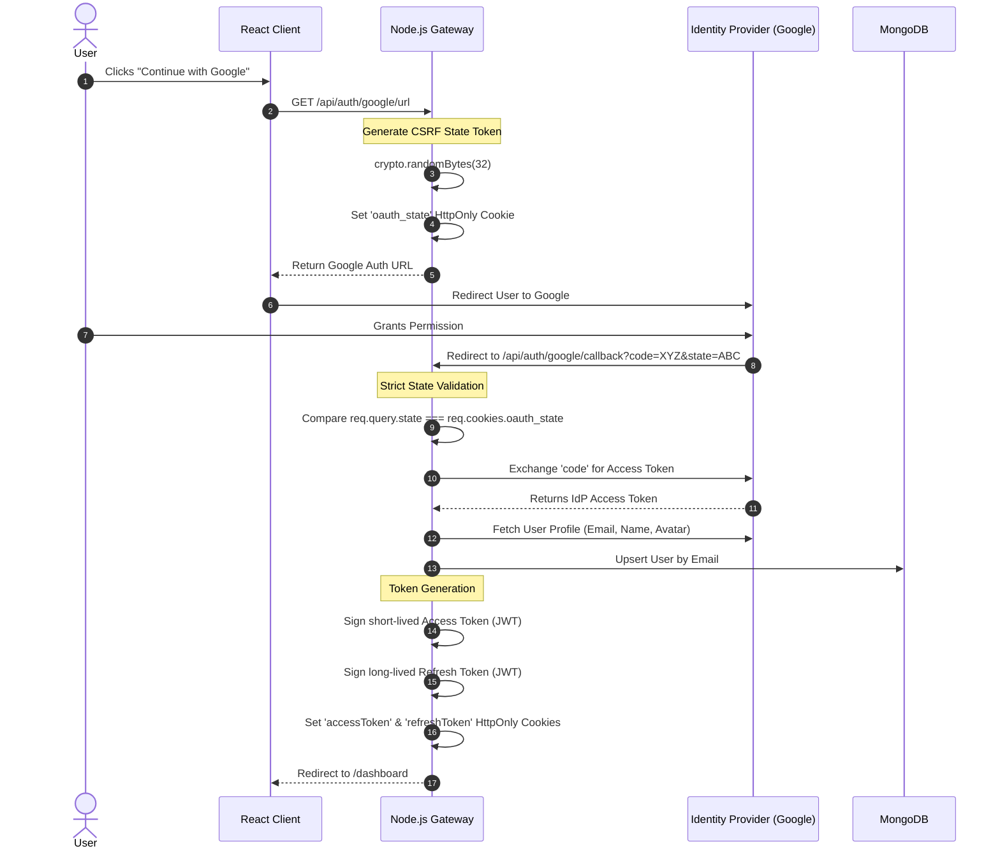
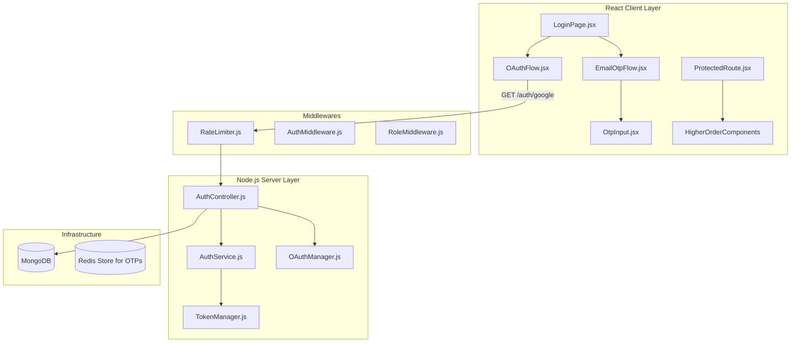

# Identity, Authentication & RBAC Module

## 1. Executive Summary & Domain Scope

The **Identity & Authentication** module is the security perimeter for the entire SkillsSphere-AI platform. It is responsible for establishing trusted sessions, enforcing strict Role-Based Access Control (RBAC), mitigating brute-force and credential-stuffing attacks, and handling federated OAuth 2.0 flows.

### Core Problem Addressed
Modern web applications require robust security that goes beyond simple username/password checks. The platform serves three distinct user personas (Student, Tutor, Recruiter), each with wildly different data access patterns. A recruiter must never be able to mutate a student's resume, and a student must never be able to view hidden cohort analytics. This module centralizes these security boundaries into a single, highly audited gateway layer.

### Target User Personas
- **All Users**: Require a frictionless login experience (via Email OTP or Google/GitHub OAuth) without compromising account security.
- **System Administrators**: Require cryptographically verifiable audit trails of authentication attempts to detect malicious actors.

### High-Level Capability Matrix
**What the Module Does:**
- **Federated Login**: Supports Google and GitHub OAuth 2.0 with strict state parameter validation to prevent CSRF attacks.
- **Passwordless OTP**: Implements a secure Time-Based One-Time Password (OTP) flow via email for users who do not wish to use federated login.
- **JWT Session Management**: Issues short-lived Access Tokens (15m) and long-lived, rotating Refresh Tokens (7d) stored securely in `HttpOnly` cookies.
- **Granular RBAC**: Enforces strict role boundaries via Express middlewares before any controller logic executes.

**What the Module Deliberately Avoids:**
- **Storing Passwords**: The system operates entirely passwordless. By relying on OAuth and Email OTP, the platform eliminates the risk of mass password hash exfiltration in the event of a database breach.
- **LocalStorage JWTs**: The frontend never stores Access or Refresh tokens in `localStorage` or `sessionStorage`, completely immunizing the application against Cross-Site Scripting (XSS) token theft.

---

## 2. Comprehensive Architecture & Sequence Diagrams

The architecture separates the token issuing logic from the validation middlewares, ensuring that every microservice route can easily verify a user's identity without querying the database for every request.

### End-to-End User Flow (OAuth 2.0 Flow)



### Component Hierarchy & Service Boundaries



---

## 3. Detailed Data Models & Schemas

The authentication models are highly streamlined because the platform delegates primary authentication to external IdPs or Email verification.

### MongoDB Schemas

**User Model (`src/database/models/User.js`)**
The central identity document.

```javascript
const mongoose = require('mongoose');

const userSchema = new mongoose.Schema({
  email: {
    type: String,
    required: true,
    unique: true,
    lowercase: true,
    trim: true,
    index: true
  },
  name: {
    type: String,
    required: true
  },
  avatarUrl: {
    type: String
  },
  role: {
    type: String,
    enum: ['student', 'tutor', 'recruiter', 'admin'],
    default: 'student',
    index: true
  },
  authProvider: {
    type: String,
    enum: ['google', 'github', 'email'],
    required: true
  },
  providerId: {
    type: String
  }, // The unique ID from Google/GitHub

  // Refresh Token Rotation Tracking
  refreshTokenVersion: {
    type: Number,
    default: 0
  },

  settings: {
    isDiscoverable: { type: Boolean, default: true },
    theme: { type: String, enum: ['light', 'dark', 'system'], default: 'dark' },
    emailNotifications: { type: Boolean, default: true }
  },
  lastLoginAt: { type: Date }
}, { timestamps: true });

// Prevent duplicate provider IDs
userSchema.index({ providerId: 1, authProvider: 1 }, { unique: true, sparse: true });

module.exports = mongoose.model('User', userSchema);
```

### Redis OTP Schema
To prevent brute-forcing, OTPs are stored in Redis with an absolute hardware-level TTL, rather than in MongoDB.

```text
Key: `otp:${email}`
Value: bcrypt_hash("123456")
TTL: 300 (5 minutes)

Key: `otp_attempts:${email}`
Value: Integer (Count of failed attempts)
TTL: 900 (15 minutes)
```

---

## 4. API Endpoints & State Management

### REST Endpoints

| Method | Endpoint | Auth Level | Purpose | Payload | Response |
| :--- | :--- | :--- | :--- | :--- | :--- |
| `POST` | `/api/auth/otp/send` | Public | Generates a 6-digit OTP and emails it via SendGrid. | `{ email: "user@example.com" }` | `{ success: true, message: "OTP Sent" }` |
| `POST` | `/api/auth/otp/verify` | Public | Validates the OTP. If valid, issues HttpOnly cookies. | `{ email: "user@example.com", otp: "123456" }` | `{ user: {...} }` (Cookies attached via headers) |
| `GET` | `/api/auth/google/url` | Public | Generates the secure OAuth redirect URL. | `None` | `{ url: "https://accounts.google.com/..." }` |
| `GET` | `/api/auth/google/callback` | Public | Consumes the OAuth code and state. | `?code=XYZ&state=ABC` | Redirects to frontend with Cookies. |
| `POST` | `/api/auth/refresh` | Public | Issues a new Access Token if the Refresh cookie is valid. | `None` | `{ success: true }` |
| `POST` | `/api/auth/logout` | Auth | Clears all cookies and increments `refreshTokenVersion` in DB. | `None` | `{ success: true }` |
| `GET` | `/api/auth/me` | Auth | Validates the current Access Token and returns the user payload. | `None` | `{ user: {...} }` |

### Redux State Management

The frontend uses Redux to store the verified user state globally, allowing protected routes to instantly block or allow access without making network calls for every page transition.

```javascript
// client/src/features/auth/authSlice.js
import { createSlice } from '@reduxjs/toolkit';

const initialState = {
  isAuthenticated: false,
  user: null, // { _id, email, name, role, avatarUrl }
  loading: true, // Initially true while checking /api/auth/me
  error: null
};

export const authSlice = createSlice({
  name: 'auth',
  initialState,
  reducers: {
    setCredentials: (state, action) => {
      state.user = action.payload.user;
      state.isAuthenticated = true;
      state.loading = false;
      state.error = null;
    },
    clearCredentials: (state) => {
      state.user = null;
      state.isAuthenticated = false;
      state.loading = false;
    },
    setAuthLoading: (state, action) => {
      state.loading = action.payload;
    }
  }
});
```

---

## 5. Security, Edge Cases & Error Handling

### XSS & CSRF Mitigation Strategy
The platform employs a deeply defense-in-depth approach to token storage.
- **XSS Immunity**: JavaScript running in the browser (even malicious third-party scripts) cannot read the `accessToken` or `refreshToken` because they are flagged as `HttpOnly: true`.
- **CSRF Immunity**: Because the tokens are stored in cookies, the browser automatically attaches them to cross-origin requests. To prevent CSRF attacks, the backend uses the `cors` middleware configured explicitly to the frontend's origin with `credentials: true`. Furthermore, state-changing endpoints (`POST`, `PATCH`, `DELETE`) require a custom header (e.g., `X-Requested-With`) or rely on SameSite cookie policies (`SameSite=Strict`).

### Refresh Token Rotation & Invalidation
If a user's laptop is stolen, the attacker might extract the Refresh Token cookie.
- **Handling**: When a user clicks "Logout All Devices" or changes their password/settings, the backend increments the `refreshTokenVersion` integer on their MongoDB User document.
- **Validation**: When the `/api/auth/refresh` endpoint is hit, it decodes the JWT and compares the embedded `tokenVersion` against the DB's `refreshTokenVersion`. If they do not match, the token is instantly rejected, effectively killing all active sessions globally.

### OTP Brute-Force Protection
An attacker could try to brute-force a 6-digit OTP (only 1,000,000 combinations).
- **Handling**: The `/api/auth/otp/verify` endpoint checks the Redis key `otp_attempts:${email}`. If the attempts exceed 5, the route immediately returns a `429 Too Many Requests` and locks the account for 15 minutes, rendering brute-force mathematically impossible within the 5-minute OTP lifespan.

### Open Redirect Prevention
During OAuth flows, attackers often try to inject malicious redirect URIs.
- **Handling**: The `OAuthManager` statically defines the allowed callback URIs in code. It strictly validates the incoming `redirect_uri` parameter against this whitelist. If it doesn't match precisely, the flow aborts immediately.

---

## 6. Component-Level Implementation Specs

### `ProtectedRoute.jsx` (The Gatekeeper)
This Higher-Order Component wraps all restricted pages (e.g., `<Route path="/dashboard" element={<ProtectedRoute allowedRoles={['student']}><Dashboard /></ProtectedRoute>} />`).
- **Logic**: It reads `isAuthenticated` and `role` from Redux.
- If `loading` is true, it renders a full-screen spinner.
- If `!isAuthenticated`, it forces a `<Navigate to="/login" replace />`.
- If `role` is not in `allowedRoles`, it forces a `<Navigate to="/unauthorized" replace />`.

### `LoginPage.jsx` (The Entry Interface)
Implements a sleek, split-pane layout with vibrant gradients.
- **Google Auth Button**: Uses an absolute URL to hit the `/api/auth/google/url` endpoint.
- **Email OTP Input**: Uses a controlled 6-box input component. As the user types, focus auto-advances to the next box.

### `AuthMiddleware.js` (The Backend Shield)
This Express middleware runs before every protected API route.

```javascript
// server/src/middleware/authMiddleware.js
const jwt = require('jsonwebtoken');

const requireAuth = (req, res, next) => {
  const token = req.cookies.accessToken;

  if (!token) {
    return res.status(401).json({ error: 'Authentication required' });
  }

  try {
    const decoded = jwt.verify(token, process.env.JWT_SECRET);
    req.user = decoded; // Attach user payload (id, role) to the request
    next();
  } catch (error) {
    // If the Access Token is expired, the client should intercept the 401
    // and fire a request to /api/auth/refresh
    return res.status(401).json({ error: 'Token invalid or expired', code: 'TOKEN_EXPIRED' });
  }
};

const requireRole = (roles) => (req, res, next) => {
  if (!roles.includes(req.user.role)) {
    return res.status(403).json({ error: 'Forbidden: Insufficient privileges' });
  }
  next();
};

module.exports = { requireAuth, requireRole };
```

### `AxiosInterceptor.js` (Silent Token Renewal)
The React client configures an Axios interceptor to handle token expiration seamlessly without bothering the user.

```javascript
// client/src/utils/axios.js
api.interceptors.response.use(
  (response) => response,
  async (error) => {
    const originalRequest = error.config;

    // If we got a 401 TOKEN_EXPIRED and haven't retried yet
    if (error.response?.data?.code === 'TOKEN_EXPIRED' && !originalRequest._retry) {
      originalRequest._retry = true;

      try {
        // Attempt to silently refresh the cookies
        await axios.post('/api/auth/refresh', {}, { withCredentials: true });

        // Retry the original failing request
        return api(originalRequest);
      } catch (refreshError) {
        // The refresh token is also dead. Force a logout.
        store.dispatch(clearCredentials());
        window.location.href = '/login';
        return Promise.reject(refreshError);
      }
    }
    return Promise.reject(error);
  }
);
```

EOF
