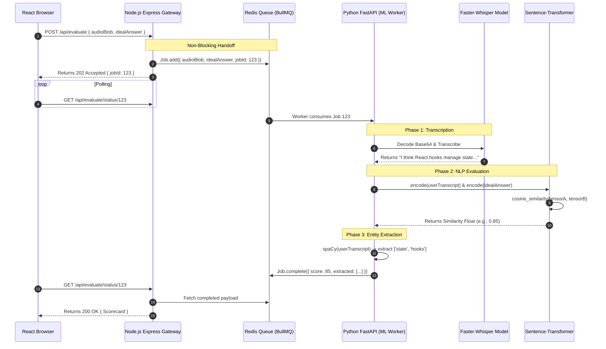
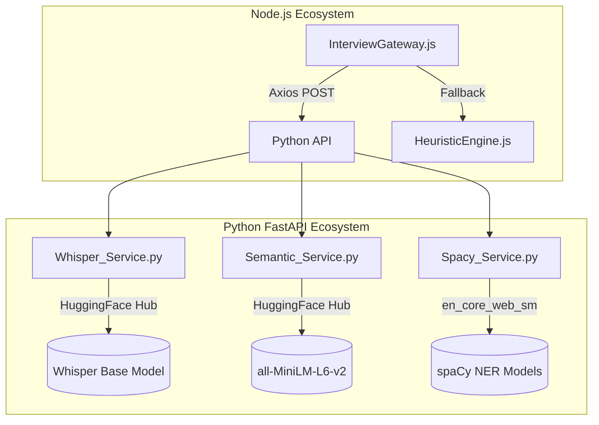

# Interview Engine AI Architecture

## 1. Executive Summary & Domain Scope

The **Interview Engine** is the most computationally intensive and AI-reliant module in the SkillsSphere-AI platform. It is designed to act as a fully autonomous, dynamic interviewer capable of testing a candidate's technical depth, behavioral responses, and architectural reasoning. While the *workflow* document covers the user-facing journey and API interactions, this document focuses strictly on the underlying Deep Learning architecture, the evaluation algorithms, and the integration between the Node.js API Gateway and the Python Fast-API ML Inference Service.

### Core Problem Addressed
Standard multiple-choice quizzes are notoriously poor indicators of engineering competence. To truly gauge a developer's skill, they must be forced to articulate complex concepts in their own words, under time pressure. Processing free-text or spoken-word engineering responses requires domain-specific NLP models that understand that "React state" and "component memory" are semantically linked, even if the strings do not match.

### Target User Personas
- **AI / ML Engineers**: Need clear documentation on how the Python microservice exposes its inference pipelines.
- **Backend Engineers**: Need to understand the failure modes and fallback heuristics if the ML service crashes.

### High-Level Capability Matrix
**What the Module Does:**
- **Asynchronous Audio Processing**: Ingests raw Base64 audio blobs, decodes them, and transcribes them using OpenAI's Faster-Whisper.
- **Deep Semantic Scoring**: Compares a user's free-text answer against an expert-curated "Ideal Answer" using highly optimized Hugging Face Sentence-Transformers (e.g., `all-MiniLM-L6-v2`).
- **Entity Extraction**: Utilizes `spaCy` to extract exact noun-chunks and technical jargon to determine "Concept Coverage".
- **Algorithmic Fallbacks**: Implements a rapid regex/heuristic fallback system in Node.js if the heavy Python API fails to respond within 10 seconds.

**What the Module Deliberately Avoids:**
- **Synchronous ML Blocking**: The Node.js event loop is never blocked by ML computation. The ML heavy lifting is strictly sandboxed in a separate Python process to prevent the main web server from degrading.

---

## 2. Comprehensive Architecture & Sequence Diagrams

### End-to-End System Architecture (The Evaluation Pipeline)



### AI Pipeline Boundaries



---

## 3. Detailed Data Models & Schemas

The ML evaluation requires a strict contract between the Node.js gateway and the Python worker to prevent marshaling errors.

### Zod Validation Schemas (Node.js Side)

Before Node.js even attempts to forward the payload to Python, it rigorously validates it to prevent wasting GPU/CPU cycles on malformed data.

```javascript
// server/src/validations/aiPayloadValidator.js
const { z } = require('zod');

const evaluationRequestSchema = z.object({
  answerText: z.string().min(10, "Answer is too short to evaluate").optional(),
  audioBase64: z.string().regex(/^data:audio\/(webm|mp4);base64,/, "Invalid audio format").optional(),
  idealAnswer: z.string().min(20),
  keyConcepts: z.array(z.string()).min(1),
}).refine(data => data.answerText || data.audioBase64, {
  message: "Either text or audio must be provided",
  path: ["answerText"]
});

module.exports = { evaluationRequestSchema };
```

### Python Pydantic Models (FastAPI Side)

FastAPI enforces the incoming payload structure.

```python
# ai-service/app/schemas/evaluation_models.py
from pydantic import BaseModel, Field
from typing import List, Optional

class EvaluationRequest(BaseModel):
    answer_text: Optional[str] = Field(None, description="The transcribed text from the user")
    audio_b64: Optional[str] = Field(None, description="Base64 encoded audio string")
    ideal_answer: str = Field(..., description="The expert answer to compare against")
    key_concepts: List[str] = Field(..., description="List of technical terms expected")

class EvaluationResponse(BaseModel):
    technical_score: float = Field(..., ge=0, le=100)
    communication_score: float = Field(..., ge=0, le=100)
    matched_concepts: List[str]
    missing_concepts: List[str]
    transcribed_text: Optional[str] = None
    feedback_summary: str
```

---

## 4. API Endpoints & State Management

### Python Microservice Endpoints

| Method | Endpoint | Purpose | GPU Accelerated? |
| :--- | :--- | :--- | :--- |
| `POST` | `/v1/evaluate` | The monolithic endpoint that handles STT, Semantic matching, and spaCy extraction in one pass. | Yes (if CUDA available) |
| `GET` | `/v1/health` | Used by Node.js to determine if the ML service is ready to accept traffic or if it's currently OOM. | No |
| `POST` | `/v1/transcribe-only` | Bypasses the evaluation pipeline. Used strictly for converting audio to text. | Yes |

### Node.js Heuristic Fallback Engine

If the Python server returns a 5xx error or times out after 10 seconds, the Node.js server intercepts the error and routes the payload to the `HeuristicEngine`. This engine is "dumb" but incredibly fast, relying entirely on string manipulation.

```javascript
// server/src/integrations/heuristicEngine.js
const generateMockScore = (userAnswer, idealAnswer, keyConcepts) => {
  const normalizedAnswer = userAnswer.toLowerCase();
  
  // 1. Concept Density Check
  let conceptsFound = 0;
  const matched = [];
  const missing = [];
  
  keyConcepts.forEach(concept => {
    if (normalizedAnswer.includes(concept.toLowerCase())) {
      conceptsFound++;
      matched.push(concept);
    } else {
      missing.push(concept);
    }
  });
  
  const coverageScore = (conceptsFound / keyConcepts.length) * 100;
  
  // 2. Length Penalty (Answers less than 50 chars are heavily penalized)
  let lengthMultiplier = 1.0;
  if (normalizedAnswer.length < 50) lengthMultiplier = 0.5;
  if (normalizedAnswer.length > 500) lengthMultiplier = 0.9; // Rambling penalty
  
  const finalScore = Math.round(coverageScore * lengthMultiplier);
  
  return {
    score: finalScore,
    feedback: finalScore > 80 ? "Great coverage of key concepts." : "You missed several critical technical terms.",
    matchedConcepts: matched,
    missingConcepts: missing,
    isHeuristicFallback: true // Flags to the frontend that AI was offline
  };
};
```

---

## 5. ML Algorithms & Optimization Strategy

### 1. The Transcription Layer (Faster-Whisper)
We utilize `faster-whisper` (CTranslate2 implementation) rather than the standard OpenAI Whisper library.
- **Why?**: Standard Whisper in PyTorch consumes ~2GB of VRAM and takes 4 seconds to transcribe 10 seconds of audio. Faster-Whisper uses INT8 quantization, dropping VRAM usage to ~800MB and transcription time to <1 second, allowing the API to remain highly concurrent even on cheap cloud instances.

### 2. The Semantic Scoring Layer (Sentence Transformers)
String matching is insufficient because "DOM manipulation" and "modifying the document object model" mean the exact same thing.
- **The Model**: `all-MiniLM-L6-v2`. It is incredibly lightweight (~80MB) and fast.
- **The Process**:
  1. Both the `user_answer` and `ideal_answer` are converted into 384-dimensional dense vectors.
  2. The system computes the Cosine Similarity between the two vectors.
  3. A cosine similarity of `1.0` means identical meaning; `0.0` means completely orthogonal.
  4. The float is mapped to a 0-100 scale using a gentle exponential curve (to prevent users from getting a 12% score just because their vocabulary is slightly different).

### 3. The Entity Extraction Layer (spaCy)
While Sentence Transformers give us the "vibe" and semantic closeness of the answer, we still need to know exactly *what* technical terms they explicitly mentioned to render the green/red badges in the UI.
- **The Model**: `en_core_web_sm` (Small English Pipeline).
- **The Process**: We run the user's transcript through the NLP pipeline to extract `NOUN_CHUNKS`. We then perform Levenshtein distance checks against the requested `key_concepts` to account for minor mispronunciations by the STT engine (e.g., "re-act" matching "React").

### Handling ML Cold Starts
If the Python microservice is deployed on a Serverless platform (like AWS Lambda or Google Cloud Run), the initial request takes 15-20 seconds to load the heavy 1GB ML models from disk into RAM.
- **Mitigation**: The Node.js server utilizes a "Ping-Keep-Alive" cron job. Every 4 minutes, it fires a dummy request to `/v1/health` on the Python service, preventing the container instance from ever scaling down to zero.

---

## 6. Implementation Specifications (Python Service)

### `main.py` (The FastAPI Entrypoint)

```python
from fastapi import FastAPI, HTTPException
from app.schemas.evaluation_models import EvaluationRequest, EvaluationResponse
from app.services import semantic_service, whisper_service

app = FastAPI(title="Interview AI Engine")

@app.post("/v1/evaluate", response_model=EvaluationResponse)
async def evaluate_answer(request: EvaluationRequest):
    try:
        user_text = request.answer_text
        
        # Phase 1: Transcribe if audio is provided
        if request.audio_b64:
            user_text = await whisper_service.transcribe_base64(request.audio_b64)
            
        if not user_text:
            raise HTTPException(status_code=400, detail="No transcript generated.")
            
        # Phase 2 & 3: Run Semantic and Concept Evaluation
        score, matched, missing = semantic_service.evaluate(
            user_text, 
            request.ideal_answer, 
            request.key_concepts
        )
        
        return EvaluationResponse(
            technical_score=score,
            communication_score=85.0, # Placeholder for readability heuristic
            matched_concepts=matched,
            missing_concepts=missing,
            transcribed_text=user_text,
            feedback_summary="Analysis complete."
        )
    except Exception as e:
        raise HTTPException(status_code=500, detail=str(e))
```

EOF
