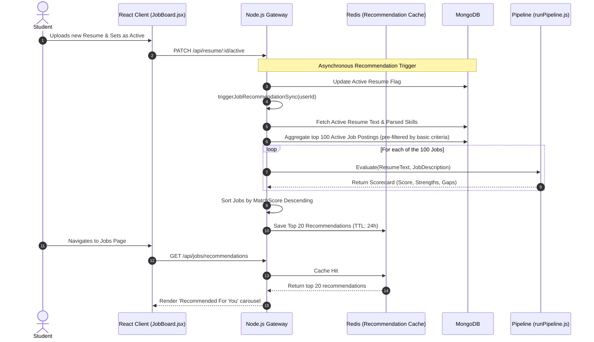
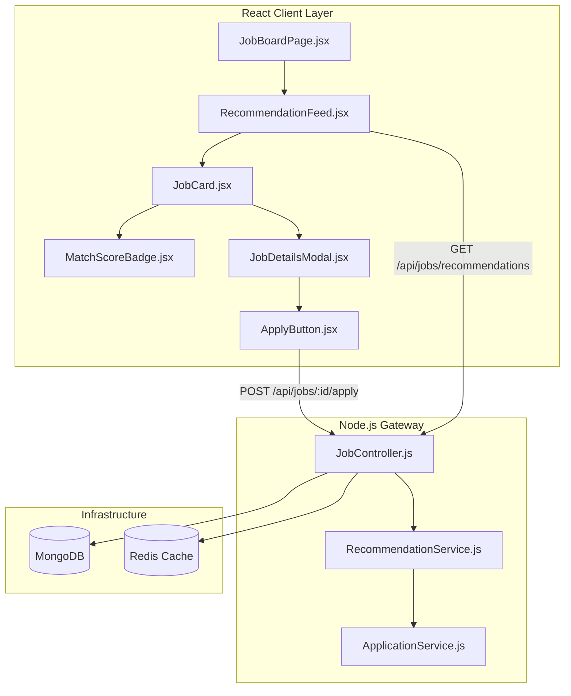

# AI Job Matcher Feature Module

## 1. Executive Summary & Domain Scope

The **AI Job Matcher** is a foundational B2C component of the SkillsSphere-AI ecosystem. It operates symmetrically to the Recruiter Talent Discovery module. While recruiters search for students, the Job Matcher flips the paradigm, automatically surfacing the highest-probability job postings to students based on a deep semantic analysis of their actively uploaded resume.

### Core Problem Addressed
Job hunting is traditionally a high-friction, low-yield process. Students spend countless hours scrolling through thousands of job listings on platforms like LinkedIn or Indeed, manually pattern-matching their skills against lengthy job descriptions. The Job Matcher eliminates this manual labor by running a continuous background pipeline that evaluates the student's ATS profile against the platform's entire active job corpus, presenting only highly qualified leads.

### Target User Personas
- **Students / Candidates**: Need a passive, zero-click discovery engine that brings highly relevant job postings to their dashboard, accompanied by transparent metrics explaining *why* they are a fit.

### High-Level Capability Matrix
**What the Module Does:**
- **Automated Intake Match**: The moment a student uploads and sets a resume as 'Active', the pipeline computes match scores against all currently open jobs in the system.
- **Why You Match Insights**: Generates a visually distinct scorecard for every recommended job, highlighting exact keyword intersections, semantic overlap, and critical missing skills.
- **One-Click Applications**: Because the resume is already parsed and stored, applying to a recommended job is a frictionless, single-click action.
- **Skill Gap Highlighting**: Explicitly identifies which skills are preventing a 100% match, directly funneling the student back into the Learning Roadmaps module.

**What the Module Deliberately Avoids:**
- **Auto-Applying**: The system will never submit an application on a user's behalf without explicit consent, preserving the sanctity of the recruiter's inbox.
- **Generic Keyword Scraping**: It does not rely on simple string matching (which breaks when a student says "ReactJS" and the job says "React"). It utilizes embedding-based vector similarity.

---

## 2. Comprehensive Architecture & Sequence Diagrams

The Job Matcher architecture relies heavily on pre-computation and caching to ensure the frontend recommendation feed loads instantly, despite the heavy ML calculations required.

### End-to-End User Flow (Recommendation Generation)



### Component Hierarchy & Microservice Boundaries



---

## 3. Detailed Data Models & Schemas

The Job Matcher relies on the foundational `JobPosting` model (detailed in the Recruitment workflow) but heavily utilizes an ephemeral caching layer to store the computed scorecard metadata, preventing the need to store millions of pivot records in MongoDB.

### Redis Caching Strategy

Computing semantic similarity between one resume and 1,000 jobs takes approximately 5-10 seconds of intensive CPU time. To prevent blocking the Node.js event loop every time a user loads the Jobs page, the results are serialized and cached in Redis.

**Redis Key Structure:**
`recs:user:{userId}` -> Contains a stringified JSON array of recommendation objects.

```json
[
  {
    "jobId": "60d5ecb74d6bb830b8e70fb5",
    "matchScore": 88,
    "scorecard": {
      "technicalAccuracy": 90,
      "missingSkills": ["GraphQL", "Docker"],
      "matchedSkills": ["React", "Node.js", "MongoDB", "Redux"]
    },
    "computedAt": "2026-06-03T12:00:00Z"
  }
]
```

**Cache Invalidation Triggers:**
1. User uploads a new active resume (Cache invalidated immediately).
2. TTL expiration (24 hours).
3. The specific job is closed/filled by the recruiter (Handled gracefully on the frontend).

---

## 4. API Endpoints & State Management

### REST Endpoints

| Method | Endpoint | Auth Level | Purpose | Payload | Response |
| :--- | :--- | :--- | :--- | :--- | :--- |
| `GET` | `/api/jobs` | Student | Retrieves a paginated list of all active jobs (unscored). | `?page=1&limit=20` | `{ jobs: [...], pagination: {...} }` |
| `GET` | `/api/jobs/recommendations` | Student | Retrieves the highly curated, AI-scored feed from the cache. | `None` | `[{ jobDetails, matchScore, scorecard }]` |
| `POST` | `/api/jobs/:jobId/apply` | Student | Submits an application using the currently active resume. | `None` | `{ success: true, applicationId: "..." }` |
| `GET` | `/api/jobs/applications` | Student | Retrieves the history and status of all submitted applications. | `None` | `[{ application, job, status, timeline }]` |
| `PATCH` | `/api/jobs/applications/:id/withdraw` | Student | Cancels a pending application. | `None` | `{ success: true }` |

### Redux State Management

The frontend uses Redux to store the recommendations and global job feed, allowing instantaneous tab switching between "All Jobs", "Recommended", and "Applied".

```javascript
// client/src/features/jobs/jobsSlice.js

const initialState = {
  feed: {
    jobs: [],
    page: 1,
    totalPages: 1,
    loading: false
  },
  recommendations: {
    jobs: [], // Inflated with matchScore and scorecard
    loading: false,
    lastFetched: null
  },
  applications: [],
  filters: {
    roleType: 'all', // 'frontend', 'backend', 'fullstack'
    remoteOnly: false
  }
};

export const jobsSlice = createSlice({
  name: 'jobs',
  initialState,
  reducers: {
    setFeed: (state, action) => {
      state.feed.jobs = action.payload.jobs;
      state.feed.totalPages = action.payload.pagination.totalPages;
    },
    setRecommendations: (state, action) => {
      state.recommendations.jobs = action.payload;
      state.recommendations.lastFetched = Date.now();
    },
    addApplication: (state, action) => {
      state.applications.unshift(action.payload);
      // Remove from recommended/feed if applied
      state.recommendations.jobs = state.recommendations.jobs.filter(
        j => j.jobDetails._id !== action.payload.jobId
      );
    }
  }
});
```

---

## 5. Security, Edge Cases & Error Handling

### Stale Recommendations (The Ghost Job Problem)
A common frustration in job hunting is applying to a job only to find out it was closed days ago. 
- **Edge Case**: A job is cached in a student's `recs:user:{userId}` list for 24 hours. At hour 12, the recruiter deletes the job.
- **Handling**: The `/api/jobs/recommendations` endpoint performs a rapid `$in` query against the MongoDB `JobPosting` collection for all job IDs in the cache array. If a job is returned with `status: 'closed'` or is entirely missing, it is dynamically pruned from the response array before being sent to the client, ensuring 100% active leads.

### Throttling the Recommendation Engine
If 1,000 students upload a resume simultaneously, the synchronous calculation of 100,000 job matches (1,000 students * 100 top jobs) would cripple the AI Pipeline.
- **Handling**: The `triggerJobRecommendationSync(userId)` function does not execute inline. It pushes a job payload to a **BullMQ** queue backed by Redis. A separate worker process slowly consumes this queue, pacing the API requests to Hugging Face / Gemini to prevent rate-limit 429s. The frontend displays a "Generating your matches..." skeleton loader if the cache is empty while the worker processes.

### Double-Application Prevention
A student might try to click "Apply" rapidly multiple times or apply via different tabs.
- **Handling**: At the database level, the `JobApplication` schema enforces a unique compound index on `{ jobId: 1, candidateId: 1 }`. If a duplicate insert is attempted, MongoDB throws an `E11000` error, which the backend intercepts to return a graceful `409 Conflict: Already applied` message.

---

## 6. Component-Level Implementation Specs

### `JobBoardPage.jsx` (The Layout Wrapper)
This page implements a standard three-tab layout: "Recommended", "All Jobs", and "My Applications".
- **Optimization**: It utilizes React Router's nested routes (`<Outlet />`) or simple local state to switch views without unmounting the parent layout. It dispatches the fetch thunks inside a `useEffect`, ensuring data is requested immediately upon mount.

### `RecommendationFeed.jsx`
Responsible for mapping over the curated list of jobs. If the Redis cache was empty and the background worker is still processing, it renders a specialized `SkeletonJobCard` that features a sweeping gradient animation to indicate AI processing.

### `JobCard.jsx`
The foundational UI component for a job listing.
- **Visual Hierarchy**: Features the company logo, role title, and a cluster of pill badges for skills.
- **Match Score Integration**: If rendered inside the recommendation feed, it mounts a floating `<MatchScoreBadge score={matchScore} />` in the top right corner. The badge uses dynamic color mapping (Red < 50, Yellow 50-79, Green 80+).

### `JobDetailsModal.jsx` (The Drill-Down)
When a `JobCard` is clicked, this modal opens using Framer Motion (`<AnimatePresence>`).
- It fetches the full, un-truncated markdown description of the job.
- **The Scorecard View**: Directly below the job description, it renders the "Why You Match" section. This maps over the cached `matchedSkills` (rendering them as green checkmarks) and `missingSkills` (rendering them as red crosses with quick-links pointing to the Roadmap module to learn them).
- **Frictionless Apply**: The footer contains a single, massive "Apply Now with Active Resume" button. Clicking this triggers the `POST` request and seamlessly transitions the modal to a confetti-filled success state.
EOF
