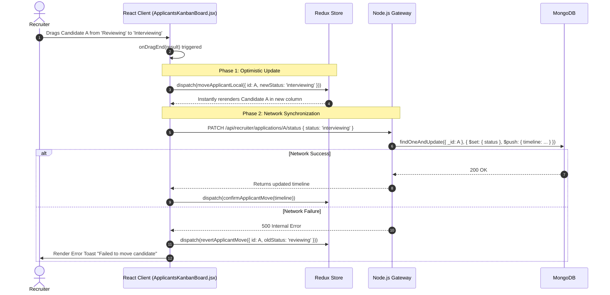
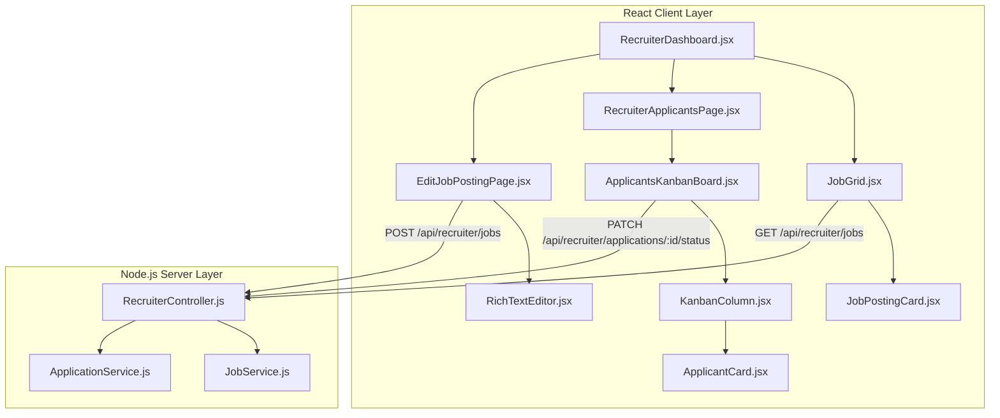

# Recruiter Dashboard & Job Management Module

## 1. Executive Summary & Domain Scope

The **Recruiter Dashboard & Job Management** module serves as the primary operational hub for users with the `recruiter` role. While the *Talent Discovery Workflow* handles the AI semantic search aspect of sourcing, this module is strictly focused on the creation, lifecycle management, and applicant tracking (via a Kanban board) of the recruiter's specific Job Postings.

### Core Problem Addressed
Recruiters juggle dozens of open requisitions simultaneously, each with hundreds of applicants at varying stages of the pipeline. Standard list-views make it difficult to visualize bottlenecks in the hiring process. This module introduces a highly visual, drag-and-drop Kanban Board system for every job posting, allowing recruiters to effortlessly transition candidates from "Applied" to "Interviewing" to "Hired".

### Target User Personas
- **Recruiters / Hiring Managers**: Need a centralized dashboard to track job posting performance (views vs. applications), a rich text editor to draft complex job requirements, and a frictionless interface to manage applicant states.

### High-Level Capability Matrix
**What the Module Does:**
- **Job Lifecycle Management**: Full CRUD operations for `JobPosting` documents (Draft, Publish, Close).
- **Kanban Applicant Tracking**: Renders a Trello-style board where each card is a candidate's application.
- **Rich Text Job Creation**: Integrates a WYSIWYG editor for drafting visually appealing job descriptions with embedded markdown support.
- **Funnel Analytics**: Displays conversion metrics (Views -> Applications -> Hires) for each active job.

**What the Module Deliberately Avoids:**
- **Automated Rejections**: Dragging a candidate to the "Rejected" column triggers the status update, but it does *not* automatically send a rejection email. The recruiter is prompted with a modal to draft a personalized note before the email fires, preserving candidate experience.

---

## 2. Comprehensive Architecture & Sequence Diagrams

The architecture focuses heavily on managing complex, nested React states during drag-and-drop operations, utilizing Optimistic UI updates to ensure the Kanban board feels instantly responsive even if the backend update takes 300ms.

### End-to-End User Flow (Drag & Drop State Mutation)



### Component Hierarchy & Service Boundaries



---

## 3. Detailed Data Models & Schemas

The recruiter dashboard relies on the same `JobPosting` and `JobApplication` schemas defined in the Recruitment workflow, but focuses specifically on the write-paths.

### Kanban Column Mapping

The frontend defines static columns that strictly map to the `enum` allowed in the `JobApplication.status` schema.

```javascript
// client/src/modules/recruiter-jobs/constants/kanbanColumns.js
export const KANBAN_COLUMNS = {
  applied: {
    id: 'applied',
    title: 'New Applications',
    color: 'bg-blue-500'
  },
  reviewing: {
    id: 'reviewing',
    title: 'Under Review',
    color: 'bg-amber-500'
  },
  interviewing: {
    id: 'interviewing',
    title: 'Interviewing',
    color: 'bg-indigo-500'
  },
  hired: {
    id: 'hired',
    title: 'Hired',
    color: 'bg-green-500'
  },
  rejected: {
    id: 'rejected',
    title: 'Rejected',
    color: 'bg-red-500'
  }
};
// Note: 'withdrawn' and 'invited' are handled in separate views, not the active Kanban board.
```

---

## 4. API Endpoints & State Management

### REST Endpoints

| Method | Endpoint | Auth Level | Purpose | Payload | Response |
| :--- | :--- | :--- | :--- | :--- | :--- |
| `GET` | `/api/recruiter/jobs` | Recruiter | Lists all jobs created by the authenticated recruiter. | `None` | `[{ _id, title, status, metrics }]` |
| `POST` | `/api/recruiter/jobs` | Recruiter | Creates a new job requisition. | `{ title, company, description, skills, salary }` | `{ success: true, jobId }` |
| `PATCH` | `/api/recruiter/jobs/:id` | Recruiter | Updates an existing job (e.g., closing a filled role). | `{ status: 'closed' }` | `{ success: true }` |
| `GET` | `/api/recruiter/jobs/:jobId/applicants` | Recruiter | Fetches all applications for the Kanban board. | `None` | `[{ application, candidatePreview }]` |
| `PATCH` | `/api/recruiter/applications/:id/status`| Recruiter | Moves a candidate between Kanban columns. | `{ status: "interviewing", note: "Optional feedback" }` | `{ success: true, timeline: [...] }` |

### Redux State Management for Drag & Drop

Managing Drag & Drop requires a highly normalized state to prevent iterating over massive arrays on every mouse movement.

```javascript
// client/src/features/recruiter/kanbanSlice.js
import { createSlice } from '@reduxjs/toolkit';

export const kanbanSlice = createSlice({
  name: 'kanban',
  initialState: {
    columns: {
      applied: [],
      reviewing: [],
      interviewing: [],
      hired: [],
      rejected: []
    },
    applicantsHash: {}, // O(1) lookup: { "app_123": { _id, candidateId, resumeId } }
    loading: false
  },
  reducers: {
    initializeBoard: (state, action) => {
      // Clear existing columns
      Object.keys(state.columns).forEach(key => state.columns[key] = []);
      
      // Populate Hash and Columns
      action.payload.forEach(app => {
        if (state.columns[app.status]) {
          state.columns[app.status].push(app._id);
          state.applicantsHash[app._id] = app;
        }
      });
    },
    optimisticMove: (state, action) => {
      const { applicantId, sourceCol, destCol, destIndex } = action.payload;
      
      // Remove from source
      state.columns[sourceCol] = state.columns[sourceCol].filter(id => id !== applicantId);
      
      // Insert into destination at specific index
      state.columns[destCol].splice(destIndex, 0, applicantId);
      
      // Update hash status
      state.applicantsHash[applicantId].status = destCol;
    },
    revertMove: (state, action) => {
      // Identical to optimisticMove but reversing the parameters 
      // Triggered if the Axios PATCH fails.
    }
  }
});
```

---

## 5. Security, Edge Cases & Error Handling

### RBAC Authorization & Tenant Isolation
A severe risk is an IDOR vulnerability where Recruiter A attempts to view or mutate the applicants of Job Posting B (owned by Recruiter B).
- **Middleware Protection**: Every route touching `/api/recruiter/jobs/:id/*` is gated by the `verifyJobOwnership` middleware.
- **Implementation**: It asserts that `JobPosting.findOne({ _id: req.params.id, recruiterId: req.user._id })` returns a document. If null, a `403 Forbidden` is thrown, blocking access to the applicant PII (Personally Identifiable Information).

### XSS Prevention in Rich Text
The `EditJobPostingPage` utilizes a WYSIWYG editor (like `react-quill`) which generates raw HTML.
- **Edge Case**: A malicious recruiter pastes `<script>alert('Stealing cookies')</script>` into the job description.
- **Handling**: The backend utilizes `DOMPurify` (run on the server side via `jsdom`) to aggressively strip all `<script>`, `<style>`, and `<iframe`> tags from the `description` payload before saving to MongoDB. The frontend additionally utilizes `dangerouslySetInnerHTML` with extreme caution, re-running a client-side sanitize pass before render.

### Drag & Drop Race Conditions
If two recruiters are managing the same Kanban board simultaneously:
- Recruiter A moves Candidate X to 'Rejected'.
- Recruiter B (whose screen hasn't refreshed) moves Candidate X to 'Interviewing'.
- **Handling**: The backend `PATCH /status` route requires an `expectedPreviousStatus` parameter. When Recruiter B fires their request, it includes `expectedPreviousStatus: 'reviewing'`. The backend checks the DB, sees the status is actually 'rejected', and throws a `409 Conflict`. Recruiter B's optimistic UI update is reverted, and a toast notifies them: "This candidate's status was modified by another user."

---

## 6. Component-Level Implementation Specs

### `ApplicantsKanbanBoard.jsx`
Wraps the entire board in a `<DragDropContext>` (from `@hello-pangea/dnd` or `react-beautiful-dnd`).
- **`onDragEnd` logic**: Parses the `result` object. If `result.destination` is null (dropped outside a column), it aborts. Otherwise, it calculates the `sourceCol`, `destCol`, and `destIndex` to fire the `optimisticMove` action.

### `KanbanColumn.jsx`
Wraps its children in a `<Droppable>` container.
- **Styling**: Utilizes dynamic Tailwind classes. When a user drags an item *over* the column, the `snapshot.isDraggingOver` boolean is used to apply a subtle background highlight (`bg-gray-800/50`) indicating a valid drop zone.

### `ApplicantCard.jsx`
Wrapped in a `<Draggable>` container.
- Renders the candidate's name, their `MatchScore` (if previously calculated by the Talent Finder), and an avatar.
- **Performance**: Heavily memoized using `React.memo`. Since a column might contain 200 applicants, dragging a card causes the parent `<Droppable>` to re-render. Memoizing the cards ensures only the dragged card and the affected siblings re-render, keeping framerates at a locked 60fps.

### `EditJobPostingPage.jsx`
The form uses `react-hook-form` coupled with `zod` for robust client-side validation.
- **Dynamic Skill Tags**: Integrates a specialized input component where typing a comma (",") or pressing Enter instantly converts the typed string into a visual pill badge, appending it to the `skills` array state.
- **Auto-Save**: Implements a debounced auto-save mechanism. Every 15 seconds, if the `isDirty` flag is true, it silences patches the `JobPosting` as a 'draft' to prevent data loss.
EOF
