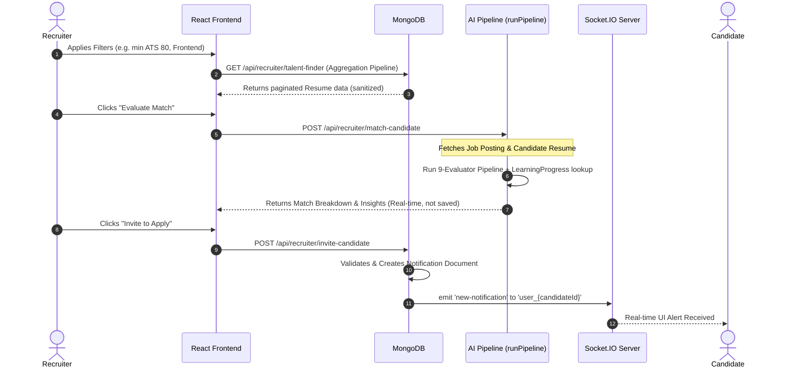

# Recruiter Module

The Recruiter Module provides proactive talent discovery, comprehensive job management, and an AI-driven candidate intelligence matching pipeline. It empowers recruiters to find the best talent and evaluate applicants using a multi-dimensional scoring system.

---

## 1. System Architecture & Component Interactions

### Talent Discovery & Invitation Workflow

This workflow maps out how a recruiter discovers a candidate, runs a real-time AI evaluation, and invites them to apply.

---

## 2. End-to-End Workflows

### A. AI Talent Finder & Semantic Search
1. **Search Mechanics**: The Talent Finder uses a complex MongoDB aggregation pipeline on the `Resume` collection.
   - Leverages `$text` search (with `$meta textScore`) if a query is provided.
   - `$match` on skills using regex and `$all` operators.
   - Extracts graduation year via regex on the `education` array.
2. **Specialization Mapping**: The frontend maps broad domains to specific technical skills for filtering:
   - *Frontend*: react, vue, angular, javascript, typescript, html, css, next.js, svelte
   - *Backend*: node.js, express, django, flask, spring, java, go, rust, fastapi
   - *DevOps*: docker, kubernetes, aws, azure, gcp, ci/cd, terraform

### B. Job Posting & Recruiter Intelligence Matching
1. **Job Management**: Recruiters can create, edit, and delete job postings. The system features cross-field validation to ensure `salary.max >= salary.min`.
2. **Intelligence Pipeline**: When a student applies, or when a recruiter evaluates a candidate in the Talent Finder, the system computes a weighted match score:
   - **Formula**: `finalScore = (ATS × 0.20) + (Skills × 0.35) + (Projects × 0.25) + (Career × 0.10) + (Contributions × 0.10)`
   - The Career (readiness) and Contribution metrics are pulled dynamically from the student's `LearningProgress` document.
3. **Match Categories**: 
   - `≥ 85`: Excellent Match
   - `≥ 70`: Moderate Match
   - `≥ 50`: Growth Potential
   - `< 50`: Weak Alignment
4. **Hiring Signals generated**: The AI generates actionable tags such as "Fast-Track Candidate" (score ≥ 85), "Growth Potential Candidate" (High contributions but score < 70), or "ATS Optimization Needed".

### C. Candidate Invitation Workflow
1. **Validation**: Prevents duplicate invitations and ensures the target user is strictly a "student".
2. **Real-Time Delivery**: Triggers a Socket.IO `new-notification` event directed strictly to `user_{candidateId}`.
3. **Data Persistence**: Creates a `Notification` document (type: "job-update") linking the recruiter, company, and job title to ensure the alert survives a page refresh.

---

## 3. Database Models

### JobPosting (`server/src/database/models/JobPosting.js`)
Tracks the requirements and metadata of a job role.
- `title`, `description`, `jobLevel`: Core metadata.
- `skills`: Auto-lowercased array of required skills.
- `salary`: Nested object with custom validation (`max >= min`).
- **Indexes**: Includes `{ title: "text" }` and compound indexes for efficient recruiter dashboard sorting.

### JobApplication (`server/src/database/models/JobApplication.js`)
Tracks a candidate's application and the persisted AI evaluation.
- `job` & `applicant`: References to `JobPosting` and `User`.
- `aiMatchScore`: 0-100 aggregated score.
- `matchCategory`: Derived category (e.g., "Excellent Match").
- `aiRecruiterInsights`, `aiWeaknesses`, `aiHiringSignals`: Arrays of AI-generated bullet points summarizing the candidate's fit.

---

## 4. API Endpoints & Socket Events

### REST API Endpoints
| Method | Endpoint | Description | Auth |
| :--- | :--- | :--- | :--- |
| `POST` | `/api/jobs` | Create a new job posting | Recruiter |
| `GET` | `/api/jobs/recruiter` | List recruiter's owned jobs | Recruiter |
| `GET` | `/api/jobs/:id/applications` | Filtered list of applicants | Recruiter |
| `GET` | `/api/recruiter/talent-finder` | Search the global Resume database | Recruiter |
| `POST` | `/api/recruiter/match-candidate` | Run real-time AI evaluation (no persistence) | Recruiter |
| `POST` | `/api/recruiter/invite-candidate` | Send a job application invite | Recruiter |

### Socket.IO Events
| Event Name | Direction | Payload | Description |
| :--- | :--- | :--- | :--- |
| `new-notification` | Server → Client | `Notification Document` | Emitted to `user_{candidateId}` room upon invite |

---

## 5. Key Files Reference

**Frontend Components (`client/src/modules/recruiter-jobs/`)**
- `pages/RecruiterJobsPage.jsx` - Job listings dashboard.
- `pages/RecruiterApplicantsPage.jsx` - Applicant tracking and AI filtering.
- `pages/TalentFinderPage.jsx` - Proactive candidate discovery.
- `components/JobPostingForm.jsx` - Job creation/editing UI.

**Backend Services (`server/src/modules/`)**
- `jobs/controller.js` & `jobs/service.js` - Job management and applicant retrieval.
- `recruiter/controller.js` - Aggregation pipelines for Talent Finder and invitation delivery.
- `recruiterIntelligence/service.js` - AI candidate evaluation engine orchestrating the weighted scores.
