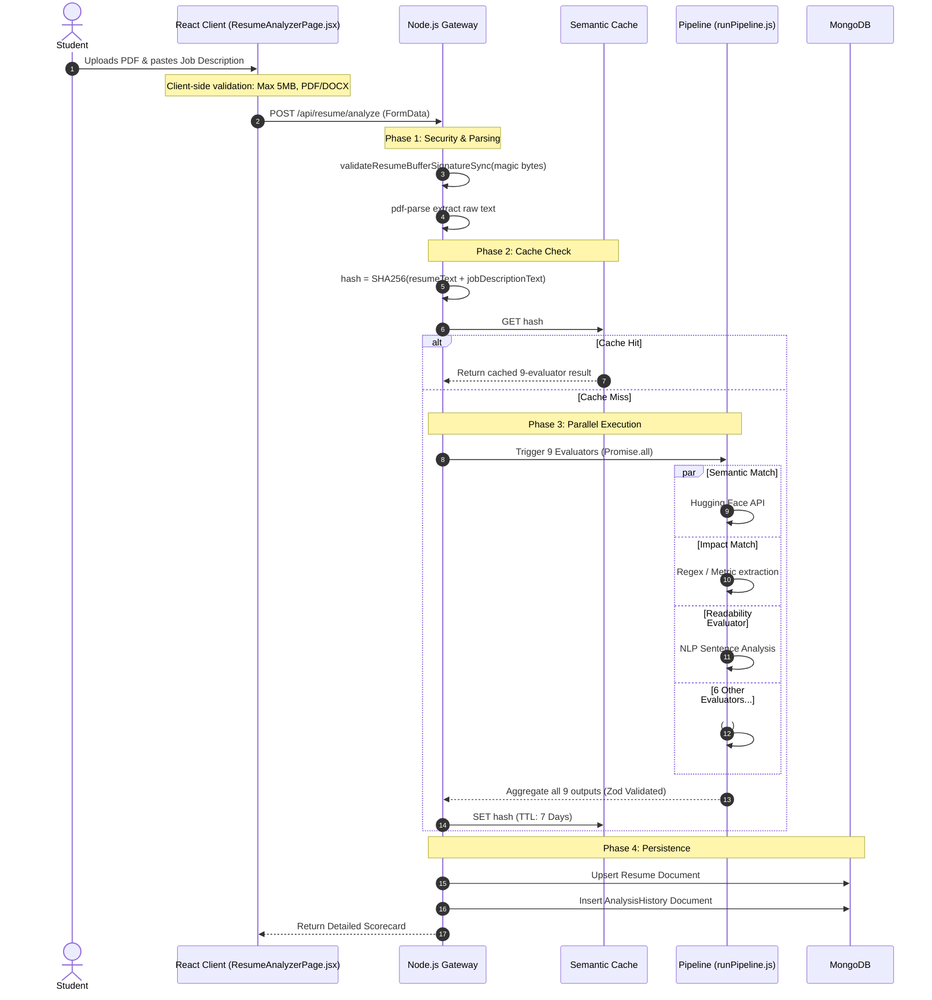
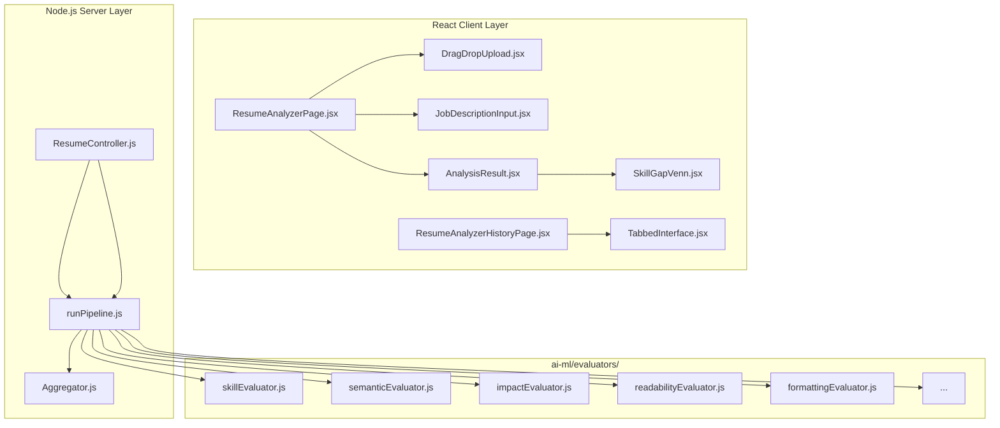

# AI Resume Analyzer Module Architecture

## 1. Executive Summary & Domain Scope

The **AI Resume Analyzer** provides comprehensive, multi-dimensional resume evaluation using a modular 9-evaluator pipeline. It acts as the core parsing and scoring engine that feeds structural data into the Job Matcher, the Learning Roadmaps, and the Recruiter Talent Finder modules.

### Core Problem Addressed
Generic ATS (Applicant Tracking System) checkers rely almost entirely on simple keyword matching. If a job description says "UI Development" and the resume says "Frontend Engineering", standard parsers fail the candidate. Furthermore, they do not measure the *quality* of the experience (e.g., quantifiable impact, power verbs, sentence readability). This module solves this by executing 9 distinct ML/NLP evaluators concurrently to provide a deeply nuanced score across semantic meaning, grammatical consistency, and technical breadth.

### Target User Personas
- **Students / Candidates**: Need instant, brutally honest feedback on their resume formatting, missing skills, and overall ATS compatibility before submitting a real application.

### High-Level Capability Matrix
**What the Module Does:**
- **Dual Scoring Modes**: Automatically adjusts its scoring weights based on whether the user provided a target Job Description (JD Match Mode) or just uploaded a naked resume (Industry Benchmark Mode).
- **Parallel AI Execution**: Executes 9 separate evaluation functions concurrently via `Promise.all` to minimize latency.
- **Deep Document Parsing**: Extracts raw text from complex PDFs and DOCX files.
- **Semantic Caching**: Utilizes a Redis/MongoDB caching layer based on SHA-256 hashes of the file buffer to return instant results for duplicate uploads.
- **Advanced ATS Scoring**: Utilizes deep linguistic analysis to score readability (Flesch-Kincaid analogs) and formatting standard compliance.
- **Unified History Hub**: Exposes a deeply paginated tabbed interface to review past resume analyses and generated cover letters.

**What the Module Deliberately Avoids:**
- **File Storage Bloat**: The platform avoids storing the raw multi-megabyte PDF binaries forever. It relies heavily on parsed text extraction to keep the database lightweight, using AWS S3 / Cloudinary for temporary binary retention.

---

## 2. Comprehensive Architecture & Sequence Diagrams

The architecture focuses on high-speed text extraction followed by massive parallelization.

### End-to-End User Flow (Analysis Pipeline)



### Component Hierarchy & Service Boundaries



---

## 3. Detailed Data Models & Schemas

### MongoDB Schemas

**Resume Schema (`src/database/models/Resume.js`)**
Stores the parsed representation of the candidate.

```javascript
const mongoose = require('mongoose');

const resumeSchema = new mongoose.Schema({
  user: { 
    type: mongoose.Schema.Types.ObjectId, 
    ref: 'User', 
    required: true, 
    index: true 
  },
  title: { type: String, default: 'My Resume' },
  isActive: { type: Boolean, default: false },
  
  // Structured Parsed Data
  skills: [{ type: String }],
  experience: [{
    role: String,
    company: String,
    duration: String,
    description: String
  }],
  education: [{
    degree: String,
    institution: String,
    year: String
  }],
  
  resumeText: { type: String, select: false }, // Excluded from default queries to save bandwidth
  
  // The aggregated scorecard
  evaluation: {
    aggregatedScore: Number,
    mode: { type: String, enum: ['match', 'benchmark'] },
    classification: { type: String, enum: ['Beginner', 'Intermediate', 'Advanced', 'Strong Match'] },
    
    // Sub-scores from the 9 evaluators
    skillMatch: { score: Number, matched: [String], missing: [String] },
    keywordMatch: { score: Number, found: [String], missing: [String] },
    semanticMatch: { score: Number, similarityScore: Number },
    impactMatch: { score: Number, metricsFound: [String], suggestions: [String] },
    atsOptimization: { score: Number, issues: [String] },
    readabilityMatch: { score: Number, scoreReadability: Number, suggestions: [String] },
    formattingMatch: { score: Number, issues: [String] },
    
    gapAnalysis: {
      criticalGaps: [String],
      recommendedSkills: [String]
    }
  }
}, { timestamps: true });

// Ensure a user can only have one active resume at a time
resumeSchema.index({ user: 1, isActive: 1 });

module.exports = mongoose.model('Resume', resumeSchema);
```

**Analysis History Schema (`src/database/models/AnalysisHistory.js`)**
Because the `Resume` model is mutable, we need an immutable ledger to track how a student's score improves over time.

```javascript
const mongoose = require('mongoose');

const analysisHistorySchema = new mongoose.Schema({
  userId: { type: mongoose.Schema.Types.ObjectId, ref: 'User', required: true, index: true },
  resumeId: { type: mongoose.Schema.Types.ObjectId, ref: 'Resume', required: true },
  jobDescriptionProvided: { type: Boolean, default: false },
  scoreSnapshot: { type: Number, required: true },
  classificationSnapshot: { type: String, required: true },
  timestamp: { type: Date, default: Date.now }
});

module.exports = mongoose.model('AnalysisHistory', analysisHistorySchema);
```

---

## 4. API Endpoints & State Management

### REST Endpoints

| Method | Endpoint | Auth Level | Purpose | Payload | Response |
| :--- | :--- | :--- | :--- | :--- | :--- |
| `POST` | `/api/resume/analyze` | Student | Upload + full 9-evaluator AI analysis. | `FormData { file, jobDescription }` | `{ success: true, evaluation: {...} }` |
| `GET` | `/api/resume/me/latest` | Any | Get active/latest resume for display on profile. | `None` | `{ resume: {...} }` |
| `PATCH` | `/api/resume/:id/active` | Student | Flags a specific resume as the primary active one for job matching. | `None` | `{ success: true }` |
| `POST` | `/api/resume/:id/cover-letter` | Student | Uses Gemini to generate an AI cover letter based on the parsed resume text. | `{ tone: "Professional" }` | `{ coverLetter: "..." }` |
| `GET` | `/api/resume/history` | Student | Deeply paginated fetch for the Unified History Hub. | `?page=1&type=analysis` | `{ history: [...], pagination: {...} }` |

### The 9-Evaluator Weighting Matrix (Dual Mode)

The aggregator changes the mathematical weighting of the sub-scores based on the presence of a Job Description.

```javascript
// server/src/ai-ml/config/weights.config.js
module.exports = {
  JD_MATCH_MODE: {
    semanticMatch: 0.20,
    skillMatch: 0.15,
    keywordMatch: 0.15,
    impactMatch: 0.15,
    experienceMatch: 0.10,
    atsOptimization: 0.10,
    readabilityMatch: 0.10,
    consistencyMatch: 0.05
  },
  BENCHMARK_MODE: {
    // If no JD is provided, Semantic/Keyword/Experience are irrelevant (0)
    impactMatch: 0.40,
    atsOptimization: 0.30,
    readabilityMatch: 0.15,
    consistencyMatch: 0.10,
    techStandard: 0.05
  }
};
```

---

## 5. Security, Edge Cases & Error Handling

### PDF Magic Byte & SSRF Validation
If a user renames `malicious.exe` to `resume.pdf`, standard mime-type checking via `multer` will fail to detect the threat.
- **Handling**: The backend utilizes `file-type` to inspect the raw binary buffer (the "magic bytes"). If the buffer headers do not explicitly match `application/pdf` or `application/msword`, the upload is rejected with a `415 Unsupported Media Type` error before it ever reaches the parsing layer.
- **SSRF Prevention**: If the resume text contains hyperlinks (e.g., a portfolio link), the backend runs a regex extractor. If it detects internal IP ranges (`127.0.0.1`, `169.254.x.x`), it strips the links to prevent Server-Side Request Forgery via the parsing library.

### ML Service Latency Optimization
Running 9 deep linguistic models sequentially could take 30 seconds.
- **Handling**: The `runPipeline.js` orchestrator utilizes `Promise.allSettled`. This allows the Regex/Heuristic evaluators (like Impact and ATS Formatting) to execute in milliseconds on the Node.js event loop, while simultaneously awaiting the HTTP response from the Hugging Face Inference API for the `semanticMatch`. 

### Evaluator Failure Isolation
If the Hugging Face API goes down, the entire analysis should not fail.
- **Handling**: Because `Promise.allSettled` is used, if `semanticMatch` throws a TimeoutError, the Aggregator intercepts the rejection, logs a warning, and dynamically re-distributes its 20% weight across the remaining 8 successful evaluators, ensuring the student still receives a highly accurate score.

---

## 6. Component-Level Implementation Specs

### `ResumeAnalyzerPage.jsx`
The main orchestrator component.
- Implements a Split-Pane design on desktop. The left pane handles the `DragDropUpload` and `JobDescriptionInput`. The right pane is conditionally rendered: initially showing a `ResumeSkeleton` (a pulsing CSS layout simulating AI thought), and eventually swapping to the `AnalysisResult` once the data arrives.

### `AnalysisResult.jsx`
A massive dashboard component broken down into discrete visual sections.
- **Score Ring**: Uses an SVG `<circle>` with a computed `stroke-dashoffset` to smoothly animate the final `aggregatedScore` from 0 to its actual value on mount.
- **SkillGapVenn.jsx**: A custom SVG component representing the intersection of "Your Skills" and "Job Requirements". It calculates the circle overlap ratios mathematically based on the length of the `matchedSkills` vs `missingSkills` arrays.

### `ResumeAnalyzerHistoryPage.jsx` (Unified History Hub)
The newly introduced hub to centralize historical artifacts.
- **Tabbed Interface**: Utilizes a sleek, animated pill-style tab selector (`framer-motion` `layoutId="activeTab"`) to seamlessly swap the view between "Resume Analyses" and "Cover Letters".
- **Pagination**: Unlike earlier implementations that hardcoded a 10-item limit, this component natively supports robust API pagination. It tracks `raPage` and `clPage` separately in state, ensuring that changing pages on the Cover Letter tab does not reset the scroll position of the Analysis tab.
- **Aesthetic Consistency**: Applies the platform's standardized floating icons, custom CSS text gradients, and decorative layout blobs to ensure the history page feels as premium as the main analyzer interface.
EOF
