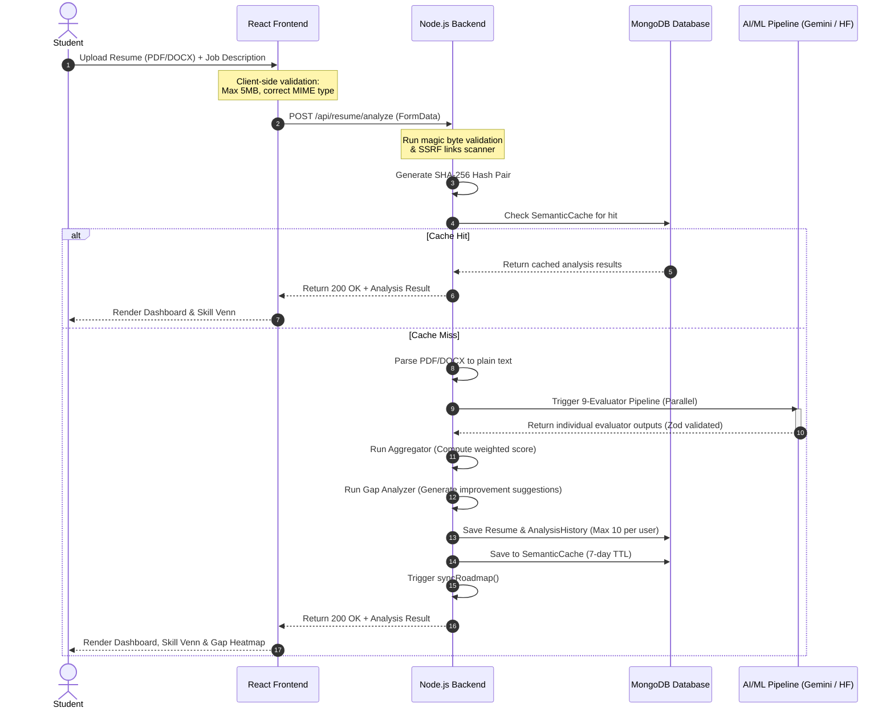

# Resume Analyzer Module

The AI Resume Analyzer provides comprehensive, multi-dimensional resume evaluation using a modular 9-evaluator pipeline. It supports dual modes—**Job Description (JD) Matching** and **Industry Benchmarking**—to score resumes on skill relevance, ATS readability, quantifiable impact, grammatical consistency, and technical depth.

---

## 1. System Architecture & Component Interactions



---

## 2. End-to-End Pipeline Workflow

### Phase A: Upload & Security Guardrails
1. **File Type & Signature Validation**:
   - The user uploads a file via `DragDropUpload`.
   - Before uploading, the frontend validates that the file size is under 5MB.
   - The server inspects the buffer headers using **magic byte helpers** (`validateResumeBufferSignatureSync`) to confirm that a renamed `.txt` file cannot bypass filters as a `.pdf`.
2. **SSRF Link Verification**:
   - The text is scanned for hyperlinks (e.g., LinkedIn, GitHub, portfolio).
   - Each link is passed to `verifyLink()` to prevent Server-Side Request Forgery (SSRF) by blocking private IPs (`127.0.0.1`, `192.168.x.x`), localhost, and cloud metadata endpoints (`169.254.169.254`).

### Phase B: Hashing & Semantic Caching
1. **Hash Generation**:
   - The server takes the SHA-256 hash of the plain-text resume content.
   - If a JD is provided, it generates a combined hash of `resumeText + jobDescriptionText`.
2. **Cache Lookup**:
   - The server queries the `SemanticCache` collection.
   - If a match is found, the pipeline bypasses AI model execution entirely, cutting analysis time from ~4 seconds down to under 200 milliseconds.
   - Cache entries have a **7-day Time-To-Live (TTL)** index.

### Phase C: Text Parsing
- If the cache misses, the server extracts raw text using `pdf-parse` or standard docx parsers.
- It extracts contact information, profile links, skills, experience blocks, and project sections.

### Phase D: The 9-Evaluator AI Pipeline
The core of the analyzer is a modular pipeline where all 9 evaluators execute concurrently using `Promise.all`:

```text
┌───────────────────────────────────────────────────────────────────────────────────┐
│                                runPipeline.js                                     │
├──────────────────────────┬─────────────────────────────┬──────────────────────────┤
│    skillMatch            │    keywordMatch             │    experienceMatch       │
│    (exact matches)       │    (synonym expansion)      │    (duration validation) │
├──────────────────────────┼─────────────────────────────┼──────────────────────────┤
│    semanticMatch         │    impactMatch              │    atsOptimization       │
│    (embeddings similarity)│    (quantifiable metrics)   │    (parser readiness)    │
├──────────────────────────┼─────────────────────────────┼──────────────────────────┤
│    readabilityMatch      │    consistencyMatch         │    techStandard          │
│    (power verbs scan)    │    (generic cliché check)    │    (domain breadth check)│
└──────────────────────────┴─────────────────────────────┴──────────────────────────┘
```

1. **`skillMatch`**: Measures direct intersections of hard and soft skills.
2. **`keywordMatch`**: Scans for specific keywords from the job description, using synonym matching.
3. **`experienceMatch`**: Checks duration of work experiences against required JD experience.
4. **`semanticMatch`**: Uses Hugging Face/Gemini Embeddings to compute cosine similarity between the resume text and the job description, capturing structural alignment even when different vocabularies are used.
5. **`impactMatch`**: Checks for quantifiable metrics (e.g., percentages, dollar amounts, multipliers like `2x`) and power verbs.
6. **`atsOptimization`**: Evaluates parseability, standard section headings, and contact block formatting.
7. **`readabilityMatch`**: Scores formatting, sentence lengths, and the presence of professional action verbs.
8. **`consistencyMatch`**: Scans for repetitive phrasing, overly generic clichés, and buzzwords.
9. **`techStandard`**: Benchmarks the breadth of skills against standard industry profiles (e.g., frontend, backend, fullstack).

---

## 3. Dual Scoring Modes

Scoring weights adjust automatically based on whether a job description is provided:

| Evaluator | Weight (JD Match Mode) | Weight (Benchmark Mode) | Primary Metric Target |
| :--- | :--- | :--- | :--- |
| **`semanticMatch`** | 20% | 0% | Semantic context similarity |
| **`skillMatch`** | 15% | 0% | Core skill overlap |
| **`keywordMatch`** | 15% | 0% | Exact keyword overlap |
| **`impactMatch`** | 15% | 40% | Quantified accomplishments |
| **`experienceMatch`** | 10% | 0% | Years of experience match |
| **`atsOptimization`** | 10% | 30% | Parser friendliness and sections |
| **`readabilityMatch`** | 10% | 15% | Flow, layout clarity, power verbs |
| **`consistencyMatch`** | 5% | 10% | Formatting and no jargon clichés |
| **`techStandard`** | 0% | 5% | Industry role standards alignment |

---

## 4. Database Models

### Resume Schema (`server/src/database/models/Resume.js`)

```javascript
{
  user: { type: Schema.Types.ObjectId, ref: 'User', required: true, index: true },
  title: { type: String, default: 'My Resume' },
  isActive: { type: Boolean, default: false },
  skills: [{ type: String }],
  experience: [{
    role: String,
    company: String,
    duration: String,
    description: String
  }],
  education: [{
    degree: String,
    institution: String,
    year: String
  }],
  projects: [{
    title: String,
    description: String,
    link: String
  }],
  linkedin: String,
  github: String,
  portfolio: String,
  resumeText: { type: String, select: false }, // Excluded from default queries for privacy
  file: {
    originalName: String,
    storedName: String,
    path: String,
    size: Number,
    mimeType: String
  },
  evaluation: {
    aggregatedScore: Number,
    mode: { type: String, enum: ['match', 'benchmark'] },
    classification: { type: String, enum: ['Beginner', 'Intermediate', 'Advanced', 'Strong Match'] },
    skillMatch: { score: Number, matched: [String], missing: [String] },
    keywordMatch: { score: Number, found: [String], missing: [String] },
    semanticMatch: { score: Number, similarityScore: Number },
    impactMatch: { score: Number, metricsFound: [String], suggestions: [String] },
    atsOptimization: { score: Number, issues: [String] },
    readabilityMatch: { score: Number, scoreReadability: Number, suggestions: [String] },
    gapAnalysis: {
      criticalGaps: [String],
      recommendedSkills: [String]
    }
  }
}
```

---

## 5. Endpoints Specifications

| Method | Endpoint | Auth | Request Payload | Response Success Payload (200 OK) |
| :--- | :--- | :--- | :--- | :--- |
| `POST` | `/api/resume/analyze` | Student | `FormData` { `file`: File, `jobDescription`: String } | `{ success: true, evaluation: { aggregatedScore: 82, ... }, classification: "Strong Match" }` |
| `GET` | `/api/resume/me/latest` | Student | None | `{ success: true, resume: { ... } }` |
| `PATCH` | `/api/resume/:id/active` | Student | None | `{ success: true, message: "Active resume updated successfully" }` |
| `POST` | `/api/resume/:id/cover-letter` | Student | `{ tone: "Professional", language: "English" }` | `{ success: true, coverLetter: { content: "...", tone: "Professional" } }` |

---

## 6. Integration Points with Other Modules

1. **Learning Roadmap Module**:
   - When an analysis finishes, the `gapAnalysis.criticalGaps` list is checked.
   - The backend triggers `syncRoadmap(userId, evaluation.gapAnalysis)`.
   - This creates or updates a dynamic **Learning Roadmap** with tailored resource links matching the missing skills.
2. **Job Matcher Module**:
   - The active resume's parsed skills feed directly into the **Job Recommendation Engine** (`GET /api/jobs/recommendations`).
   - Recommends relevant jobs based on semantic fit.
3. **Recruiter Talent Finder**:
   - Recruiters performing searches query the `skills` index of the `Resume` model.
   - Candidates are ranked based on their latest `aggregatedScore`.
The AI Resume Analyzer provides comprehensive resume evaluation using a 9-evaluator pipeline that scores resumes on skill match, ATS readiness, impact, readability, and more. Supports dual modes: JD-matching and industry benchmarking.

## Architecture

```text
┌──────────────────────────────────────────────────────────────────┐
│                        React Frontend                             │
│  ResumeAnalyzerPage → DragDropUpload + JobDescriptionInput        │
│                     → AnalysisResult + SkillGapVenn               │
│                     → AnalysisReportPDF (export)                  │
│  resumeService.js (API client)                                   │
└──────────────────────────┬───────────────────────────────────────┘
                           │ REST API
┌──────────────────────────▼───────────────────────────────────────┐
│                      Node.js Backend                              │
│  routes.js → controller.js → service.js                           │
│  evaluatorAdapters.js → runPipeline.js (9 evaluators)            │
│  coverLetter.controller.js → Gemini AI                           │
│  Models: Resume, AnalysisHistory, SemanticCache, CoverLetter      │
└──────────────────────────┬───────────────────────────────────────┘
                           │
┌──────────────────────────▼───────────────────────────────────────┐
│                    AI/ML Pipeline                                  │
│  skillEvaluator | keywordEvaluator | experienceEvaluator         │
│  semanticEvaluator (HF API) | impactEvaluator                    │
│  readabilityEvaluator | consistencyEvaluator                     │
│  atsOptimizationEvaluator | techStandardEvaluator                │
│  aggregator.js → weighted scoring → gapAnalyzer → classifier     │
└──────────────────────────────────────────────────────────────────┘
```

## Resume Flow

1. **Student uploads PDF** → `DragDropUpload` validates file (max 5MB, PDF/DOC/DOCX)
2. **Optionally provides JD** → `JobDescriptionInput` with clipboard paste, .txt upload, auto-clean
3. **Clicks Analyze** → `POST /api/resume/analyze` with FormData (file + optional JD)
4. **Server parses** → Extracts text, skills, experience, education via `parseResume()`
5. **Cache check** → SHA-256 hash of resume+JD; returns cached result if hit
6. **Pipeline runs** → 9 evaluators execute in parallel via `Promise.all`
7. **Aggregation** → Weighted score computed (different weights for JD vs no-JD mode)
8. **Results saved** → Upserted to `Resume` model, history tracked in `AnalysisHistory`
9. **Response returned** → Score, breakdown, skill gap, suggestions, classification
10. **Roadmap sync** → If classification exists, triggers `syncRoadmap()` for learning path

## Dual Scoring Modes

| Mode          | Trigger                  | Weight Focus                                                                                                               |
| ------------- | ------------------------ | -------------------------------------------------------------------------------------------------------------------------- |
| ------        | ---------                | --------------                                                                                                             |
| **Match**     | Job description provided | Semantic (20%), Skill (15%), Keyword (15%), Impact (15%), Experience (10%), ATS (10%), Readability (10%), Consistency (5%) |
| **Benchmark** | No JD provided           | Impact (40%), ATS (30%), Readability (15%), Consistency (10%), Tech Standard (5%)                                          |

## Evaluator Pipeline

| Evaluator          | Weight (JD)   | Weight (No-JD)   | What It Measures                                   |
| ------------------ | ------------- | ---------------- | -------------------------------------------------- |
| -----------        | ------------- | ---------------- | ------------------                                 |
| `skillMatch`       | 0.15          | 0.00             | Exact skill overlap between resume and job         |
| `keywordMatch`     | 0.15          | 0.00             | JD keyword presence in resume                      |
| `experienceMatch`  | 0.10          | 0.00             | Years of experience comparison                     |
| `semanticMatch`    | 0.20          | 0.00             | Embedding-based semantic similarity (HF API)       |
| `impactMatch`      | 0.15          | 0.40             | Quantifiable achievements (%, $, multipliers)      |
| `atsOptimization`  | 0.10          | 0.30             | ATS compatibility (sections, contacts, formatting) |
| `readabilityMatch` | 0.10          | 0.15             | Sentence quality, power verb usage                 |
| `consistencyMatch` | 0.05          | 0.10             | Repetitive content, generic phrases                |
| `techStandard`     | 0.00          | 0.05             | Technical breadth across domains                   |

**Semantic caching:** Results cached in MongoDB with 7-day TTL using SHA-256 hash pairs.

## Database Models

### Resume

Stores parsed resume data and all evaluation results.

| Field                                                             | Type     | Notes                                          |
| ----------------------------------------------------------------- | -------- | ---------------------------------------------- |
| -------                                                           | ------   | -------                                        |
| `user`                                                            | ObjectId | Ref: User, indexed                             |
| `title`                                                           | String   | Default "My Resume"                            |
| `isActive`                                                        | Boolean  | Active baseline flag                           |
| `skills`, `education`, `experience`, `projects`, `certifications` | [String] | Parsed sections                                |
| `linkedin`, `github`, `portfolio`                                 | String   | Profile URLs                                   |
| `resumeText`                                                      | String   | `select: false` for privacy                    |
| `file`                                                            | Object   | originalName, storedName, path, size, mimeType |
| `skillMatch`, `keywordMatch`, `experienceMatch`, `semanticMatch`  | Object   | Evaluator results                              |
| `aggregatedScore`                                                 | Number   | Final weighted score                           |
| `classification`                                                  | String   | Beginner/Intermediate/Advanced/Strong Match    |
| `gapAnalysis`                                                     | Mixed    | Categorized improvement suggestions            |
| `mode`                                                            | String   | "match" or "benchmark"                         |

### AnalysisHistory

Tracks analysis history for version comparison. Max 10 records per user.

### SemanticCache

Caches semantic similarity results. TTL index expires after 7 days.

### CoverLetter

Generated cover letters linked to resume and job description.

## API Endpoints

| Method   | Endpoint                       | Auth    | Description                 |
| -------- | ------------------------------ | ------- | --------------------------- |
| -------- | ----------                     | ------  | -------------               |
| `POST`   | `/api/resume/upload`           | student | Upload resume file          |
| `POST`   | `/api/resume/analyze`          | student | Upload + full AI analysis   |
| `GET`    | `/api/resume/me/latest`        | any     | Get active/latest resume    |
| `GET`    | `/api/resume/list`             | student | List all resume versions    |
| `PATCH`  | `/api/resume/:id/active`       | student | Set active resume           |
| `PATCH`  | `/api/resume/:id/rename`       | student | Rename resume               |
| `DELETE` | `/api/resume/:id`              | student | Delete resume               |
| `GET`    | `/api/resume/result/:id`       | any     | Get specific result         |
| `POST`   | `/api/resume/compare`          | any     | AI compare two versions     |
| `POST`   | `/api/resume/:id/cover-letter` | student | Generate AI cover letter    |
| `GET`    | `/api/cover-letters`           | student | List cover letters          |
| `POST`   | `/api/cover-letters/generate`  | student | Template-based cover letter |

## Frontend Routes

| Route              | Page               | Description                                                 |
| ------------------ | ------------------ | ----------------------------------------------------------- |
| -------            | ------             | -------------                                               |
| `/resume-analyzer` | ResumeAnalyzerPage | Main analysis page with upload, JD input, results dashboard |

## Key Components

| Component             | Purpose                                                                     |
| --------------------- | --------------------------------------------------------------------------- |
| -----------           | ---------                                                                   |
| `ResumeAnalyzerPage`  | Orchestrates upload, analysis, results, version management (max 3 versions) |
| `DragDropUpload`      | Drag-and-drop + clipboard paste + file browser for PDF upload               |
| `JobDescriptionInput` | JD text input with paste from clipboard, .txt upload, auto-clean            |
| `AnalysisResult`      | Full results dashboard: score, metrics, skill gap, ATS checklist, actions   |
| `SkillGapVenn`        | SVG Venn diagram showing matched vs missing skills                          |
| `AnalysisReportPDF`   | Print-friendly layout for PDF export (html2canvas + jsPDF)                  |
| `ResumeSkeleton`      | Loading placeholder during analysis                                         |

## Version Management

- Students can upload up to **3 resume versions**
- One version is marked `isActive` (the baseline for matching)
- Switching active version reloads latest analysis for that version
- Deleting the active version auto-activates the most recent remaining one
- Inline rename support for version titles

## Cover Letter Generation

Two generation paths:

1. **AI-powered** (`coverLetter.controller.js`): Uses Google Gemini with dynamic prompt engineering
   - Tone options: Professional, Formal, Confident, Concise, Startup-Friendly, Creative
   - Language support: English, Hindi, German, French, Spanish
   - Saves to `CoverLetter` model

2. **Template-based** (`coverLetters/service.js`): Injects user data into a professional template
   - Faster, no AI dependency
   - Available via `/api/cover-letters/generate`

## Key Files

```text
client/src/modules/resume-analyzer/
├── pages/ResumeAnalyzerPage.jsx          # Main page (509 lines)
├── components/
│   ├── DragDropUpload.jsx                # File upload (284 lines)
│   ├── AnalysisResult.jsx                # Results dashboard (559 lines)
│   ├── JobDescriptionInput.jsx           # JD input (249 lines)
│   ├── AnalysisReportPDF.jsx             # PDF export template (364 lines)
│   ├── SkillGapVenn.jsx                  # Venn diagram (106 lines)
│   └── ResumeSkeleton.jsx               # Loading skeleton (117 lines)
└── services/resumeService.js             # API client (176 lines)

server/src/modules/resumes/
├── routes.js                             # 10 endpoints (197 lines)
├── controller.js                         # Core logic (519 lines)
├── service.js                            # DB operations (126 lines)
├── evaluatorAdapters.js                  # Pipeline adapters (134 lines)
└── coverLetter.controller.js             # AI cover letter (88 lines)

ai-ml/
├── evaluators/                           # 9 evaluators
│   ├── skillEvaluator.js
│   ├── keywordEvaluator.js
│   ├── experienceEvaluator.js
│   ├── semanticEvaluator.js
│   ├── impactEvaluator.js
│   ├── readabilityEvaluator.js
│   ├── consistencyEvaluator.js
│   ├── atsOptimizationEvaluator.js
│   └── techStandardEvaluator.js
├── pipeline/
│   ├── runPipeline.js                    # Orchestrator (257 lines)
│   ├── aggregator.js                     # Weighted scoring (37 lines)
│   ├── evaluatorContract.js              # Zod validation (19 lines)
│   └── recommendationEngine.js           # Multi-job matching (45 lines)
└── config/weights.config.js              # Weight maps
```

## Integration Points

- **Roadmap module**: Analysis triggers `syncRoadmap()` to update learning path based on skill gaps
- **Dashboard module**: Resume score feeds into skill tracking metrics
- **Job Matcher module**: Parsed resume data used for job recommendations
- **Recruiter Talent Finder**: Resume data searchable by recruiters
- **Notifications**: Cover letter generation and analysis events can trigger notifications
