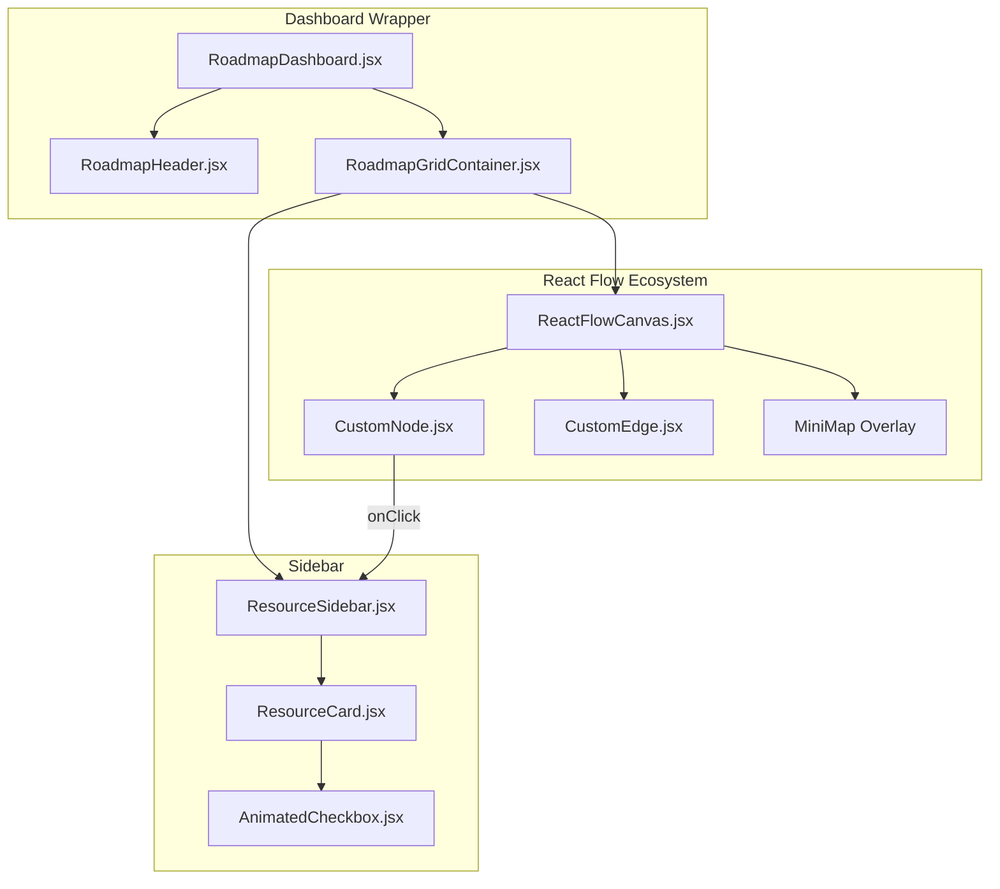
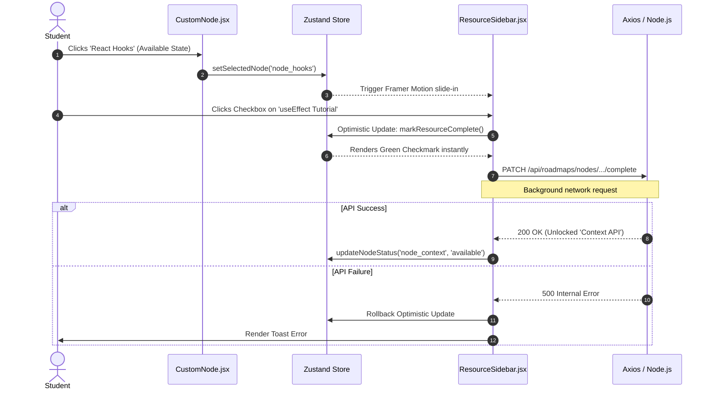

# Dynamic Learning Roadmap Feature

## 1. Executive Summary & Domain Scope

The **Learning Roadmap Feature** is the highly interactive, gamified frontend module responsible for rendering the student's personalized curriculum. While the backend traversal logic is covered in the *Learning Roadmaps Workflow*, this document focuses strictly on the React implementation, the Canvas rendering engine (`reactflow`), the state management, and the intricate UI/UX micro-interactions that keep users engaged.

### Core Problem Addressed
Presenting a massive curriculum of 50+ inter-dependent topics in a flat list or table is overwhelming and pedagogically flawed. Students need to visually comprehend how mastering "Promises" directly unlocks "Async/Await". The Roadmap feature solves this by rendering a spatial, interactive Directed Acyclic Graph (DAG) that students can pan, zoom, and explore.

### Target User Personas
- **Students**: Need a frictionless, highly visual interface that clearly indicates what they should study next, while providing immediate, gratifying feedback (animations, confetti) when they complete a task.

### High-Level Capability Matrix
**What the Module Does:**
- **Canvas Rendering**: Uses `reactflow` to render thousands of DOM nodes effortlessly via virtualization and spatial hashing.
- **Micro-Animations**: Leverages `framer-motion` for slide-over sidebars, pulsing available nodes, and celebratory success states.
- **Optimistic UI Updates**: Instantly mutates the local state when a user clicks "Complete Resource" without waiting for the network round-trip, ensuring zero UI lag.
- **Minimap Navigation**: Provides a miniaturized overlay of the entire tree so users never get lost while zooming.

**What the Module Deliberately Avoids:**
- **Physics-Based Layouts**: The nodes are not positioned using force-directed graphs (like `d3-force`) because force graphs are unpredictable. The layout uses a strict hierarchical positioning algorithm (e.g., Dagre) to ensure the tree flows perfectly top-to-bottom every time.

---

## 2. Comprehensive Architecture & Sequence Diagrams

The frontend architecture is heavily specialized around managing the spatial state (x,y coordinates) separately from the business state (is a node locked?).

### React Component Hierarchy



### End-to-End User Flow (UI Interaction)



---

## 3. Detailed Data Models & Schemas

The frontend receives a deeply nested JSON object from the server. However, `reactflow` requires a very specific array structure for `nodes` and `edges`.

### Node Data Structure (React Flow Format)

```javascript
// Example payload passed directly into <ReactFlow nodes={initialNodes} />
const initialNodes = [
  {
    id: "node_1",
    type: "custom", // Tells ReactFlow to use our CustomNode.jsx
    position: { x: 250, y: 50 },
    data: { 
      label: "JavaScript Fundamentals",
      status: "completed", // 'locked', 'available', 'completed'
      progress: 100,
      resources: [
        { id: "res_1", title: "Variables & Scopes", isCompleted: true }
      ]
    },
    // Prevent user from dragging the node to preserve the strict DAG layout
    draggable: false 
  },
  {
    id: "node_2",
    type: "custom",
    position: { x: 250, y: 150 },
    data: { 
      label: "Promises & Async",
      status: "available",
      progress: 0,
      resources: [
        { id: "res_2", title: "Event Loop Deep Dive", isCompleted: false }
      ]
    },
    draggable: false
  }
];
```

### Edge Data Structure

```javascript
const initialEdges = [
  {
    id: "e1-2",
    source: "node_1",
    target: "node_2",
    type: "smoothstep", // Creates pleasant rounded right-angles
    animated: true, // Only animate if source is completed and target is available
    style: { stroke: "#6366f1", strokeWidth: 2 }
  }
];
```

---

## 4. API Endpoints & State Management

### Zustand State Management

Because interacting with a canvas fires thousands of `onMouseMove` and `onWheel` events per second, standard React Context or Redux can cause catastrophic lag if not perfectly memoized. `zustand` is used because it allows components to bind to specific slices of state without triggering a re-render of the entire tree.

```javascript
// client/src/modules/roadmap/store/roadmapStore.js
import { create } from 'zustand';
import { applyNodeChanges, applyEdgeChanges } from 'reactflow';

export const useRoadmapStore = create((set, get) => ({
  nodes: [],
  edges: [],
  selectedNodeId: null,
  
  // High-frequency Canvas Event Handlers
  onNodesChange: (changes) => {
    set({ nodes: applyNodeChanges(changes, get().nodes) });
  },
  onEdgesChange: (changes) => {
    set({ edges: applyEdgeChanges(changes, get().edges) });
  },
  
  // Business Logic Handlers
  selectNode: (id) => set({ selectedNodeId: id }),
  closeSidebar: () => set({ selectedNodeId: null }),
  
  toggleResourceCompletion: (nodeId, resourceId) => {
    const nodes = get().nodes.map(node => {
      if (node.id !== nodeId) return node;
      
      const updatedResources = node.data.resources.map(res => 
        res.id === resourceId ? { ...res, isCompleted: !res.isCompleted } : res
      );
      
      // Calculate new progress percentage
      const completedCount = updatedResources.filter(r => r.isCompleted).length;
      const progress = Math.round((completedCount / updatedResources.length) * 100);
      
      return {
        ...node,
        data: { ...node.data, resources: updatedResources, progress }
      };
    });
    
    set({ nodes });
  }
}));
```

---

## 5. Security, Edge Cases & Error Handling

### Optimistic Rollback
If a user checks a box in the UI, the progress bar fills up instantly. However, if their WiFi drops before the `PATCH` request finishes, the UI is now out of sync with the database.
- **Handling**: The UI stores the previous state snapshot before executing the `toggleResourceCompletion` in Zustand. If the Axios `.catch()` block triggers, the UI instantly reverts the Zustand store to the snapshot and fires a "Network Error" toast via `react-hot-toast`.

### Mobile Viewport Constraints
Rendering a massive canvas on a mobile device introduces severe UX challenges (accidental zooming, impossible to click tiny nodes).
- **Handling**: The `RoadmapDashboard` utilizes a `useMediaQuery` hook. If the screen is less than `768px` (standard tablet), the canvas is completely unmounted. Instead, it renders a simplified `VerticalTimeline` component, flattening the DAG into a linear, scrollable list that is drastically easier to navigate with a thumb.

---

## 6. Component-Level Implementation Specs

### `CustomNode.jsx`
This is arguably the most complex UI component in the module. It must look distinct based on its `data.status`.

```jsx
import { Handle, Position } from 'reactflow';
import { CheckCircle, Lock, BookOpen } from 'lucide-react';

const CustomNode = ({ data, isConnectable }) => {
  const isLocked = data.status === 'locked';
  const isCompleted = data.status === 'completed';
  const isAvailable = data.status === 'available';

  return (
    <div className={`px-4 py-3 rounded-lg border-2 shadow-lg w-48 bg-gray-900 transition-all ${
      isLocked ? 'border-gray-700 opacity-50 grayscale' : 
      isCompleted ? 'border-green-500' : 
      'border-indigo-500 animate-pulse-border'
    }`}>
      {/* Invisible Handles required for Edges to connect */}
      <Handle type="target" position={Position.Top} isConnectable={false} className="opacity-0" />
      
      <div className="flex items-center justify-between mb-2">
        <h3 className="text-sm font-bold text-white truncate">{data.label}</h3>
        {isLocked && <Lock size={14} className="text-gray-500" />}
        {isCompleted && <CheckCircle size={14} className="text-green-500" />}
        {isAvailable && <BookOpen size={14} className="text-indigo-400" />}
      </div>
      
      {/* Mini Progress Bar embedded in the node */}
      <div className="w-full h-1.5 bg-gray-800 rounded-full overflow-hidden">
        <div 
          className={`h-full ${isCompleted ? 'bg-green-500' : 'bg-indigo-500'} transition-all duration-500`} 
          style={{ width: `${data.progress}%` }} 
        />
      </div>
      
      <Handle type="source" position={Position.Bottom} isConnectable={false} className="opacity-0" />
    </div>
  );
};
```

### `ReactFlowCanvas.jsx`
Configures the environment.
- It disables `nodesConnectable={false}` and `elementsSelectable={false}` to prevent the user from accidentally tearing the graph apart. The graph is read-only from a structural standpoint.
- Injects a dark theme `Background` with a dotted pattern to mimic a blueprint aesthetic.

### `ResourceSidebar.jsx`
Uses `<AnimatePresence>` from Framer Motion.
```jsx
<AnimatePresence>
  {selectedNodeId && (
    <motion.div
      initial={{ x: '100%' }}
      animate={{ x: 0 }}
      exit={{ x: '100%' }}
      transition={{ type: 'spring', damping: 20 }}
      className="absolute top-0 right-0 w-80 h-full bg-gray-900 border-l border-gray-800 shadow-2xl z-50 p-6"
    >
      {/* Map through resources and render cards */}
    </motion.div>
  )}
</AnimatePresence>
```
EOF
