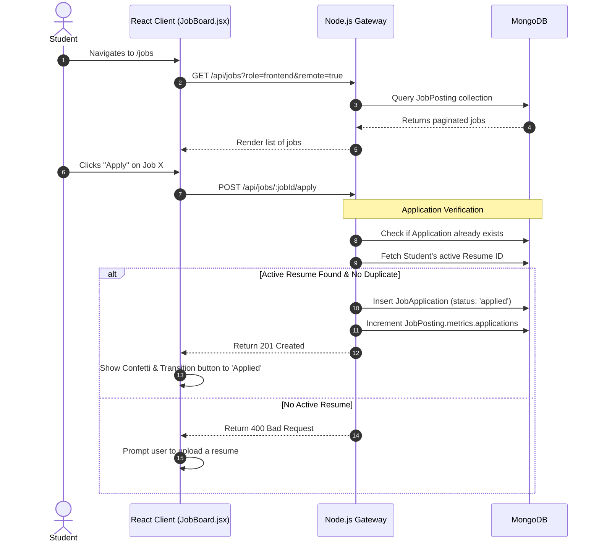
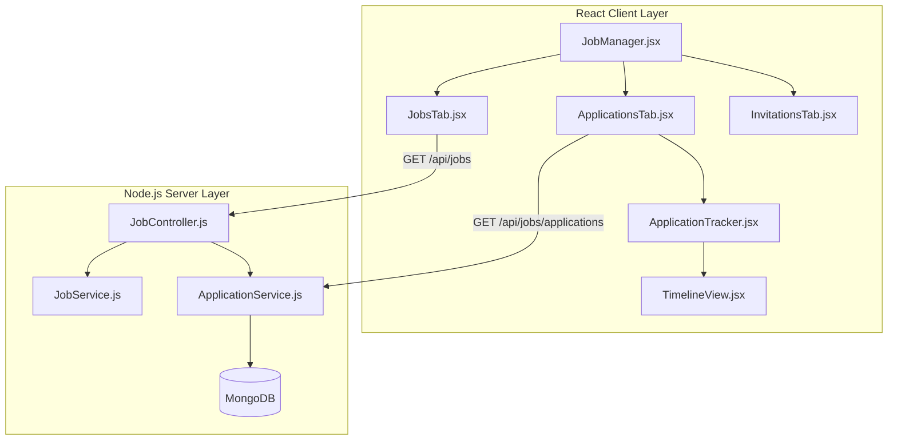

# Student Jobs & Applications Module

## 1. Executive Summary & Domain Scope

The **Student Jobs & Applications** module is the counterpart to the Recruiter Talent Finder. While the Job Matcher handles *automated* discovery via AI, this module handles the manual browsing, filtering, and lifecycle management of job applications for the student persona. It serves as the candidate's unified dashboard for tracking exactly where they stand in the hiring pipeline across multiple organizations.

### Core Problem Addressed
Applying to jobs across disparate company portals leads to a fragmented experience where students lose track of their application statuses, interview dates, and recruiter feedback. This module centralizes the entire application lifecycle into a single Kanban-style or list-view dashboard, natively tied to the resume they used to apply.

### Target User Personas
- **Students / Candidates**: Need a robust search interface to find specific roles (e.g., "Remote React Internship"), a frictionless application process utilizing their verified AI-scored resume, and a transparent tracking system to see if they've been rejected or advanced.

### High-Level Capability Matrix
**What the Module Does:**
- **Job Board**: Provides a standard, filter-heavy interface to browse all public `JobPosting` documents.
- **Application Tracking**: Maintains a real-time ledger of all submitted applications, updating status badges (`applied`, `reviewing`, `interviewing`, `rejected`) as the recruiter mutates them.
- **Invitation Management**: Allows students to view, accept, or decline direct proactive invitations sent by recruiters via the Talent Finder.
- **Application Withdrawal**: Empowers students to pull their application out of the pipeline, which removes their resume from the recruiter's view to enforce data privacy.

**What the Module Deliberately Avoids:**
- **External Redirection**: To maintain quality control and tracking fidelity, the platform does not allow "Apply on Company Site" links. All applications are processed natively within the SkillsSphere ecosystem.

---

## 2. Comprehensive Architecture & Sequence Diagrams

The architecture focuses on efficient querying of the `JobApplication` pivot collection, heavily populating (via Mongoose `$lookup`) the related `JobPosting` and `User` (Recruiter) data.

### End-to-End User Flow (Manual Job Application)



### Component Hierarchy & Service Boundaries



---

## 3. Detailed Data Models & Schemas

This module heavily utilizes the `JobApplication` schema. While the full schema is documented in the Recruitment workflow, the Student perspective relies heavily on the `timeline` array to render historical context.

### The Timeline Sub-Document

```javascript
// Embedded within JobApplication schema
timeline: [{
  status: { 
    type: String, 
    enum: ['applied', 'invited', 'reviewing', 'interviewing', 'rejected', 'withdrawn'] 
  },
  updatedAt: { 
    type: Date, 
    default: Date.now 
  },
  note: { 
    type: String // Optional public feedback provided by the recruiter
  }
}]
```
Whenever a recruiter changes the status of an application, the backend does not just overwrite the `status` field. It pushes a new entry onto the `timeline` array. This allows the frontend to render a vertical progression tracker (similar to package tracking UIs), showing the student exactly when their application moved from 'applied' to 'reviewing'.

---

## 4. API Endpoints & State Management

### REST Endpoints

| Method | Endpoint | Auth Level | Purpose | Payload | Response |
| :--- | :--- | :--- | :--- | :--- | :--- |
| `GET` | `/api/jobs` | Student | Browses all public jobs. Supports text search and filtering. | `?q=react&remote=true` | `{ jobs: [...], pagination: {...} }` |
| `GET` | `/api/jobs/:id` | Student | Fetches a single job with its full markdown description. | `None` | `{ job: {...} }` |
| `POST` | `/api/jobs/:jobId/apply` | Student | Submits an application using the Active Resume. | `None` | `{ success: true, applicationId }` |
| `GET` | `/api/jobs/applications` | Student | Fetches the user's application ledger. | `None` | `[{ application, jobPosting, timeline }]` |
| `PATCH` | `/api/jobs/applications/:id/withdraw` | Student | Aborts the application process. | `None` | `{ success: true }` |
| `PATCH` | `/api/jobs/applications/:id/accept-invite` | Student | Accepts a recruiter's proactive invitation. | `None` | `{ success: true }` |

### Redux State Management

```javascript
// client/src/features/studentJobs/studentJobsSlice.js
import { createSlice, createAsyncThunk } from '@reduxjs/toolkit';

export const fetchApplications = createAsyncThunk(
  'studentJobs/fetchApplications',
  async () => {
    const response = await api.get('/api/jobs/applications');
    return response.data;
  }
);

export const studentJobsSlice = createSlice({
  name: 'studentJobs',
  initialState: {
    applications: [], // Array of populated JobApplication objects
    invitations: [], // Filtered array where status === 'invited'
    loading: false
  },
  reducers: {},
  extraReducers: (builder) => {
    builder
      .addCase(fetchApplications.fulfilled, (state, action) => {
        state.loading = false;
        // Automatically partition the data for different tabs
        state.applications = action.payload.filter(app => app.status !== 'invited');
        state.invitations = action.payload.filter(app => app.status === 'invited');
      });
  }
});
```

---

## 5. Security, Edge Cases & Error Handling

### Orphaned Applications (Cascading Deletes)
- **Edge Case**: A student applies to Job X. The recruiter then deletes Job X entirely from the platform.
- **Handling**: The database utilizes Mongoose pre-remove hooks on the `JobPosting` model. If a posting is deleted, the backend performs a cascading `deleteMany` on all associated `JobApplication` records. The frontend intercepts this gracefully; if an application disappears from the state, it means the job was pulled.

### Resume Snapshotting (Immutability)
- **Edge Case**: A student applies to a Backend Node.js job using Resume A. A week later, they change their active resume to Resume B (a Frontend React resume) to apply for a different job. The recruiter for the Backend job logs in. Do they see the new Frontend resume?
- **Handling**: No. The `JobApplication` explicitly stores a hard reference (`resumeId`) to the specific document version used at the exact moment of application. If the student overwrites or deletes that specific resume version, the backend enforces a soft-delete mechanism, ensuring the recruiter still retains access to the historical snapshot they received.

### Application Rate Limiting
To prevent a malicious user or bot from applying to 10,000 jobs in a second:
- The `/apply` endpoint is governed by an aggressive rate limiter specific to the user's IP and ID: maximum 50 applications per hour.

---

## 6. Component-Level Implementation Specs

### `JobManager.jsx` (The Dashboard)
The primary layout component. It uses standard React Router tabs to switch between `/jobs/board`, `/jobs/applications`, and `/jobs/invitations`. It dispatches the initial data fetching thunks to populate the Redux store.

### `ApplicationTracker.jsx` (The Ledger)
Renders the list of active applications as highly styled cards.
- **Dynamic Badging**: Utilizes a helper function `getStatusColor(status)` to render Tailwind classes. 'reviewing' yields an amber badge, 'interviewing' yields an indigo badge, 'rejected' yields a muted gray badge.
- **Expandable Timeline**: Clicking the card reveals the nested `<TimelineView />`.

### `TimelineView.jsx` (Progress Visualization)
Maps over the `application.timeline` array.
- Renders a vertical dotted line using CSS borders (`border-l-2 border-dashed border-gray-600`).
- For each step, it renders a circular node. The most recent step pulses using a Tailwind `@keyframes` animation (`animate-pulse`).
- Displays the relative time format (e.g., "2 days ago") using a library like `date-fns`.

### `InvitationsTab.jsx`
A dedicated view for proactive outreach from recruiters.
- Renders the recruiter's name, company, and the specific job posting.
- Provides two massive, high-contrast action buttons: "Accept Invitation" (which patches the status to 'applied' and moves the card to the standard tracker) and "Decline" (which patches the status to 'withdrawn' and alerts the recruiter).
EOF
