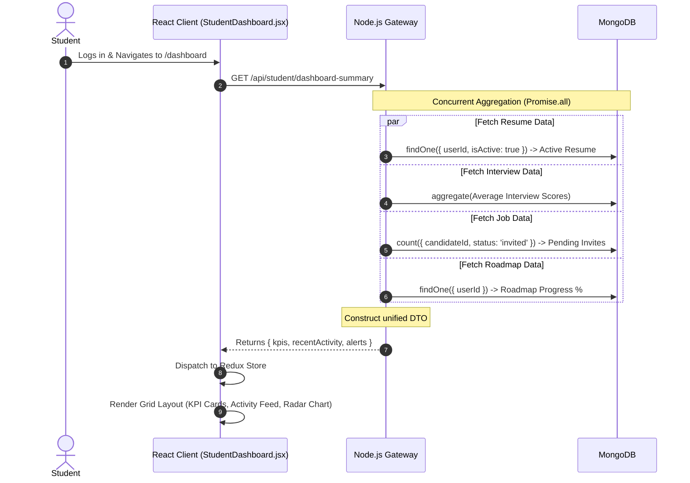
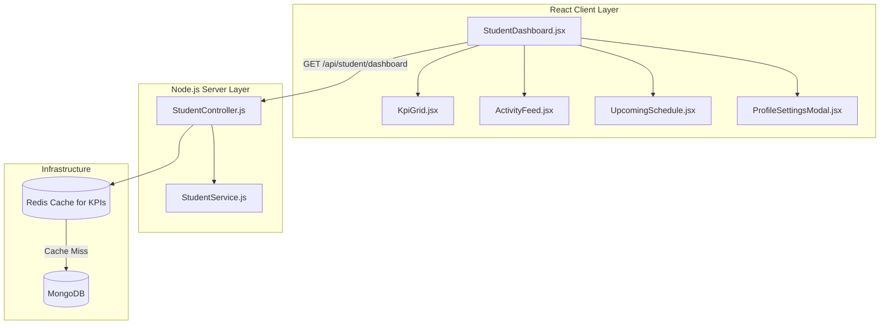

# Student Dashboard & Profile Module

## 1. Executive Summary & Domain Scope

The **Student Dashboard & Profile** module operates as the central hub (the "home base") for all users with the `student` role. While other modules (like Resume Analyzer or Interview Engine) handle specialized tasks, this module aggregates the data generated by those microservices into a unified, high-level visualization of the student's holistic progress, career readiness, and active cohorts.

### Core Problem Addressed
When an application is split into highly specialized vertical microservices, users often suffer from "data fragmentation." A student might have a 95% ATS score in one module, a failing Mock Interview score in another, and 4 pending job applications in a third. The Student Dashboard solves this by acting as a single pane of glass, aggregating these disparate data streams into digestible KPIs, recent activity feeds, and upcoming schedule alerts.

### Target User Personas
- **Students**: Require a rapid overview of their standing. They need to know immediately: "Do I have any pending recruiter invitations?", "Did my active resume score drop?", "When is my next Live Classroom?"

### High-Level Capability Matrix
**What the Module Does:**
- **KPI Aggregation**: Surfaces top-level metrics (Active Resume Score, Total Interviews, Learning Streak).
- **Activity Feed**: Normalizes events from all other services (e.g., `JobApplied`, `ResumeAnalyzed`, `RoadmapNodeCompleted`) into a unified chronological timeline.
- **Profile Management**: Manages basic identity settings, privacy toggles (e.g., `isDiscoverable`), and UI theme preferences.
- **Global Search**: Provides a command-palette style omnibar (`Cmd+K`) to jump directly to specific features or active classrooms.

**What the Module Deliberately Avoids:**
- **Deep Feature Logic**: The dashboard renders *summaries* (like a small radar chart of interview scores), but clicking "View Details" strictly navigates the user to the dedicated module (e.g., `/mock-interview/results/:id`). It avoids duplicating complex UI logic.

---

## 2. Comprehensive Architecture & Sequence Diagrams

Because the dashboard requires data from almost every other database collection, a naive implementation would result in 15 sequential HTTP requests stalling the page load. The architecture avoids this using a specialized Backend-For-Frontend (BFF) aggregation route.

### End-to-End User Flow (Dashboard Loading)



### Component Hierarchy & Service Boundaries



---

## 3. Detailed Data Models & Schemas

The Student module relies heavily on the core `User` schema (for profile settings) and an `ActivityLog` schema which standardizes cross-module events.

### MongoDB Schemas

**User Settings Sub-Document**
Stored directly on the `User` document.

```javascript
// Embedded within src/database/models/User.js
settings: {
  isDiscoverable: { 
    type: Boolean, 
    default: true,
    description: "If false, hard-filtered from recruiter Talent Finder"
  },
  theme: { 
    type: String, 
    enum: ['light', 'dark', 'system'], 
    default: 'dark' 
  },
  emailNotifications: { 
    type: Boolean, 
    default: true 
  },
  preferredRoles: [{
    type: String // e.g., 'Frontend', 'DevOps'
  }],
  githubUsername: { type: String } // Used for fetching commit graphs
}
```

**Activity Log Model (`src/database/models/ActivityLog.js`)**
An append-only ledger used to generate the dashboard activity feed.

```javascript
const mongoose = require('mongoose');

const activityLogSchema = new mongoose.Schema({
  userId: { 
    type: mongoose.Schema.Types.ObjectId, 
    ref: 'User', 
    required: true,
    index: true 
  },
  type: { 
    type: String, 
    enum: [
      'RESUME_ANALYZED', 
      'INTERVIEW_COMPLETED', 
      'JOB_APPLIED', 
      'ROADMAP_NODE_COMPLETED',
      'CLASSROOM_ATTENDED'
    ],
    required: true
  },
  metadata: {
    // Dynamic payload depending on the type
    // e.g., { score: 95, targetId: "resume_id" }
    type: mongoose.Schema.Types.Mixed 
  },
  title: { type: String, required: true }, // "You scored 95% on React Interview"
  description: { type: String },
  icon: { type: String } // 'FileText', 'Mic', 'Briefcase'
}, { timestamps: true });

// Index for rapid chronological fetching for the feed
activityLogSchema.index({ userId: 1, createdAt: -1 });

module.exports = mongoose.model('ActivityLog', activityLogSchema);
```

---

## 4. API Endpoints & State Management

### REST Endpoints

| Method | Endpoint | Auth Level | Purpose | Payload | Response |
| :--- | :--- | :--- | :--- | :--- | :--- |
| `GET` | `/api/student/dashboard` | Student | Fetches the highly aggregated BFF payload for the main view. | `None` | `{ kpis: {...}, feed: [...], alerts: [...] }` |
| `GET` | `/api/student/profile` | Student | Fetches mutable profile settings and links. | `None` | `{ name, avatarUrl, settings, ... }` |
| `PATCH` | `/api/student/profile` | Student | Updates user settings (e.g., toggling discoverability). | `{ settings: { isDiscoverable: false } }` | `{ success: true }` |
| `GET` | `/api/student/activity` | Student | Paginated fetch of the ActivityLog ledger. | `?page=1&limit=20` | `{ activities: [...] }` |

### Redux State Management

The dashboard data is relatively static and is cached heavily in Redux to prevent re-fetching the heavy aggregation route every time the user navigates back to "Home".

```javascript
// client/src/features/student/studentSlice.js
import { createSlice, createAsyncThunk } from '@reduxjs/toolkit';

export const fetchDashboardData = createAsyncThunk(
  'student/fetchDashboard',
  async (_, { getState }) => {
    // Prevent fetching if data is less than 5 minutes old
    const lastFetch = getState().student.lastFetched;
    if (lastFetch && Date.now() - lastFetch < 300000) {
      return null; 
    }
    const response = await api.get('/api/student/dashboard');
    return response.data;
  }
);

export const studentSlice = createSlice({
  name: 'student',
  initialState: {
    kpis: null,
    feed: [],
    alerts: [],
    loading: true,
    lastFetched: null
  },
  reducers: {},
  extraReducers: (builder) => {
    builder.addCase(fetchDashboardData.fulfilled, (state, action) => {
      if (action.payload) {
        state.kpis = action.payload.kpis;
        state.feed = action.payload.feed;
        state.alerts = action.payload.alerts;
        state.lastFetched = Date.now();
      }
      state.loading = false;
    });
  }
});
```

---

## 5. Security, Edge Cases & Error Handling

### The Privacy Toggle Boundary
The `isDiscoverable` toggle is the most critical compliance feature in the module. 
- **Edge Case**: A student disables discoverability, but their data is currently cached in the Recruiter module's Redis layer.
- **Handling**: When `PATCH /api/student/profile` is hit with `isDiscoverable: false`, the backend doesn't just update MongoDB. It immediately fires an event bus hook: `eventBus.emit('user-privacy-changed', { userId, isDiscoverable: false })`. The Recruiter Service listens to this and actively sweeps its local Redis cache, purging any references to this user ID, ensuring instantaneous compliance.

### Graceful Degradation of the BFF Route
The `/api/student/dashboard` route utilizes `Promise.allSettled` instead of `Promise.all`.
- **Why?**: If the ML cluster is down (causing the Interview query to fail), we do not want the entire dashboard to crash. `Promise.allSettled` allows the backend to return the Resume KPIs, the Roadmap KPIs, and a `null` for the Interview KPIs.
- **Frontend Handling**: The `KpiGrid` component detects `null` values and renders a localized "Service Unavailable" skeleton block specifically for that one card, keeping the rest of the dashboard fully operational.

---

## 6. Component-Level Implementation Specs

### `StudentDashboard.jsx` (The Layout)
The main component enforces the "Gold Standard" UI aesthetics.
- Utilizes CSS Grid (`grid-cols-12`) to arrange the dashboard.
- The `KpiGrid` spans full width at the top (`col-span-12`).
- The `ActivityFeed` takes up the left 8 columns (`md:col-span-8`).
- The `UpcomingSchedule` takes up the right 4 columns (`md:col-span-4`).

### `KpiGrid.jsx` (Metrics Visualization)
Renders a row of elevated `<KpiCard />` components.
- Each card receives an `icon` (from `lucide-react`), a `label`, a `value`, and a `trend` (e.g., `+12% this week`).
- **Styling**: Hovering over a KPI card activates a subtle `framer-motion` scale effect (`whileHover={{ scale: 1.02 }}`) and intensifies the underlying shadow to encourage interactivity.

### `ActivityFeed.jsx` (The Timeline)
Maps over the unified `feed` array.
- Renders an icon based on the `activity.type` (e.g., a purple Briefcase for `JOB_APPLIED`).
- Utilizes `date-fns` `formatDistanceToNow` to render human-readable timestamps (e.g., "2 hours ago").
- Limits the initial render to 5 items to prevent scrolling fatigue, providing a "View All Activity" button that expands the list or navigates to a dedicated route.

### `Omnibar.jsx` (Command Palette)
A globally accessible search bar triggered via the `Cmd+K` (Mac) or `Ctrl+K` (Windows) keyboard shortcut.
- Mounts a fixed, full-screen overlay backdrop.
- Allows students to rapidly type commands: "Go to React Interview", "View Active Resume", "Check Roadmap".
- Uses a fuzzy search library (`fuse.js`) to match the user's keystrokes against a predefined array of application routes and active classroom sessions.
EOF
