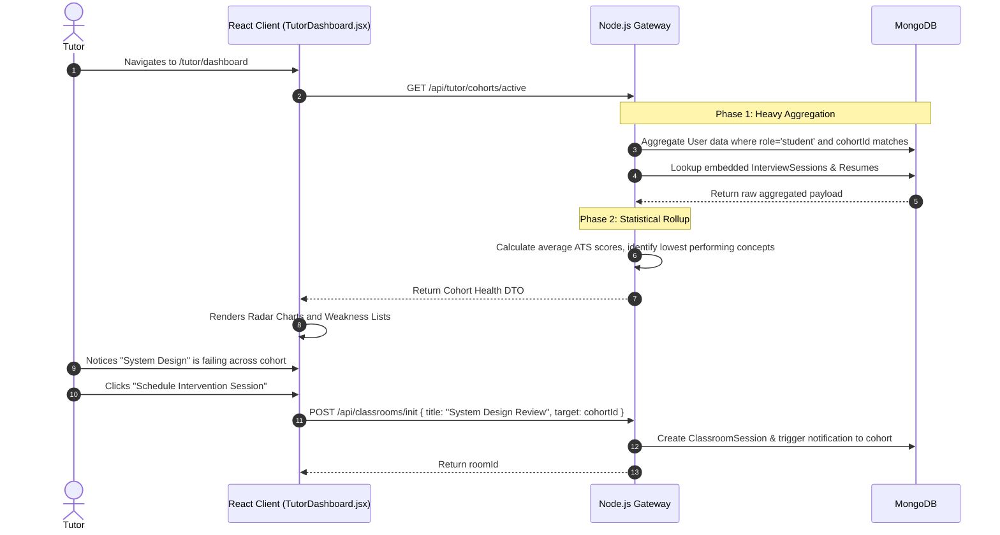
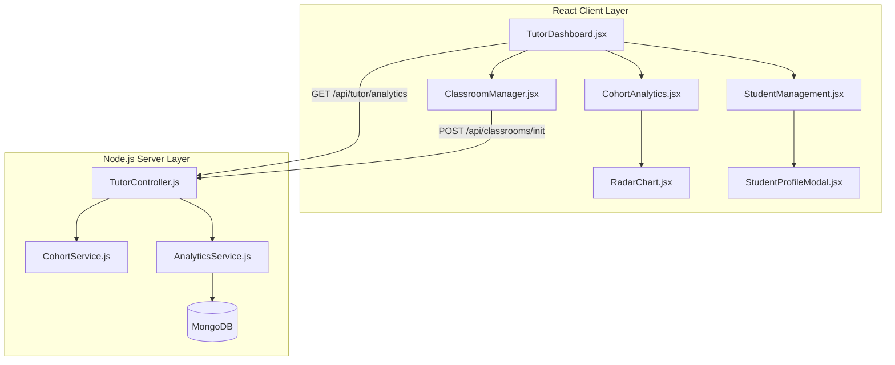

# Tutor & Mentorship Module Architecture

## 1. Executive Summary & Domain Scope

The **Tutor & Mentorship Module** constitutes the educational backbone of the SkillsSphere-AI platform. It is engineered specifically to empower technical educators, mentors, and industry professionals to manage cohorts, curate content, and conduct live interactive sessions with zero friction.

### Core Problem Addressed
Most LMS (Learning Management Systems) feel bloated and disconnected from the modern developer ecosystem. Tutors often struggle with a lack of actionable analytics—they do not know which specific skills their students are failing at until midterms or final projects. This module flips the script by integrating deeply with the AI Resume Analyzer and Mock Interview Engine, giving tutors real-time, aggregated data on their cohort’s weaknesses, allowing them to instantly spin up targeted Live Classrooms or assign customized Learning Roadmaps.

### Target User Personas
- **Tutors / Instructors**: Require macro-level analytics (how is the cohort performing on "React Server Components"?), micro-level interventions (1-on-1 mock interview reviews), and administrative control over live classrooms.
- **Bootcamp Managers**: Require oversight on mentor performance and student graduation readiness.

### High-Level Capability Matrix
**What the Module Does:**
- **Cohort Management**: Enables the grouping of students into structured cohorts with shared analytics dashboards.
- **Analytics Aggregation**: Rolls up individual student scores (ATS, Mock Interviews) into a unified "Cohort Health" metric.
- **Live Classroom Orchestration**: Provides the host controls to spin up WebRTC mesh networks, enforce strict entry policies, and manage collaborative whiteboards/code editors.
- **Curriculum Assignment**: Allows tutors to push specific `Resource` nodes into their students' active Learning Roadmaps.

**What the Module Deliberately Avoids:**
- **Automated Grading**: Tutors have access to AI-generated scores for mock interviews, but the platform does not restrict tutors from overriding these scores based on human nuance.

---

## 2. Comprehensive Architecture & Sequence Diagrams

The Tutor Module architecture acts primarily as an aggregation and orchestration layer on top of the underlying `User`, `Resume`, and `ClassroomSession` models.

### End-to-End User Flow (Cohort Analytics & Intervention)



### Component Hierarchy & Service Boundaries



---

## 3. Detailed Data Models & Schemas

The Tutor module relies heavily on the `Cohort` grouping model and extensive aggregation pipelines over the `User` model.

### MongoDB Schemas

**Cohort Model (`src/database/models/Cohort.js`)**
Represents a logical grouping of students managed by one or more tutors.

```javascript
const mongoose = require('mongoose');

const cohortSchema = new mongoose.Schema({
  name: { 
    type: String, 
    required: true,
    index: true 
  },
  tutorIds: [{ 
    type: mongoose.Schema.Types.ObjectId, 
    ref: 'User',
    required: true,
    index: true
  }],
  studentIds: [{ 
    type: mongoose.Schema.Types.ObjectId, 
    ref: 'User' 
  }],
  curriculumTags: [{ 
    type: String 
  }], // e.g., ['MERN', 'DataStructures', 'AWS']
  status: { 
    type: String, 
    enum: ['active', 'archived', 'upcoming'], 
    default: 'active' 
  },
  metrics: {
    averageAtsScore: { type: Number, default: 0 },
    averageInterviewScore: { type: Number, default: 0 },
    lastCalculatedAt: { type: Date }
  }
}, { timestamps: true });

// Prevent a tutor from having identically named active cohorts
cohortSchema.index({ name: 1, tutorIds: 1 }, { unique: true });

module.exports = mongoose.model('Cohort', cohortSchema);
```

**Aggregated Analytics Payload Structure (DTO)**
The backend `AnalyticsService.js` performs heavy `$lookup` and `$group` operations to construct this payload, preventing the frontend from having to stitch data together.

```json
{
  "cohortId": "60d5ec...",
  "headcount": 45,
  "overallHealthScore": 82,
  "conceptMastery": [
    { "concept": "React Hooks", "averageScore": 92, "status": "excellent" },
    { "concept": "Node.js Streams", "averageScore": 45, "status": "critical" }
  ],
  "atRiskStudents": [
    {
      "studentId": "60d5ec...",
      "name": "Jane Doe",
      "recentAtsScore": 42,
      "unresolvedGaps": ["System Design"]
    }
  ]
}
```

---

## 4. API Endpoints & State Management

### REST Endpoints

| Method | Endpoint | Auth Level | Purpose | Request Payload | Response |
| :--- | :--- | :--- | :--- | :--- | :--- |
| `GET` | `/api/tutor/cohorts` | Tutor | Lists all cohorts managed by the authenticated tutor. | `None` | `[{ cohortId, name, headcount, status }]` |
| `GET` | `/api/tutor/cohorts/:id/analytics` | Tutor | Fetches the deep aggregated health metrics. | `None` | `{ headCount, overallHealthScore, conceptMastery: [...] }` |
| `POST` | `/api/tutor/cohorts/:id/students` | Tutor | Adds a student to the cohort. | `{ studentEmail }` | `{ success: true, updatedHeadcount }` |
| `DELETE` | `/api/tutor/cohorts/:id/students/:studentId` | Tutor | Removes a student. | `None` | `{ success: true }` |
| `POST` | `/api/tutor/interventions/roadmap` | Tutor | Pushes a mandatory module into the roadmaps of specific students. | `{ studentIds: [...], conceptTag: "Streams" }` | `{ success: true }` |

### Redux State Management

Tutors often manage large datasets (e.g., a cohort of 100 students, each with 5 mock interview histories). To keep the React UI snappy, data is normalized using Redux Toolkit's `createEntityAdapter`, which stores data in a dictionary format rather than arrays to ensure O(1) lookups.

```javascript
// client/src/features/tutor/tutorSlice.js
import { createSlice, createEntityAdapter } from '@reduxjs/toolkit';

const cohortsAdapter = createEntityAdapter({
  selectId: (cohort) => cohort._id,
  sortComparer: (a, b) => b.metrics.averageAtsScore - a.metrics.averageAtsScore,
});

const studentsAdapter = createEntityAdapter({
  selectId: (student) => student._id,
});

export const tutorSlice = createSlice({
  name: 'tutor',
  initialState: {
    cohorts: cohortsAdapter.getInitialState(),
    activeCohortStudents: studentsAdapter.getInitialState({
      loading: false,
      analytics: null
    }),
    ui: {
      isAnalyticsModalOpen: false,
      selectedStudentId: null
    }
  },
  reducers: {
    setCohorts: cohortsAdapter.setAll,
    setActiveCohortStudents: (state, action) => {
      studentsAdapter.setAll(state.activeCohortStudents, action.payload.students);
      state.activeCohortStudents.analytics = action.payload.analytics;
    },
    updateStudentMetric: (state, action) => {
      studentsAdapter.updateOne(state.activeCohortStudents, {
        id: action.payload.id,
        changes: action.payload.changes
      });
    }
  }
});
```

---

## 5. Security, Edge Cases & Error Handling

### Data Privacy & Tenant Isolation (RBAC)
A severe security risk in educational platforms is IDOR (Insecure Direct Object Reference) where Tutor A attempts to view the analytics of Tutor B's cohort.
- **Middleware Guard**: Every `/api/tutor/cohorts/:id/*` route is protected by a specialized `verifyCohortOwnership` middleware.
- **Implementation**: The middleware queries the DB: `Cohort.exists({ _id: req.params.id, tutorIds: req.user._id })`. If false, it immediately throws a `403 Forbidden`, blocking the controller from executing the heavy aggregation pipeline.

### Aggregation Pipeline Throttling
Calculating the `averageAtsScore` and `conceptMastery` across 100 students (who each might have 10 resume versions and 5 interview sessions) requires traversing thousands of sub-documents.
- **Edge Case**: If a tutor rapidly refreshes the analytics page, they could crash the MongoDB instance via CPU exhaustion.
- **Mitigation 1 (Rate Limiting)**: The `/analytics` endpoint enforces an aggressive API rate limit (max 5 requests per minute per IP).
- **Mitigation 2 (Materialized Views)**: Instead of calculating metrics completely on-the-fly, the `ResumeAnalyzerService` and `aiInterviewService` emit events upon completion. A background cron job listens to these events and updates the `Cohort.metrics.lastCalculatedAt` fields asynchronously, meaning the `GET /analytics` endpoint is merely fetching pre-computed integers rather than running the `$group` aggregations in real-time.

---

## 6. Component-Level Implementation Specs

### `TutorDashboard.jsx` (The Command Center)
The entry point for the tutor persona. 
- **Layout**: Utilizes a persistent left-hand navigation sidebar (Cohorts, Students, Classrooms, Settings) and a main content area powered by `<Outlet />`.
- **Initialization**: Dispatches `fetchCohortsThunk` on mount. If no cohorts exist, it renders an Empty State component with an illustrative SVG and a prominent "Create Your First Cohort" call to action.

### `CohortAnalytics.jsx` (Data Visualization)
This component is responsible for turning raw numbers into actionable insights.
- **Charting Libraries**: Heavily utilizes `Recharts` for rendering.
- **Radar Chart Implementation**:
  ```jsx
  <RadarChart cx="50%" cy="50%" outerRadius="80%" data={analytics.conceptMastery}>
    <PolarGrid stroke="#374151" />
    <PolarAngleAxis dataKey="concept" tick={{ fill: '#9CA3AF', fontSize: 12 }} />
    <Radar 
      name="Average Score" 
      dataKey="averageScore" 
      stroke="#6366F1" // Indigo-500
      fill="#6366F1" 
      fillOpacity={0.4} 
    />
    <Tooltip content={<CustomTooltip />} />
  </RadarChart>
  ```
- It maps over the `atRiskStudents` array, rendering warning banners that allow the tutor to click "View Profile" to initiate a direct intervention.

### `StudentProfileModal.jsx` (The Micro View)
A heavily detailed slide-over panel (using headless UI's `<Dialog />`) that appears when a specific student is selected.
- **Tabs**: Splits data into "Resume History", "Interview History", and "Roadmap Progress".
- **Action Buttons**: Contains high-visibility actions: "Invite to Classroom" and "Assign Curriculum".

### `ClassroomManager.jsx` (Live Session Orchestration)
Provides the UI to initialize a WebRTC room.
- Allows the tutor to toggle settings: `allowScreenShare` (prevents students from hijacking the screen), `requireApproval` (enables a waiting room mechanism).
- Upon successful creation, it copies the unique `roomId` to the clipboard and provides a direct navigation link to `/classrooms/:roomId` where the Tutor assumes the Host role defined in the Classrooms Workflow.
EOF
