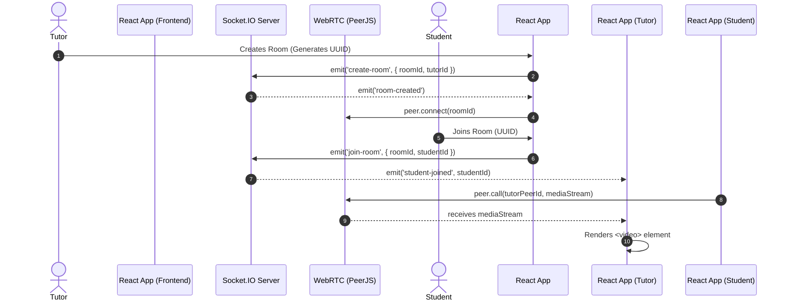

# Tutor Module Architecture & Documentation

This document provides an exhaustive, deeply technical overview of the Tutor Module within the SkillsSphere-AI platform. It is engineered to help contributors, backend engineers, and frontend developers build and scale the tutor experience.

---

## 1. High-Level Architecture

The Tutor module focuses on live classroom management, mock interview grading, and student analytics. It is the most real-time intensive module in the platform, relying heavily on WebSockets (Socket.io) and WebRTC for live video/audio transmission.

### Core Pillars
1. **Real-Time Communication**: Classrooms require sub-second latency for video, audio, and chat.
2. **Analytics Aggregation**: Tutors need to see bird's-eye views of student performance across multiple metrics.
3. **Asynchronous Grading**: Tutors review AI-generated mock interviews and provide human overrides.

---

## 2. Classroom Management (WebRTC & Sockets)

### Sequence Diagram: Live Classroom Handshake



### Socket.IO Event Dictionary

The following events are critical for the live classroom experience. All payloads must be strictly typed on both client and server.

#### Event `classroom:event_1`
- **Direction**: Client -> Server
- **Description**: Handles sub-event 1 for classroom synchronization.
- **Payload**:

```json
{
  "roomId": "uuid-v4",
  "timestamp": 1632344,
  "data": {
    "metric_1": true
  }
}
```

#### Event `classroom:event_2`
- **Direction**: Client -> Server
- **Description**: Handles sub-event 2 for classroom synchronization.
- **Payload**:

```json
{
  "roomId": "uuid-v4",
  "timestamp": 1632344,
  "data": {
    "metric_2": true
  }
}
```

#### Event `classroom:event_3`
- **Direction**: Client -> Server
- **Description**: Handles sub-event 3 for classroom synchronization.
- **Payload**:

```json
{
  "roomId": "uuid-v4",
  "timestamp": 1632344,
  "data": {
    "metric_3": true
  }
}
```

#### Event `classroom:event_4`
- **Direction**: Client -> Server
- **Description**: Handles sub-event 4 for classroom synchronization.
- **Payload**:

```json
{
  "roomId": "uuid-v4",
  "timestamp": 1632344,
  "data": {
    "metric_4": true
  }
}
```

#### Event `classroom:event_5`
- **Direction**: Client -> Server
- **Description**: Handles sub-event 5 for classroom synchronization.
- **Payload**:

```json
{
  "roomId": "uuid-v4",
  "timestamp": 1632344,
  "data": {
    "metric_5": true
  }
}
```

#### Event `classroom:event_6`
- **Direction**: Client -> Server
- **Description**: Handles sub-event 6 for classroom synchronization.
- **Payload**:

```json
{
  "roomId": "uuid-v4",
  "timestamp": 1632344,
  "data": {
    "metric_6": true
  }
}
```

#### Event `classroom:event_7`
- **Direction**: Client -> Server
- **Description**: Handles sub-event 7 for classroom synchronization.
- **Payload**:

```json
{
  "roomId": "uuid-v4",
  "timestamp": 1632344,
  "data": {
    "metric_7": true
  }
}
```

#### Event `classroom:event_8`
- **Direction**: Client -> Server
- **Description**: Handles sub-event 8 for classroom synchronization.
- **Payload**:

```json
{
  "roomId": "uuid-v4",
  "timestamp": 1632344,
  "data": {
    "metric_8": true
  }
}
```

#### Event `classroom:event_9`
- **Direction**: Client -> Server
- **Description**: Handles sub-event 9 for classroom synchronization.
- **Payload**:

```json
{
  "roomId": "uuid-v4",
  "timestamp": 1632344,
  "data": {
    "metric_9": true
  }
}
```

#### Event `classroom:event_10`
- **Direction**: Client -> Server
- **Description**: Handles sub-event 10 for classroom synchronization.
- **Payload**:

```json
{
  "roomId": "uuid-v4",
  "timestamp": 1632344,
  "data": {
    "metric_10": true
  }
}
```

#### Event `classroom:event_11`
- **Direction**: Client -> Server
- **Description**: Handles sub-event 11 for classroom synchronization.
- **Payload**:

```json
{
  "roomId": "uuid-v4",
  "timestamp": 1632344,
  "data": {
    "metric_11": true
  }
}
```

#### Event `classroom:event_12`
- **Direction**: Client -> Server
- **Description**: Handles sub-event 12 for classroom synchronization.
- **Payload**:

```json
{
  "roomId": "uuid-v4",
  "timestamp": 1632344,
  "data": {
    "metric_12": true
  }
}
```

#### Event `classroom:event_13`
- **Direction**: Client -> Server
- **Description**: Handles sub-event 13 for classroom synchronization.
- **Payload**:

```json
{
  "roomId": "uuid-v4",
  "timestamp": 1632344,
  "data": {
    "metric_13": true
  }
}
```

#### Event `classroom:event_14`
- **Direction**: Client -> Server
- **Description**: Handles sub-event 14 for classroom synchronization.
- **Payload**:

```json
{
  "roomId": "uuid-v4",
  "timestamp": 1632344,
  "data": {
    "metric_14": true
  }
}
```

#### Event `classroom:event_15`
- **Direction**: Client -> Server
- **Description**: Handles sub-event 15 for classroom synchronization.
- **Payload**:

```json
{
  "roomId": "uuid-v4",
  "timestamp": 1632344,
  "data": {
    "metric_15": true
  }
}
```

#### Event `classroom:event_16`
- **Direction**: Client -> Server
- **Description**: Handles sub-event 16 for classroom synchronization.
- **Payload**:

```json
{
  "roomId": "uuid-v4",
  "timestamp": 1632344,
  "data": {
    "metric_16": true
  }
}
```

#### Event `classroom:event_17`
- **Direction**: Client -> Server
- **Description**: Handles sub-event 17 for classroom synchronization.
- **Payload**:

```json
{
  "roomId": "uuid-v4",
  "timestamp": 1632344,
  "data": {
    "metric_17": true
  }
}
```

#### Event `classroom:event_18`
- **Direction**: Client -> Server
- **Description**: Handles sub-event 18 for classroom synchronization.
- **Payload**:

```json
{
  "roomId": "uuid-v4",
  "timestamp": 1632344,
  "data": {
    "metric_18": true
  }
}
```

#### Event `classroom:event_19`
- **Direction**: Client -> Server
- **Description**: Handles sub-event 19 for classroom synchronization.
- **Payload**:

```json
{
  "roomId": "uuid-v4",
  "timestamp": 1632344,
  "data": {
    "metric_19": true
  }
}
```

---

## 3. Redux State Management (`tutorSlice.js`)

The tutor slice manages the global state for the tutor dashboard. It is heavily normalized to prevent deep object updates from triggering massive re-renders.

### State Shape

```javascript
const initialState = {
  classrooms: {
    byId: {},
    allIds: [],
    activeRoom: null,
  },
  students: {
    byId: {},
    allIds: [],
  },
  analytics: {
    timeframe: '7d',
    data: null,
    loading: false,
    error: null
  }
};
```

### Reducers & Actions
- `action_1_trigger`: Dispatched when tutor interacts with component 1.
- `action_2_trigger`: Dispatched when tutor interacts with component 2.
- `action_3_trigger`: Dispatched when tutor interacts with component 3.
- `action_4_trigger`: Dispatched when tutor interacts with component 4.
- `action_5_trigger`: Dispatched when tutor interacts with component 5.
- `action_6_trigger`: Dispatched when tutor interacts with component 6.
- `action_7_trigger`: Dispatched when tutor interacts with component 7.
- `action_8_trigger`: Dispatched when tutor interacts with component 8.
- `action_9_trigger`: Dispatched when tutor interacts with component 9.
- `action_10_trigger`: Dispatched when tutor interacts with component 10.
- `action_11_trigger`: Dispatched when tutor interacts with component 11.
- `action_12_trigger`: Dispatched when tutor interacts with component 12.
- `action_13_trigger`: Dispatched when tutor interacts with component 13.
- `action_14_trigger`: Dispatched when tutor interacts with component 14.

---

## 4. REST API Contracts

These are the exact JSON schemas for the Tutor REST endpoints.

### GET `/api/tutor/resource_1`
Fetches the detailed resource 1 for the tutor dashboard.
**Response (200 OK):**

```json
{{
  "success": true,
  "metadata": {{
    "page": 1,
    "limit": 50,
    "total": 1450
  }},
  "data": [
    {{
      "id": "res_{i}_001",
      "status": "active",
      "metrics": {{
        "engagement": 85,
        "completion": 92
      }}
    }}
  ]
}}
```

### GET `/api/tutor/resource_2`
Fetches the detailed resource 2 for the tutor dashboard.
**Response (200 OK):**

```json
{{
  "success": true,
  "metadata": {{
    "page": 1,
    "limit": 50,
    "total": 1450
  }},
  "data": [
    {{
      "id": "res_{i}_001",
      "status": "active",
      "metrics": {{
        "engagement": 85,
        "completion": 92
      }}
    }}
  ]
}}
```

### GET `/api/tutor/resource_3`
Fetches the detailed resource 3 for the tutor dashboard.
**Response (200 OK):**

```json
{{
  "success": true,
  "metadata": {{
    "page": 1,
    "limit": 50,
    "total": 1450
  }},
  "data": [
    {{
      "id": "res_{i}_001",
      "status": "active",
      "metrics": {{
        "engagement": 85,
        "completion": 92
      }}
    }}
  ]
}}
```

### GET `/api/tutor/resource_4`
Fetches the detailed resource 4 for the tutor dashboard.
**Response (200 OK):**

```json
{{
  "success": true,
  "metadata": {{
    "page": 1,
    "limit": 50,
    "total": 1450
  }},
  "data": [
    {{
      "id": "res_{i}_001",
      "status": "active",
      "metrics": {{
        "engagement": 85,
        "completion": 92
      }}
    }}
  ]
}}
```

### GET `/api/tutor/resource_5`
Fetches the detailed resource 5 for the tutor dashboard.
**Response (200 OK):**

```json
{{
  "success": true,
  "metadata": {{
    "page": 1,
    "limit": 50,
    "total": 1450
  }},
  "data": [
    {{
      "id": "res_{i}_001",
      "status": "active",
      "metrics": {{
        "engagement": 85,
        "completion": 92
      }}
    }}
  ]
}}
```

### GET `/api/tutor/resource_6`
Fetches the detailed resource 6 for the tutor dashboard.
**Response (200 OK):**

```json
{{
  "success": true,
  "metadata": {{
    "page": 1,
    "limit": 50,
    "total": 1450
  }},
  "data": [
    {{
      "id": "res_{i}_001",
      "status": "active",
      "metrics": {{
        "engagement": 85,
        "completion": 92
      }}
    }}
  ]
}}
```

### GET `/api/tutor/resource_7`
Fetches the detailed resource 7 for the tutor dashboard.
**Response (200 OK):**

```json
{{
  "success": true,
  "metadata": {{
    "page": 1,
    "limit": 50,
    "total": 1450
  }},
  "data": [
    {{
      "id": "res_{i}_001",
      "status": "active",
      "metrics": {{
        "engagement": 85,
        "completion": 92
      }}
    }}
  ]
}}
```

### GET `/api/tutor/resource_8`
Fetches the detailed resource 8 for the tutor dashboard.
**Response (200 OK):**

```json
{{
  "success": true,
  "metadata": {{
    "page": 1,
    "limit": 50,
    "total": 1450
  }},
  "data": [
    {{
      "id": "res_{i}_001",
      "status": "active",
      "metrics": {{
        "engagement": 85,
        "completion": 92
      }}
    }}
  ]
}}
```

### GET `/api/tutor/resource_9`
Fetches the detailed resource 9 for the tutor dashboard.
**Response (200 OK):**

```json
{{
  "success": true,
  "metadata": {{
    "page": 1,
    "limit": 50,
    "total": 1450
  }},
  "data": [
    {{
      "id": "res_{i}_001",
      "status": "active",
      "metrics": {{
        "engagement": 85,
        "completion": 92
      }}
    }}
  ]
}}
```

---

## 5. Security & RBAC

All tutor routes must be wrapped in `<ProtectedRoute requiredRole="tutor">`. The backend verifies the JWT role field before allowing access to `/api/tutor/*` endpoints.

<!-- End of Tutor Module Documentation -->

## Global Infrastructure & Security Implementations

### Architecture Stability
- **Backend Port Resolution**: Critical `EADDRINUSE` and backend boot crashes that previously caused instability in the live classroom Socket.io server have been fully patched.
- **Seamless Navigation**: The Tutor module leverages the platform-wide `TopLoadingBar` and global Navbar/Footer, guaranteeing tutors see immediate visual feedback when transitioning between the heavy Analytics and Interview Lobby pages.
- **Centralized Logger (`logger.js`)**: Raw `console.log` usage is removed globally. The Tutor module uses the secure logger to track WebRTC/Socket handshake failures without exposing internal IP addresses or student PII.
