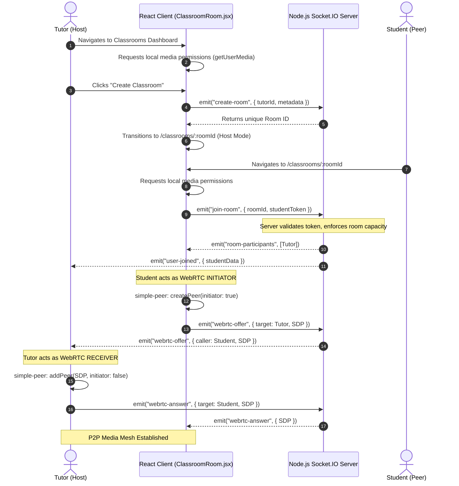
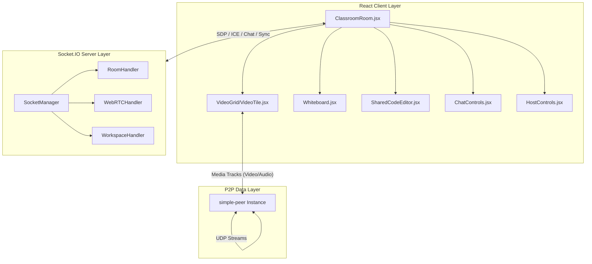

# Live Interactive Classrooms Workflow

## 1. Executive Summary & Domain Scope

The **Live Interactive Classrooms** module is the cornerstone of real-time collaborative learning within the SkillsSphere-AI platform. It is engineered to seamlessly bridge the gap between traditional video conferencing and highly specialized technical education tools. By converging low-latency peer-to-peer (P2P) WebRTC media streaming, synchronized WebSockets for state management, and deeply integrated collaborative workspaces, the module provides a comprehensive digital classroom environment.

### Core Problem Addressed
Traditional remote learning often suffers from tool fragmentation—students and tutors must juggle separate applications for video calls, whiteboarding, and code execution. This context switching breaks focus and degrades the educational experience. The Classrooms module eliminates this friction by unifying these discrete tools into a single, highly performant, browser-native interface that requires no third-party installations.

### Target User Personas
- **Tutors (Hosts)**: Require authoritative control over the session, the ability to monitor student engagement, and seamless tools to explain complex architectural or code-level concepts in real-time.
- **Students (Participants)**: Require a distraction-free, highly responsive environment where they can consume multimedia streams, interact via chat or hand-raising, and collaboratively edit code or diagrams without noticeable latency.

### High-Level Capability Matrix
**What the Module Does:**
- Establishes true P2P WebRTC mesh networks for audio/video/screen streaming, bypassing centralized media servers to reduce infrastructural costs and latency.
- Provides a real-time synchronized HTML5 canvas for collaborative whiteboarding.
- Integrates a real-time synchronized Code Editor (supporting Operational Transforms or full-document sync) for pair programming.
- Enforces strict Role-Based Access Control (RBAC) and host-level teardown safeguards.
- Implements native Picture-in-Picture (PiP) support for persistent media visibility across different workspaces.

**What the Module Deliberately Avoids:**
- **Centralized Media Routing (SFU/MCU)**: To maintain a zero-cost infrastructure footprint for media, all video/audio streams are routed strictly P2P. This enforces a soft cap on room sizes (optimally 5-8 participants) before client-side CPU/bandwidth bottlenecks occur.
- **Persistent Media Storage**: The platform does not record or persist video/audio streams. All media data is inherently ephemeral.

---

## 2. Comprehensive Architecture & Sequence Diagrams

The architecture relies on a hybrid model:
1. **Signaling (Centralized State)**: Socket.io handles the exchange of SDP (Session Description Protocol) offers, answers, and ICE candidates.
2. **Media Delivery (Decentralized Mesh)**: `simple-peer` handles the actual transmission of UDP media packets directly between clients.

### End-to-End User Flow



### Component Hierarchy & Service Boundaries



---

## 3. Detailed Data Models & Schemas

Although the media streams are ephemeral, the underlying room metadata, participant configurations, and security tokens require strict schema validation both in-memory and within the database.

### MongoDB Schemas

**Classroom Session Model (`src/database/models/ClassroomSession.js`)**
Tracks the lifecycle and metadata of a room, primarily for analytics and billing/usage tracking.

```javascript
const mongoose = require('mongoose');

const classroomSessionSchema = new mongoose.Schema({
  roomId: { 
    type: String, 
    required: true, 
    unique: true,
    index: true 
  },
  hostId: { 
    type: mongoose.Schema.Types.ObjectId, 
    ref: 'User', 
    required: true,
    index: true
  },
  title: { 
    type: String, 
    default: 'Live Session' 
  },
  status: { 
    type: String, 
    enum: ['active', 'ended', 'aborted'], 
    default: 'active' 
  },
  participants: [{
    userId: { type: mongoose.Schema.Types.ObjectId, ref: 'User' },
    joinedAt: { type: Date, default: Date.now },
    leftAt: { type: Date }
  }],
  settings: {
    maxParticipants: { type: Number, default: 10 },
    allowScreenShare: { type: Boolean, default: true },
    requireApproval: { type: Boolean, default: false }
  },
  startedAt: { type: Date, default: Date.now },
  endedAt: { type: Date }
}, { 
  timestamps: true 
});

// Compound index for querying active sessions by host
classroomSessionSchema.index({ hostId: 1, status: 1 });

module.exports = mongoose.model('ClassroomSession', classroomSessionSchema);
```

### In-Memory State Maps (Node.js)

To achieve extreme low-latency signaling, the Socket.io server maintains in-memory maps. Relying on Redis or MongoDB for high-frequency coordinate syncing (e.g., Whiteboard strokes) would introduce unacceptable latency.

```javascript
// src/modules/classrooms/socketStore.js

/**
 * Mapping of RoomID -> RoomState
 * {
 *   "room-uuid": {
 *     hostSocketId: "socket-xyz",
 *     participants: Map<SocketId, UserContext>,
 *     activeWorkspace: "video" | "whiteboard" | "editor",
 *     whiteboardState: Array<StrokeData>,
 *     editorState: String
 *   }
 * }
 */
const activeRooms = new Map();

/**
 * Mapping of SocketID -> UserContext
 * Used for fast reverse lookups during disconnects.
 * {
 *   "socket-xyz": {
 *     userId: "mongo-uuid",
 *     roomId: "room-uuid",
 *     role: "tutor" | "student",
 *     isMuted: boolean,
 *     isHandRaised: boolean
 *   }
 * }
 */
const socketToUser = new Map();
```

---

## 4. API Endpoints & State Management

### REST Endpoints
While WebSockets handle real-time sync, standard HTTP endpoints handle the initialization and historical tracking of rooms.

| Method | Endpoint | Auth Level | Purpose | Request Payload | Response |
| :--- | :--- | :--- | :--- | :--- | :--- |
| `POST` | `/api/classrooms/init` | Tutor Only | Creates a new session DB record and reserves a roomId. | `{ title: "React Hooks Deep Dive", settings: {...} }` | `{ roomId: "...", token: "JWT" }` |
| `GET` | `/api/classrooms/active` | Auth | Retrieves a list of active rooms available to the student. | `None` | `[{ roomId, title, hostName, participantCount }]` |
| `POST` | `/api/classrooms/:roomId/end` | Tutor Only | Force-terminates a session, kicking all users. | `None` | `{ success: true }` |
| `GET` | `/api/classrooms/history` | Auth | Retrieves past attended/hosted sessions for the dashboard. | `?page=1&limit=10` | `{ sessions: [...], pagination: {...} }` |

### Redux State Management

The frontend heavily utilizes Redux Toolkit to manage the ephemeral state of the room, preventing prop-drilling across the complex workspace grid.

```javascript
// client/src/features/classroom/classroomSlice.js

const initialState = {
  roomId: null,
  connectionStatus: 'disconnected', // 'connecting' | 'connected' | 'error'
  participants: [], // Array of { id, name, role, isMuted, isHandRaised, streamId }
  activeWorkspace: 'video', // 'video' | 'whiteboard' | 'editor'
  layoutConfig: {
    sidebarOpen: true,
    pipActive: false
  },
  chatMessages: [],
  error: null
};

export const classroomSlice = createSlice({
  name: 'classroom',
  initialState,
  reducers: {
    setRoomId: (state, action) => { state.roomId = action.payload; },
    addParticipant: (state, action) => { state.participants.push(action.payload); },
    removeParticipant: (state, action) => { 
      state.participants = state.participants.filter(p => p.id !== action.payload); 
    },
    updateParticipantState: (state, action) => {
      const index = state.participants.findIndex(p => p.id === action.payload.id);
      if (index !== -1) {
        state.participants[index] = { ...state.participants[index], ...action.payload.changes };
      }
    },
    setWorkspace: (state, action) => { state.activeWorkspace = action.payload; },
    addChatMessage: (state, action) => { state.chatMessages.push(action.payload); },
    resetClassroomState: () => initialState
  }
});
```

---

## 5. Security, Edge Cases & Error Handling

### WebRTC Stream Injection Prevention
A critical security vector in signaling servers is "Stream Injection," where a malicious client emits a `webrtc-offer` to a target socket ID in a room they haven't joined. The backend strict validation middleware blocks this:

```javascript
// Server-side socket listener
socket.on("webrtc-offer", (payload) => {
  const callerContext = socketToUser.get(socket.id);
  const targetContext = socketToUser.get(payload.targetSocketId);
  
  // Strict Validation: Ensure both users exist and belong to the EXACT same room
  if (!callerContext || !targetContext || callerContext.roomId !== targetContext.roomId) {
    console.warn(`[SECURITY] Blocked cross-room stream injection attempt from ${socket.id}`);
    return;
  }
  
  io.to(payload.targetSocketId).emit("webrtc-offer", {
    callerSocketId: socket.id,
    offer: payload.offer
  });
});
```

### Rate Limiting the Whiteboard
A user could easily crash other clients by firing a script that draws 10,000 lines per second on the whiteboard. To mitigate this, the client implements `lodash/throttle` on `mousemove` events (typically 16ms to match 60fps), and the server enforces a socket-level rate limit.

### Handling Unexpected Disconnects (Zombie Connections)
If a user closes their laptop lid, the TCP connection drops without firing a clean `disconnect` event immediately. The server relies on WebSocket ping/pong heartbeats. Once the timeout threshold is breached, the server forcibly executes the `cleanupZombieSocket` routine, which updates the room state and broadcasts `user-left` to the remaining peers, ensuring the UI accurately reflects reality and WebRTC instances are garbage collected.

### Host Teardown Safeguards
When the Tutor clicks "End Session", the client fires `/api/classrooms/:roomId/end`. The backend updates the DB status to 'ended', and the signaling server emits a `session-terminated` event. All clients are programmed to immediately execute `peer.destroy()` on all active connections, stop their local media tracks (`track.stop()`), and redirect to the dashboard, ensuring no orphan media streams continue running in the background.

---

## 6. Component-Level Implementation Specs

### `ClassroomRoom.jsx` (The Orchestrator)
This monolithic component is the brain of the module. It handles the `useEffect` that initializes the Socket.IO connection and orchestrates the WebRTC handshake.

- **Dependencies**: Uses `useRef` extensively to hold the mutable `socket` instance, the `peers` array, and the `localStream` without triggering unnecessary React re-renders.
- **Optimization**: The list of peers is mapped to a state array to trigger rendering of `VideoTile` components. It utilizes `useCallback` for functions like `toggleMute` and `toggleScreenShare` to maintain stable references passed down to the control bar.

```javascript
// Core setup effect in ClassroomRoom.jsx
useEffect(() => {
  let isMounted = true;
  
  const initMediaAndSockets = async () => {
    try {
      // 1. Get Local Media
      const stream = await navigator.mediaDevices.getUserMedia({ video: true, audio: true });
      if (!isMounted) return;
      localStreamRef.current = stream;
      
      // 2. Connect Socket
      socketRef.current = io(process.env.VITE_API_URL, { auth: { token } });
      
      // 3. Register listeners
      socketRef.current.on("room-participants", handleExistingParticipants);
      socketRef.current.on("user-joined", handleNewUser);
      socketRef.current.on("webrtc-offer", handleReceiveOffer);
      socketRef.current.on("webrtc-answer", handleReceiveAnswer);
      
      // 4. Join Room
      socketRef.current.emit("join-room", { roomId, user: currentUser });
      
    } catch (err) {
      handleMediaError(err);
    }
  };
  
  initMediaAndSockets();
  
  return () => {
    isMounted = false;
    // CRITICAL CLEANUP
    if (localStreamRef.current) {
      localStreamRef.current.getTracks().forEach(t => t.stop());
    }
    peersRef.current.forEach(p => p.peer.destroy());
    socketRef.current?.disconnect();
  };
}, [roomId]);
```

### `VideoTile.jsx` (Media Rendering)
React cannot natively bind a raw `MediaStream` object to a video tag's `src` attribute. This component elegantly bridges the React and DOM worlds using a ref.

```javascript
const VideoTile = ({ stream, isLocal, userName, isMuted }) => {
  const videoRef = useRef(null);

  useEffect(() => {
    // The exact moment the stream is available, attach it to the raw DOM node
    if (videoRef.current && stream) {
      videoRef.current.srcObject = stream;
    }
  }, [stream]);

  return (
    <div className="relative rounded-xl overflow-hidden bg-gray-900 aspect-video shadow-lg">
      <video
        ref={videoRef}
        autoPlay
        playsInline
        muted={isLocal} // NEVER play local audio back to avoid deafening feedback loops
        className="w-full h-full object-cover"
      />
      
      {/* Overlay UI */}
      <div className="absolute bottom-3 left-3 bg-black/60 px-3 py-1 rounded-full backdrop-blur-md flex items-center gap-2">
        <span className="text-white text-xs font-semibold">{userName} {isLocal && "(You)"}</span>
        {isMuted && <MicOff size={14} className="text-red-400" />}
      </div>
    </div>
  );
};
```

### `Whiteboard.jsx` (Synchronized Canvas)
This component leverages a native HTML5 `<canvas>`. Redundant paddings have been removed via CSS (`w-full h-full inset-0`) to absolutely maximize the drawing space.
- It uses a `useLayoutEffect` to size the canvas perfectly to its parent container.
- When `onMouseMove` fires while drawing, it emits the `[x0, y0, x1, y1]` coordinate vector.
- The receiving clients plot these exact coordinates using `ctx.lineTo()` and `ctx.stroke()`.

### `SharedCodeEditor.jsx`
Implements dynamic layout shifting. When active, it forces the `VideoGrid` into a horizontal ribbon at the top of the viewport. It utilizes a controlled component pattern where the `value` is synced via Redux, and changes are debounced before emitting via sockets to prevent race conditions during rapid typing.
