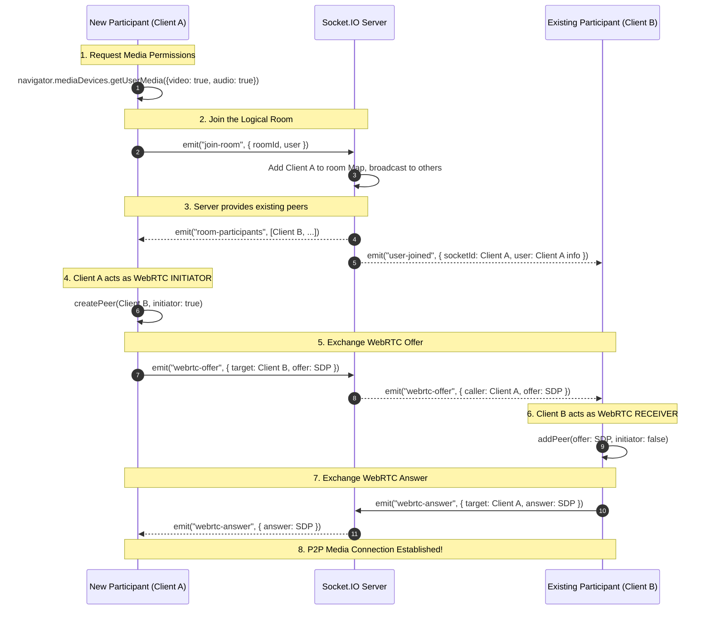

# Live Interactive Classrooms Workflow

This document provides a highly comprehensive, exhaustive technical breakdown of the Live Classroom workflow within the SkillsSphere-AI platform. It details exactly how WebRTC peer-to-peer connections are established, how UI states (like hand raising and screen sharing) are synchronized across clients, the security measures in place, and the exact files responsible for this functionality.

---

## 1. High-Level Architecture Overview

The Classroom feature is designed to support real-time, low-latency communication between Tutors and Students. To achieve this without incurring massive server bandwidth costs, it relies on a hybrid architectural model:

1. **Signaling (Centralized State Management)**: Handled by **Socket.io** over standard WebSockets. The Node.js backend acts as a signaling server. It does not touch media data. Instead, it securely passes WebRTC offers, answers, and ICE candidates between clients. It also acts as the authoritative source of truth for non-media data (e.g., chat logs, hand raises, and active participant lists).
2. **Media Delivery (Decentralized Mesh)**: Handled by **WebRTC** (using the `simple-peer` wrapper) for true peer-to-peer delivery of audio, video, and screen sharing streams. This means media goes directly from Student A to Student B, bypassing the server entirely.

---

## 2. End-to-End Workflow & Sequence

### Step 1: Room Creation & Initialization

1. A **Tutor** navigates to the Classrooms Dashboard (`client/src/modules/classrooms/pages/ClassroomsDashboard.jsx`).
2. They initiate the "Create Classroom" action.
3. The frontend generates a unique `roomId` (typically a UUID or a short phonetic string) or requests one from the backend API.
4. The Tutor is navigated to `/classrooms/:roomId`, becoming the "Host" of the session.
5. Students receive the URL and navigate to the same route.

### Step 2: Joining the Room & WebRTC Signaling

When any user (Tutor or Student) lands on the `ClassroomRoom.jsx` component, a complex handshake occurs.



#### Detailed Explanation of Peer Creation:
When `Client A` receives the list of existing participants, it iterates over them and instantiates a `simple-peer` object for each one with `initiator: true`. 

```javascript
// Inside ClassroomRoom.jsx
function createPeer(userToSignal, callerId, stream, callerUser) {
  const peer = new Peer({
    initiator: true,
    trickle: false, // We use simplified full-SDP signaling for stability
    stream,
  });

  peer.on("signal", signal => {
    socketRef.current.emit("webrtc-offer", {
      targetSocketId: userToSignal,
      callerSocketId: callerId,
      callerUser,
      offer: signal
    });
  });

  peer.on("stream", incomingStream => {
    // Attach stream to React state for VideoTile rendering
    setPeers(prev => prev.map(p => {
      if (p.peerId === userToSignal) return { ...p, stream: incomingStream };
      return p;
    }));
  });

  return peer;
}
```

---

## 3. Media & Workspace Controls

### A. Mute / Hide Video (Soft Toggles)
In WebRTC, stopping a track entirely requires renegotiating the entire SDP offer/answer cycle. To avoid this latency and complexity, the platform uses "Soft Toggles". The client simply disables the track locally, which immediately transmits black frames (for video) or silence (for audio) to all peers without dropping the connection.

```javascript
// ClassroomRoom.jsx toggleMute snippet
const toggleMute = () => {
  if (localStream) {
    const audioTrack = localStream.getAudioTracks()[0];
    if (audioTrack) {
      audioTrack.enabled = !audioTrack.enabled; // Mutes mic instantly across all peers
      setIsMuted(!audioTrack.enabled);
    }
  }
};
```

### B. Screen Sharing (Track Replacement)
To share a screen, the client calls `navigator.mediaDevices.getDisplayMedia()`. 
Crucially, `simple-peer` supports dynamic track replacement via `peer.replaceTrack()`. This allows a user to swap their camera feed for their screen feed without tearing down the WebRTC connection.

```javascript
const toggleScreenShare = async () => {
  if (!isScreenSharing) {
    try {
      const stream = await navigator.mediaDevices.getDisplayMedia({ video: true });
      screenStreamRef.current = stream;
      
      const screenTrack = stream.getVideoTracks()[0];
      const cameraTrack = localStreamRef.current?.getVideoTracks()[0];
      
      // Replace the camera track with the screen track for ALL connected peers
      if (cameraTrack) {
        peersRef.current.forEach(p => {
          p.peer.replaceTrack(cameraTrack, screenTrack, localStreamRef.current);
        });
      }
      setIsScreenSharing(true);
    } catch (err) {
      logger.error("Failed to share screen", err);
    }
  } else {
    // ... logic to revert back to cameraTrack
  }
};
```

### C. Real-time Features & Sockets
- **Hand Raising**: A non-critical UI state. The client emits `toggle-hand-raise` with `{ roomId, isRaised: true }`. The backend broadcasts `hand-raise-toggled` to the room. The React state updates, rendering a yellow hand icon on the user's video tile.
- **Chat**: A basic broadcast model. The client emits `chat-message`. The server broadcasts it. It is stored entirely in React state (`chatMessages`) and is intentionally ephemeral (lost upon refresh) to mimic standard video conferencing behavior.

---

## 4. Collaborative Workspaces

The classroom features a dynamic layout system allowing users to switch between three primary workspaces. The active workspace is purely a local UI state (`activeWorkspace`), meaning a Tutor can be looking at the code editor while a Student is looking at the Whiteboard.

### Workspace 1: Video Grid
The default view. Uses CSS Grid (`grid-cols-1 md:grid-cols-2 lg:grid-cols-3`) to evenly distribute `VideoTile` components.

### Workspace 2: Collaborative Whiteboard
Rendered via `Whiteboard.jsx`. It utilizes an HTML5 `<canvas>`.
- **Syncing**: Captures `onMouseDown`, `onMouseMove`, and `onMouseUp` events.
- **Broadcasting**: Emits raw coordinate data `[x, y]` and color/brush size over Socket.io.
- **Rendering**: Remote peers listen for `draw-line` events and programmatically draw on their local canvas.

### Workspace 3: Shared Code Editor
Rendered via `SharedCodeEditor.jsx`. Typically utilizes a library like Monaco Editor or CodeMirror.
- **Syncing**: Captures `onChange` events.
- **Broadcasting**: Emits the entire document string or operational transforms (OT) over Socket.io.
- **Rendering**: Updates the local editor state.

*(Note: When in Whiteboard or Code mode, the video grid minimizes to a horizontal scrolling ribbon at the top of the screen to maximize workspace real estate).*

---

## 5. Disconnection & Cleanup

Graceful teardown is critical to prevent memory leaks and zombie video tiles.

When a user clicks "Leave" or closes the tab:
1. The WebSocket connection drops. The Node.js server detects the `disconnect` event.
2. The server removes the socket ID from the internal room mapping and broadcasts a `user-left` payload to remaining participants.
3. The remaining clients listen for `user-left`:
   ```javascript
   s.on("user-left", ({ socketId }) => {
     activeSocketIdsRef.current.delete(socketId);
     const item = peersRef.current.find(p => p.peerId === socketId);
     if (item) {
       item.peer.destroy(); // Safely close the WebRTC connection
     }
     // Remove from React state to unmount the VideoTile
     setPeers(prev => prev.filter(p => p.peerId !== socketId));
   });
   ```

---

## 6. Key Files & Components Reference

| File Path | Responsibility |
| :--- | :--- |
| `client/src/modules/classrooms/pages/ClassroomRoom.jsx` | The monolithic orchestrator. Manages the Socket connection, WebRTC peer arrays, `getUserMedia` streams, and the UI layout (Video / Chat / Participants). |
| `client/src/modules/classrooms/components/VideoTile.jsx` | Renders a single HTML `<video>` element. It intercepts the React `ref` and manually attaches the WebRTC `MediaStream` object to the `video.srcObject` property. |
| `client/src/modules/classrooms/components/Whiteboard.jsx` | The real-time drawing canvas component. |
| `client/src/modules/classrooms/components/SharedCodeEditor.jsx` | The collaborative code environment. |
| `server/src/modules/classrooms/socket.js` | The backend signaling server. Maintains an in-memory `Map` of active rooms and participants. Manages the broadcasting of WebRTC offers/answers without storing media. |

---

## 7. Security & Limitations

### WebRTC Injection Prevention
Because WebRTC offers are routed through a central Socket.io server, a malicious user could attempt to send an offer to a room they are not a part of. The frontend actively prevents this:

```javascript
s.on("webrtc-offer", (payload) => {
  // Security check: Verify that the caller is a registered participant in this room
  if (!activeSocketIdsRef.current.has(payload.callerSocketId)) {
    logger.warn(`Silently dropped unauthorized WebRTC stream injection from socket: ${payload.callerSocketId}`);
    return;
  }
  // Proceed with addPeer...
});
```

### Scalability (The Mesh Network Limitation)
This application utilizes a **Full Mesh Network** topology. Every peer connects to every other peer.
- 2 participants = 1 connection.
- 5 participants = 10 connections.
- 10 participants = 45 connections.

Because the client must encode and upload their video stream separately for *each* connection, bandwidth and CPU usage scale exponentially. The recommended maximum room size for this architecture is **5-8 participants**. For larger classrooms, the backend would need to be re-architected to use an **SFU (Selective Forwarding Unit)** like mediasoup or Janus, where the client sends one stream to the server, and the server multiplexes it to the other clients.
