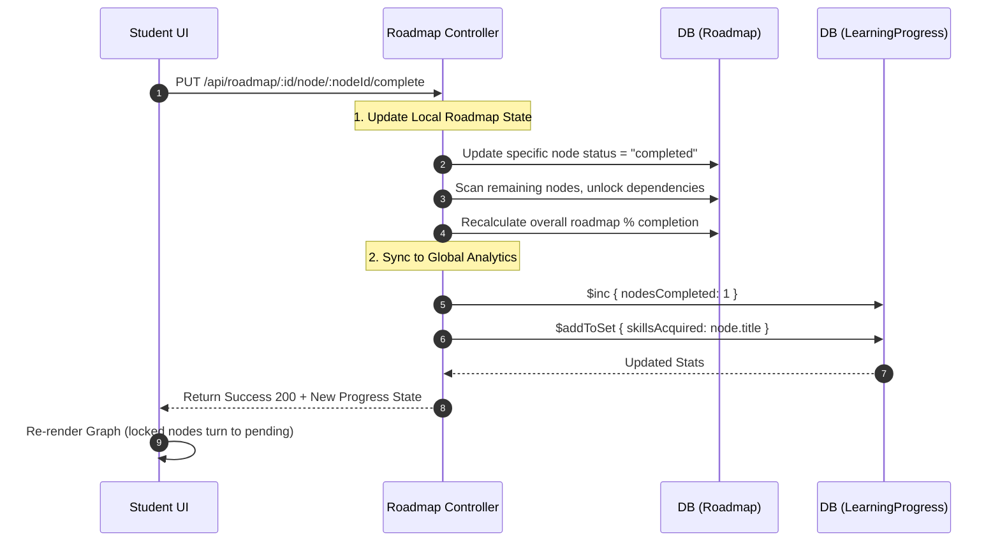

# Dynamic Learning Roadmaps Workflow

This document details the architecture, data flow, and underlying mechanics of the Learning Roadmaps feature. This system allows students to generate customized, AI-driven study paths in the form of Directed Acyclic Graphs (DAGs), track their progression over time, and feed that progress data up to the Tutor Analytics layer.

---

## 1. High-Level Architecture Overview

The Roadmaps module serves as the primary long-term tracking mechanism for a student's learning journey. It is primarily driven by the `roadmap` backend service, which interfaces with an LLM to generate structured JSON learning graphs based on open-ended student prompts. 

Once the AI generates the graph, the roadmap is persisted in the MongoDB database. As the student interacts with the UI, their progression through individual nodes is tracked and synced to their global `LearningProgress` profile. This centralization allows Recruiter modules and Tutor Dashboards to read a single source of truth regarding the student's competence.

---

## 2. End-to-End Workflow & Sequence

### Step 1: Roadmap Generation

The process begins when a student sets a learning goal.

1. The student navigates to the Roadmap dashboard (`client/src/modules/roadmap/pages/RoadmapDashboard.jsx`).
2. They input a specific learning goal into a text prompt (e.g., "I want to become a Senior React Developer focusing on performance optimization").
3. The frontend sends a `POST /api/roadmap/generate` request.

#### The AI Generation Step
The backend `controller.js` intercepts this request and builds an extensive system prompt for the AI. 
The LLM is strictly instructed to return a JSON object representing a Directed Acyclic Graph (DAG) of learning nodes. Each node represents a topic, subtopics, recommended resources, and an estimated completion time in hours.

Example of the generated JSON schema structure:
```json
{
  "title": "Senior React Developer Path",
  "nodes": [
    {
      "id": "node_1",
      "title": "Advanced Hooks",
      "description": "Deep dive into useMemo, useCallback, and custom hooks.",
      "estimatedHours": 10,
      "status": "pending",
      "dependsOn": []
    },
    {
      "id": "node_2",
      "title": "Concurrent Rendering",
      "description": "Understanding React 18 concurrent features.",
      "estimatedHours": 15,
      "status": "locked",
      "dependsOn": ["node_1"]
    }
  ]
}
```
The JSON is validated against this schema, and if successful, saved as a new `Roadmap` document linked to the student's `User` ID.

### Step 2: Progression Tracking & Unlocking

As the student studies, they interact with the Roadmap UI to mark nodes as complete. The UI heavily relies on the `dependsOn` array. If `node_2` depends on `node_1`, the UI renders `node_2` with a "locked" padlock icon and disables interactions until `node_1`'s status becomes "completed".

When a student completes a node, a cascading data update occurs:



### Step 3: Analytics Integration (The Data Sink)

The data generated in Step 2 doesn't just stay isolated within the Roadmap module. It is pipelined into the broader platform ecosystem:

1. **The Student Profile**: The completed nodes and extracted skills are appended to the student's public profile. This directly increases their visibility to Recruiters using the `Talent Finder` semantic search.
2. **The Recruiter Intelligence Pipeline**: The `recruiterIntelligence` scoring algorithm reads the `LearningProgress.nodesCompleted` metric to calculate the "Career" and "Contributions" scores (which account for 20% of a candidate's final job match score).
3. **The Tutor Analytics Dashboard**: Tutors can view the aggregate roadmap progress of their assigned students. If a Tutor sees that 80% of their cohort is stuck on "node_2" (Concurrent Rendering), they can intervene and schedule a Live Classroom session on that specific topic.

---

## 3. Key Files & Components Reference

| File Path | Responsibility |
| :--- | :--- |
| `client/src/modules/roadmap/pages/RoadmapDashboard.jsx` | The primary UI for generating new roadmaps and rendering the high-level list of active roadmaps. |
| `client/src/modules/roadmap/components/RoadmapGraph.jsx` | The visual component (often using a library like `react-flow` or custom CSS grids) responsible for parsing the JSON DAG and rendering nodes with connecting lines, handling "locked" vs "pending" visual states. |
| `server/src/modules/roadmap/controller.js` | Handles the Express API routes for prompting the LLM, validating the JSON graph schema, and toggling node completion statuses. |
| `server/src/database/models/Roadmap.js` | The Mongoose schema storing the complex JSON graph structure generated by the AI, including the array of nodes and their `dependsOn` arrays. |
| `server/src/database/models/LearningProgress.js` | The centralized analytics schema that receives metric updates (`$inc`, `$addToSet`) whenever a roadmap node is completed. |

---

## 4. Error Handling & Edge Cases

- **AI JSON Hallucinations**: LLMs occasionally fail to return perfectly formatted JSON, or they might generate a circular dependency in the graph (e.g., Node A depends on Node B, which depends on Node A). The backend `controller.js` must implement strict `try/catch` parsing blocks and a cycle-detection algorithm (like Kahn's algorithm or a Depth-First Search) before saving the Roadmap to the database. If a cycle is detected, the API returns a 500 and asks the user to retry generation.
- **Offline Mode**: If a student marks a node as complete while experiencing network issues, the UI relies on standard React Query or local state to optimistically render the change, while the API call is queued or retried in the background to ensure `LearningProgress` stays in sync.
- **Dependency Violations**: If a direct API call is made to complete a node whose dependencies are not yet met (bypassing the UI), the backend route actively rejects the request with a 400 Bad Request, enforcing the strict progression rules.
