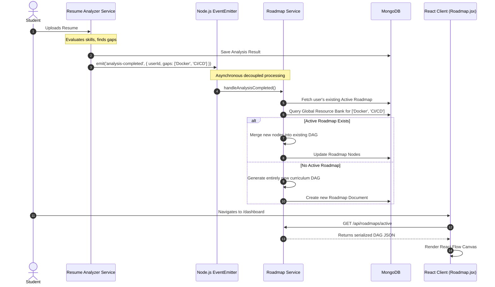
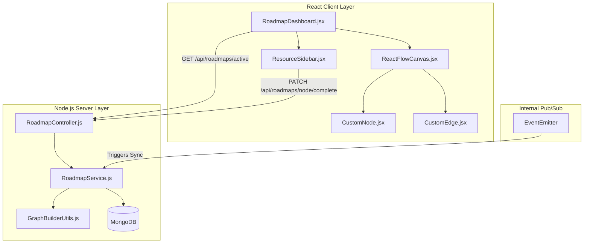

# Learning Roadmaps Workflow

## 1. Executive Summary & Domain Scope

The **Dynamic Learning Roadmaps** module acts as the "connective tissue" of the SkillsSphere-AI ecosystem. It automatically translates the raw scores, semantic gaps, and missing competencies identified by other modules (Resume Analyzer, Mock Interviews, Skill Quizzes) into actionable, step-by-step curriculum paths.

### Core Problem Addressed
When a student receives an AI evaluation (e.g., "You lack knowledge in React Server Components"), they are often left without clear, sequential guidance on how to remediate that gap. The Roadmaps module solves this by generating personalized, node-based learning trees populated with external resources (YouTube, Coursera, documentation) and internal platform exercises.

### Target User Personas
- **Students**: Need a highly visual, gamified progression path (similar to a skill tree in an RPG) that adapts dynamically as their skill profile evolves.
- **Content Curators / Admin**: Need a structured way to map external educational resources to specific keyword concepts inside the platform's knowledge graph.

### High-Level Capability Matrix
**What the Module Does:**
- **Dynamic Skill Trees**: Generates visual directed acyclic graphs (DAGs) representing prerequisite-based learning.
- **Cross-Module Syncing**: Automatically triggers a roadmap regeneration when a new resume is analyzed or an interview score drops.
- **Gamified Progression**: Tracks completion percentages, awards "Skill Badges," and manages daily streaks.
- **Resource Curation**: Aggregates structured learning materials based on NLP tagging.

**What the Module Deliberately Avoids:**
- **Hosting Native Video Content**: To minimize CDN costs and storage overhead, the platform does not host video lectures itself. It exclusively acts as an aggregator and progress tracker for external content.
- **Strict Linear Locking**: While prerequisites exist, students are not strictly locked out of advanced nodes. The system advises linear progression but allows non-linear exploration.

---

## 2. Comprehensive Architecture & Sequence Diagrams

The architecture is heavily reliant on a Pub/Sub event model, ensuring the Roadmap module is decoupled from the heavy processing logic of the Resume Analyzer or Interview Engine.

### End-to-End User Flow (Automated Generation)



### Component Hierarchy & Service Boundaries



---

## 3. Detailed Data Models & Schemas

Generating visual node graphs requires extremely strict data structuring. The database models essentially store a directed graph along with user-specific progress metadata.

### MongoDB Schemas

**Global Resource Bank Model (`src/database/models/Resource.js`)**
The master repository of educational links. These are tagged with specific concepts.

```javascript
const mongoose = require('mongoose');

const resourceSchema = new mongoose.Schema({
  title: { type: String, required: true },
  type: { 
    type: String, 
    enum: ['video', 'article', 'course', 'documentation', 'platform_quiz'],
    required: true
  },
  url: { type: String, required: true },
  provider: { type: String, default: 'External' }, // e.g., 'YouTube', 'MDN'
  estimatedMinutes: { type: Number, default: 30 },
  difficulty: { type: String, enum: ['Beginner', 'Intermediate', 'Advanced'] },
  
  // Tags mapped to AI Evaluator outputs
  tags: [{ type: String, index: true }], 
  
  metrics: {
    upvotes: { type: Number, default: 0 },
    completions: { type: Number, default: 0 }
  }
}, { timestamps: true });

// Essential for rapid tag-based aggregation during roadmap generation
resourceSchema.index({ tags: 1, difficulty: 1 });

module.exports = mongoose.model('Resource', resourceSchema);
```

**User Roadmap Model (`src/database/models/Roadmap.js`)**
The user-specific instance of a learning path. It stores the DAG structure using an adjacency list approach.

```javascript
const mongoose = require('mongoose');

const nodeSchema = new mongoose.Schema({
  id: { type: String, required: true }, // e.g., 'node_react_1'
  concept: { type: String, required: true }, // e.g., 'React Hooks'
  type: { type: String, enum: ['core', 'elective', 'milestone'], default: 'core' },
  status: { type: String, enum: ['locked', 'available', 'in_progress', 'completed'], default: 'locked' },
  
  // Positional metadata for React Flow rendering
  position: {
    x: { type: Number, required: true },
    y: { type: Number, required: true }
  },
  
  // Embedded resources specific to this node
  resources: [{
    resourceId: { type: mongoose.Schema.Types.ObjectId, ref: 'Resource' },
    title: { type: String },
    url: { type: String },
    type: { type: String },
    isCompleted: { type: Boolean, default: false }
  }]
}, { _id: false });

const edgeSchema = new mongoose.Schema({
  id: { type: String, required: true },
  source: { type: String, required: true }, // Reference to node.id
  target: { type: String, required: true }, // Reference to node.id
  type: { type: String, default: 'smoothstep' }
}, { _id: false });

const roadmapSchema = new mongoose.Schema({
  userId: { 
    type: mongoose.Schema.Types.ObjectId, 
    ref: 'User', 
    required: true,
    unique: true, // 1 Active Roadmap per user
    index: true
  },
  title: { type: String, default: 'My Personalized Path' },
  progressPercentage: { type: Number, default: 0 },
  
  // The Graph Structure
  nodes: [nodeSchema],
  edges: [edgeSchema],
  
  // Gamification tracking
  streak: {
    current: { type: Number, default: 0 },
    highest: { type: Number, default: 0 },
    lastActivityDate: { type: Date }
  }
}, { timestamps: true });

module.exports = mongoose.model('Roadmap', roadmapSchema);
```

---

## 4. API Endpoints & State Management

### REST Endpoints (Node.js Gateway)

| Method | Endpoint | Auth Level | Purpose | Payload | Response |
| :--- | :--- | :--- | :--- | :--- | :--- |
| `GET` | `/api/roadmaps/active` | Student | Retrieves the user's active DAG for rendering. | `None` | `{ roadmap: { nodes: [...], edges: [...] } }` |
| `POST` | `/api/roadmaps/generate` | Student | Manually triggers a complete roadmap recreation (destructive). | `{ targetRole: "Frontend Engineer" }` | `{ success: true, roadmap: {...} }` |
| `PATCH` | `/api/roadmaps/nodes/:nodeId/resources/:resourceId/complete` | Student | Marks a specific learning resource as finished. | `None` | `{ updatedNode: {...}, newProgress: 45 }` |
| `PATCH` | `/api/roadmaps/nodes/:nodeId/complete` | Student | Marks an entire concept node as mastered, potentially unlocking child nodes. | `None` | `{ unlockedNodes: ['node_7', 'node_8'] }` |
| `GET` | `/api/roadmaps/leaderboard` | Auth | Fetches top users based on streak and completed nodes. | `?limit=10` | `[{ userId, name, streak, completedNodes }]` |

### Complex Business Logic: Node Unlocking Algorithm
When a user completes a node via `PATCH /api/roadmaps/nodes/:nodeId/complete`, the backend must traverse the graph to determine if child nodes should transition from `locked` to `available`.

```javascript
// Server-side DAG Traversal (GraphBuilderUtils.js)
const unlockChildNodes = async (roadmap, completedNodeId) => {
  // 1. Find all edges where this node is the source
  const outgoingEdges = roadmap.edges.filter(e => e.source === completedNodeId);
  const targetNodeIds = outgoingEdges.map(e => e.target);
  
  let newlyUnlocked = [];
  
  // 2. Evaluate each target node
  for (let targetId of targetNodeIds) {
    const targetNode = roadmap.nodes.find(n => n.id === targetId);
    
    if (targetNode.status === 'locked') {
      // Check if ALL incoming dependencies for this target are completed
      const incomingEdges = roadmap.edges.filter(e => e.target === targetId);
      
      let allDependenciesMet = true;
      for (let edge of incomingEdges) {
        const sourceNode = roadmap.nodes.find(n => n.id === edge.source);
        if (sourceNode.status !== 'completed') {
          allDependenciesMet = false;
          break;
        }
      }
      
      if (allDependenciesMet) {
        targetNode.status = 'available';
        newlyUnlocked.push(targetId);
      }
    }
  }
  
  return newlyUnlocked;
};
```

### React State Management (Zustand over Redux)
Because the Roadmap renders a highly interactive, 60fps canvas (using `reactflow`), utilizing standard Redux often incurs too much overhead leading to rendering stutter. Therefore, the roadmap state is managed using `zustand`, which provides unopinionated, transient state updates ideal for dragging and dropping nodes.

```javascript
// client/src/modules/roadmap/store/useRoadmapStore.js
import { create } from 'zustand';
import { applyNodeChanges, applyEdgeChanges } from 'reactflow';

export const useRoadmapStore = create((set, get) => ({
  nodes: [],
  edges: [],
  progress: 0,
  
  setRoadmap: (data) => set({ 
    nodes: data.nodes, 
    edges: data.edges,
    progress: data.progressPercentage 
  }),
  
  // React Flow required handlers
  onNodesChange: (changes) => set({
    nodes: applyNodeChanges(changes, get().nodes),
  }),
  
  onEdgesChange: (changes) => set({
    edges: applyEdgeChanges(changes, get().edges),
  }),
  
  markNodeComplete: (nodeId) => {
    const nodes = get().nodes.map(n => {
      if (n.id === nodeId) return { ...n, data: { ...n.data, status: 'completed' } };
      return n;
    });
    set({ nodes });
  }
}));
```

---

## 5. Security, Edge Cases & Error Handling

### Graph Integrity & Circular Dependency Prevention
A critical edge case in any DAG implementation is the accidental introduction of circular dependencies (e.g., A requires B, B requires C, C requires A). If a user attempts to generate a roadmap that results in a circular graph, the traversal algorithm will infinite-loop, crashing the Node.js process.
- **Mitigation**: During the `GraphBuilderUtils` generation phase, the backend utilizes Kahn’s Algorithm for Topological Sorting. If the topological sort fails (the queue empties before visiting all nodes), the system immediately detects a cycle, aborts the generation, and falls back to a safe linear roadmap template.

### State Desynchronization
If a user keeps two browser tabs open, completes a node in Tab A, and then interacts with that same node in Tab B, state desync occurs.
- **Mitigation**: Every `PATCH` request returns the full updated status of the mutated node and its immediate children. The client optimistic UI is immediately reconciled against the server's authoritative response. Furthermore, `ETag` caching ensures that if Tab B makes a subsequent fetch, it receives the latest state.

### Streak Gamification Exploits
To prevent students from rapidly clicking "Complete" on 50 resources in one day to artificially boost their metrics:
- The backend enforces a `timeSpent` validation check based on the resource's `estimatedMinutes`.
- A background cron job runs at 00:00 UTC to evaluate streaks. If `lastActivityDate` is older than 48 hours, the streak resets to 0.

---

## 6. Component-Level Implementation Specs

### `RoadmapDashboard.jsx` (The Layout Wrapper)
This component serves as the flexbox container that holds the interactive canvas and the side panel. It handles the initial data fetching logic (`useEffect`) and orchestrates the loading states (displaying a skeletal graph while fetching).

### `ReactFlowCanvas.jsx` (The Interactive Core)
Wraps the `reactflow` library. 
- **Custom Nodes**: Instead of standard rectangles, the canvas registers a `nodeTypes = { custom: CustomNode }` object.
- **Minimap & Controls**: Integrates the native React Flow `<MiniMap />` and `<Controls />` components to allow zooming and panning across massive skill trees (some containing 50+ nodes).
- **Background**: Utilizes the `<Background color="#4f46e5" gap={16} />` to render the dot-grid aesthetic matching the "Gold Standard" dark mode theme.

### `CustomNode.jsx` (The Node UI)
This is a heavily customized React component that visually represents a concept.
- **Props**: Receives `data` which includes `concept`, `status`, and `resources`.
- **Styling**: Dynamically applies Tailwind utility classes based on status:
  - `status === 'locked'`: Grayscale, low opacity, padlock icon.
  - `status === 'available'`: Pulsing border, brand gradient text.
  - `status === 'completed'`: Solid green background, checkmark icon.
- **Handles**: Renders `<Handle type="target" />` at the top and `<Handle type="source" />` at the bottom to serve as connection points for the SVG edges.

### `ResourceSidebar.jsx` (The Drill-Down View)
When a user clicks on an `available` node in the canvas, this sliding sidebar (using Framer Motion for entrance animations) appears from the right edge.
- It iterates over the node's `resources` array, rendering clickable cards.
- Each card displays the resource provider (YouTube, MDN), the estimated time, and a checkbox.
- Clicking the checkbox fires the `PATCH /api/roadmaps/nodes/:nodeId/resources/:resourceId/complete` thunk, updating the backend and triggering a localized re-render of the node's progress bar.
