# AI Mock Interviews & Tutor Analytics Workflow

This document provides a highly detailed, exhaustive technical breakdown of the Mock Interview pipeline. It traces the flow of data from the student's initial persona configuration, through the real-time Speech-to-Text response capture, into the backend AI evaluation engine (`runPipeline`), and finally explores how this data is surfaced on the Tutor Dashboard for human review.

---

## 1. High-Level Architecture Overview

The Mock Interview system is designed to simulate a real-world technical interview environment. It relies on a decoupled architecture:

1. **Frontend Capture**: A React-based interface (`InterviewSession.jsx`) that handles state management for the active question, records the duration of the interview, and interfaces with the browser's native `SpeechRecognition` API to capture audio answers as text transcripts.
2. **Backend AI Engine**: A Node.js service (`interviews/service.js`) that receives the raw transcript array upon completion. It orchestrates a heavy data-processing pipeline that compares the student's answers against semantically loaded `QuestionBank` data using a multi-variable weighted scoring formula.
3. **Analytics Aggregation**: A centralized MongoDB schema (`LearningProgress`) that aggregates these AI scores over time, allowing Tutors to visualize trends via `Recharts` and drill down into specific weaknesses.

---

## 2. End-to-End Workflow & Sequence

### Step 1: Pre-Interview Lobby & Configuration

1. The student navigates to the Mock Interview module (`client/src/modules/mock-interview/pages/InterviewLobby.jsx`).
2. The UI presents a configuration form where the student selects a target role or topic (e.g., "Frontend Developer", "Data Structures").
3. The frontend makes a `GET /api/interviews/questions?topic={topic}` request.
4. The backend queries the `QuestionBank` collection, returning a randomized, tailored subset of questions (typically 5-10) to prevent memorization of a static test.

### Step 2: The Active Interview Session

Once the student clicks "Start", they are routed to `InterviewSession.jsx`. The UI enters a focused, full-screen mode.

#### Speech-to-Text Integration
To mimic a real interview, the student is encouraged to speak their answers. This is handled natively in the browser without sending raw audio blobs to the server, heavily reducing bandwidth and latency.

```javascript
// Speech-to-Text Initialization Snippet
const SpeechRecognition = window.SpeechRecognition || window.webkitSpeechRecognition;
const recognition = new SpeechRecognition();
recognition.continuous = true;
recognition.interimResults = true;

recognition.onresult = (event) => {
  let finalTranscript = '';
  for (let i = event.resultIndex; i < event.results.length; ++i) {
    if (event.results[i].isFinal) {
      finalTranscript += event.results[i][0].transcript;
    }
  }
  // Append to current answer state
  setCurrentAnswer(prev => prev + ' ' + finalTranscript);
};
```

*Fallback*: If the student's browser does not support the API, or they lack a microphone, a standard text area is provided.

The session tracks:
- Time spent per question.
- The exact transcript of the answer.
- The question's reference ID.

### Step 3: Submission & The AI Evaluation Pipeline

When the student finishes the final question, the frontend array of `{ questionId, answer }` objects is sent via `POST /api/interviews/submit`. 

This triggers the heavy backend evaluation pipeline.

```mermaid
sequenceDiagram
    autonumber
    participant FE as React Frontend
    participant Route as Interview Controller
    participant Service as Interview Service
    participant AI as Evaluator (runPipeline)
    participant DB as MongoDB (LearningProgress)

    FE->>Route: POST /api/interviews/submit (Answers Array)
    Route->>Service: processInterviewSubmission(userId, answers)
    
    loop For Each Answer
        Service->>DB: Fetch Question metadata (expected skills/keywords)
        Service->>AI: runPipeline(question, answer, schema)
        Note over AI: 1. Extract Keywords<br/>2. Semantic Similarity Score<br/>3. Identify specific Weaknesses
        AI-->>Service: Return Breakdown Object { score: 85, feedback: "..." }
    end
    
    Note over Service: Calculate Aggregate Session Score
    Service->>DB: $push: { mockInterviews: sessionResult }
    Service->>DB: $addToSet: { weaknesses: identifiedWeaknesses }
    
    DB-->>Route: DB Update Success
    Route-->>FE: Return full AI Feedback & Scorecard
```



### Step 4: Tutor Analytics & Review

The value of the Mock Interview system is in how the data is utilized by educators. Tutors have a specialized set of dashboards to monitor this data.

#### A. The Global Analytics Dashboard
Located at `client/src/modules/analytics/TutorAnalyticsDashboard.jsx`. 
This page aggregates data from *all* assigned students. It utilizes the `Recharts` library to visualize:
- Average mock interview scores over the last 30 days.
- A treemap of the most frequently identified AI weaknesses across the cohort.

#### B. The Tutor Interview Console
Located at `client/src/modules/mock-interview/pages/TutorInterviewConsole.jsx`.
Tutors can drill down into a specific student's profile and open a specific interview session. The UI presents:
- The overall AI score out of 100.
- A side-by-side view of the Question, the Expected Answer, and the Student's Raw Transcript.
- The AI's isolated feedback on *why* a certain score was given.

This allows the Tutor to audit the AI. If the AI graded the student too harshly because of a Speech-to-Text transcription error, the Tutor can manually override the score.

---

## 3. The `runPipeline` Evaluation Engine

The `runPipeline` function is the core of the AI grading system. It does not rely purely on LLM "vibes" but uses a strict, deterministic weighted formula.

### The Scoring Formula
The final score for a single answer is a blended average:
- **Keyword Match (20%)**: The system checks the transcript against an array of required technical terms. For example, if the question is about React state, the terms `useState` and `immutable` might be required.
- **Experience Match (20%)**: Checks if the answer includes practical context (e.g., "In my last project, I used...").
- **Semantic Skill Match (60%)**: Uses LLM-based evaluations to understand the context and correctness of the answer. This prevents students from artificially inflating their score by simply listing keywords randomly ("keyword stuffing").

```javascript
// Backend Evaluator Snippet
export const runPipeline = async (question, answerText) => {
  const keywordScore = calculateKeywordDensity(answerText, question.requiredKeywords);
  const semanticScore = await invokeLLMEvaluator(question.prompt, answerText);
  
  const finalScore = (keywordScore * 0.2) + (semanticScore * 0.8);
  
  return {
    score: finalScore,
    weaknesses: identifyGaps(answerText, question.expectedConcepts)
  };
};
```

---

## 4. Key Files & Components Reference

| File Path | Responsibility |
| :--- | :--- |
| `client/src/modules/mock-interview/pages/InterviewSession.jsx` | Handles the UI for the active interview. Integrates with the browser's Web Speech API for voice capture and manages the session timer. |
| `client/src/modules/mock-interview/pages/TutorInterviewConsole.jsx` | The review portal for Tutors to audit AI-graded interviews, view transcripts, and assess weaknesses. |
| `client/src/modules/analytics/TutorAnalyticsDashboard.jsx` | The high-level Recharts dashboard aggregating all `LearningProgress` data. |
| `server/src/modules/interviews/controller.js` | The Express route handler that receives the submitted transcript and routes it to the AI service. |
| `server/src/modules/interviews/service.js` | Orchestrates the `runPipeline` evaluation loop, calculates averages, and persists the resulting scores to the database. |
| `server/src/database/models/LearningProgress.js` | The central schema tying a `User` (student) to their historical interview scores, roadmaps, and identified weaknesses. |

---

## 5. Error Handling & Edge Cases

- **No Microphone Access**: If the student denies microphone permissions, the UI gracefully falls back to a multi-line text area, allowing them to type their answers.
- **Lost Connection**: If the browser refreshes mid-interview, current state is lost unless cached in `localStorage`. The current implementation requires the student to complete the session in one sitting.
- **Empty Transcripts**: If the student submits a completely empty transcript for a question, the backend pipeline short-circuits the LLM call to save costs, immediately returning a score of `0` for that question.
