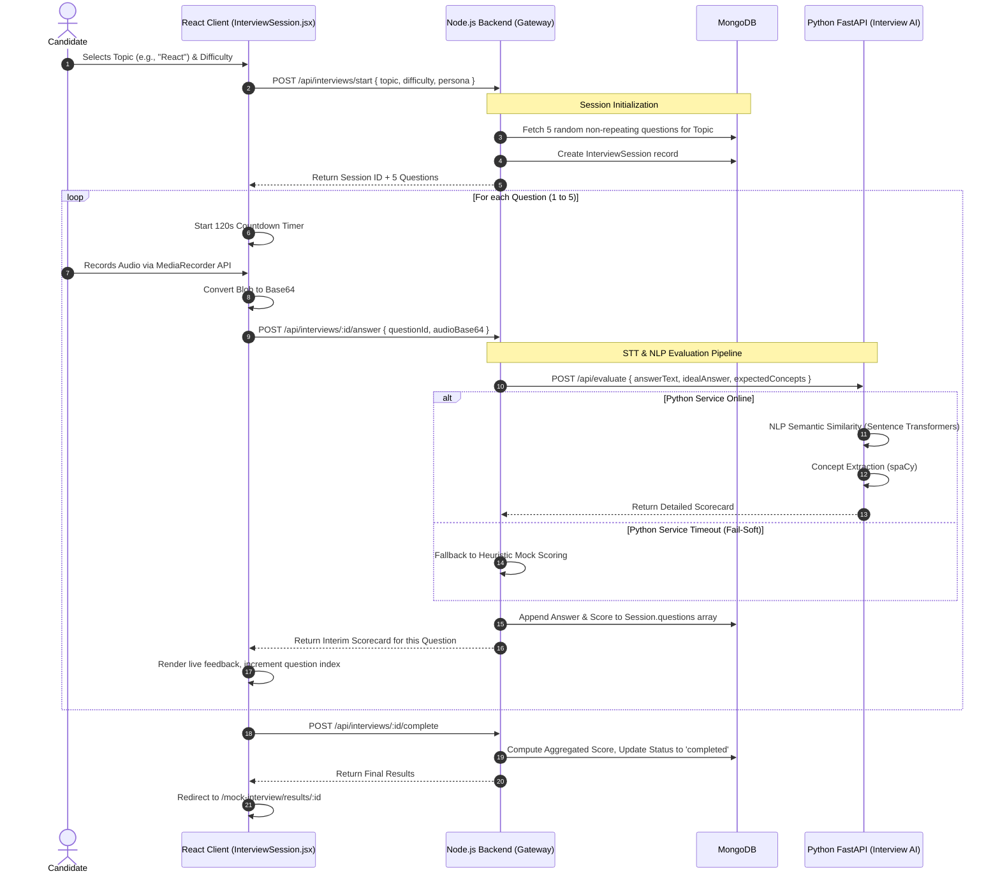
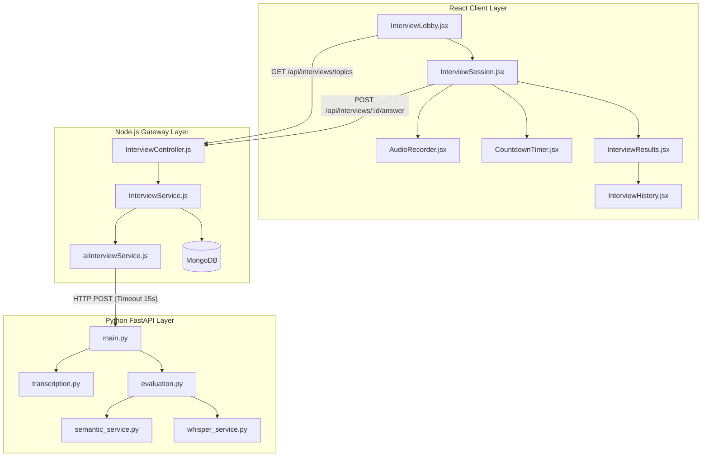

# Mock Interview Engine Workflow

## 1. Executive Summary & Domain Scope

The **AI Mock Interview Engine** is a heavily integrated, multi-service module within the SkillsSphere-AI ecosystem. It is designed to autonomously simulate technical, behavioral, and architectural interviews by combining an interactive React frontend with a specialized Python FastAPI microservice dedicated to Natural Language Processing (NLP) and Speech-to-Text (STT) tasks.

### Core Problem Addressed
Candidates often lack realistic environments to practice high-stress verbal technical communication. Traditional mock interviews require a human peer, which is expensive and difficult to schedule. This module solves this by using AI to dynamically generate domain-specific questions, transcribe spoken audio using Whisper models, and evaluate the candidate's answers based on technical accuracy, semantic similarity to an optimal answer, and communication clarity.

### Target User Personas
- **Students (Candidates)**: Require a low-latency, stress-inducing (via timers and camera feeds) mock environment to practice technical articulation before actual interviews.
- **Tutors/Mentors**: Can review the historical paginated scorecards of their students to identify recurring weaknesses in specific domains (e.g., React hooks, Node.js streams).

### High-Level Capability Matrix
**What the Module Does:**
- **Dynamic Question Generation**: Randomly selects questions from a predefined domain bank without repeating questions across sequential sessions.
- **Multimodal Input**: Captures both typed text and spoken audio (using `MediaRecorder` APIs), converting speech to text via the Python STT microservice.
- **Multi-Dimensional Evaluation**: Evaluates answers across three axes: Technical Accuracy (Semantic similarity via HuggingFace Sentence Transformers), Concept Coverage (spaCy noun-chunking), and Communication Clarity (Readability scoring).
- **Graceful Fallbacks (Fail-Soft Mode)**: If the Python AI service goes offline, the Node.js backend automatically intercepts the timeout and generates mock heuristic scores, ensuring the user is never stuck in a loading state.

**What the Module Deliberately Avoids:**
- **Fully Generative Questions**: To prevent AI hallucinations or overly generic questions ("What is programming?"), the base questions and their "ideal answers" are pre-seeded in the database by domain experts. The AI is used exclusively for *evaluation* of the user's answer, not for *generating* the base question itself.
- **Real-time Video Processing**: To save bandwidth, the camera feed in the lobby is strictly a local mirror (using `getUserMedia`). No video data is uploaded to the server; only audio blobs are transmitted.

---

## 2. Comprehensive Architecture & Sequence Diagrams

The Interview Engine spans three distinct environments: the React Client, the Node.js API Gateway, and the Python FastAPI Microservice.

### End-to-End User Flow



### Component Hierarchy & Microservice Boundaries



---

## 3. Detailed Data Models & Schemas

The engine relies on two highly structured Mongoose models to track the seed questions and the dynamic user sessions.

### MongoDB Schemas

**Question Bank Model (`src/database/models/QuestionBank.js`)**
Stores the expert-curated questions used to evaluate candidates.

```javascript
const mongoose = require('mongoose');

const questionBankSchema = new mongoose.Schema({
  topic: { 
    type: String, 
    required: true, 
    index: true,
    enum: ['React', 'Node.js', 'System Design', 'JavaScript', 'Data Structures']
  },
  difficulty: { 
    type: String, 
    enum: ['Beginner', 'Intermediate', 'Advanced'], 
    required: true 
  },
  question: { 
    type: String, 
    required: true 
  },
  idealAnswer: { 
    type: String, 
    required: true 
  },
  keyConcepts: [{ 
    type: String 
  }], // Extracted by spaCy during DB seeding
  metadata: {
    estimatedTimeSeconds: { type: Number, default: 120 },
    category: { type: String } // e.g., 'Hooks', 'Streams', 'Trees'
  }
}, { timestamps: true });

// Compound index for extremely fast randomized selection queries
questionBankSchema.index({ topic: 1, difficulty: 1 });

module.exports = mongoose.model('QuestionBank', questionBankSchema);
```

**Interview Session Model (`src/database/models/InterviewSession.js`)**
Tracks the stateful progression of a user's 5-question interview.

```javascript
const mongoose = require('mongoose');

const answerSchema = new mongoose.Schema({
  questionId: { type: mongoose.Schema.Types.ObjectId, ref: 'QuestionBank', required: true },
  questionText: { type: String, required: true },
  userAnswer: { type: String, required: true },
  timeSpentSeconds: { type: Number, required: true },
  isAudio: { type: Boolean, default: false },
  
  // Evaluation block populated by Python AI Service
  evaluation: {
    score: { type: Number, min: 0, max: 100 },
    feedback: { type: String },
    technicalAccuracy: { type: Number, min: 0, max: 100 }, // Sentence-Transformer Cosine Similarity
    communicationClarity: { type: Number, min: 0, max: 100 }, // Flesch-Kincaid / Grammar check
    coveredConcepts: [{ type: String }],
    missingConcepts: [{ type: String }]
  },
  submittedAt: { type: Date, default: Date.now }
});

const interviewSessionSchema = new mongoose.Schema({
  userId: { 
    type: mongoose.Schema.Types.ObjectId, 
    ref: 'User', 
    required: true,
    index: true
  },
  topic: { type: String, required: true },
  difficulty: { type: String, required: true },
  persona: { type: String, enum: ['Strict', 'Friendly', 'Technical'], default: 'Friendly' },
  status: { 
    type: String, 
    enum: ['initialized', 'in-progress', 'completed', 'abandoned'], 
    default: 'initialized' 
  },
  questions: [answerSchema], // Embedded sub-documents for fast read/write
  finalScore: { type: Number },
  overallFeedback: { type: String },
  startedAt: { type: Date, default: Date.now },
  completedAt: { type: Date }
}, { timestamps: true });

// Index for paginated history fetching
interviewSessionSchema.index({ userId: 1, status: 1, createdAt: -1 });

module.exports = mongoose.model('InterviewSession', interviewSessionSchema);
```

---

## 4. API Endpoints & State Management

### REST Endpoints (Node.js Gateway)

| Method | Endpoint | Auth Level | Purpose | Payload | Response |
| :--- | :--- | :--- | :--- | :--- | :--- |
| `GET` | `/api/interviews/topics` | Auth | Retrieves available topics and total question counts. | `None` | `[{ topic: "React", count: 45 }]` |
| `POST` | `/api/interviews/start` | Auth | Starts a session, selects 5 random questions. | `{ topic: "React", difficulty: "Intermediate" }` | `{ sessionId: "...", questions: [...] }` |
| `POST` | `/api/interviews/:id/answer` | Auth | Submits a single answer for AI evaluation. | `{ questionId, text, timeSpent }` | `{ evaluation: { score, feedback, ... } }` |
| `POST` | `/api/interviews/:id/complete` | Auth | Aggregates the 5 sub-scores into a final result. | `None` | `{ finalScore: 88, status: "completed" }` |
| `GET` | `/api/interviews/:id/results` | Auth | Retrieves the full historical scorecard. | `None` | `{ session: {...} }` |

### Python Microservice Endpoints (Internal Only)
These endpoints are intentionally not exposed to the public internet. The Node.js gateway securely forwards traffic to them over the internal docker network or VPC.

| Method | Endpoint | Payload | Action |
| :--- | :--- | :--- | :--- |
| `POST` | `/api/evaluate` | `{ answer, ideal, concepts }` | Computes semantic similarity (SentenceTransformers) and extracts NLP concepts (spaCy). |
| `POST` | `/api/transcribe` | `{ audio_base64 }` | Converts Base64 audio back to bytes and runs Faster-Whisper to transcribe speech to text. |

### React State Management (Custom Hook)
To prevent massive Redux bloat for ephemeral interview data, the frontend manages session state using a specialized custom hook `useInterviewState.js` coupled with standard React context.

```javascript
// client/src/modules/mock-interview/hooks/useInterviewState.js
export function useInterviewState(sessionId) {
  const [session, setSession] = useState(null);
  const [currentQuestionIndex, setCurrentQuestionIndex] = useState(0);
  const [isSubmitting, setIsSubmitting] = useState(false);
  const [timeRemaining, setTimeRemaining] = useState(120);

  const submitAnswer = async (answerText) => {
    setIsSubmitting(true);
    try {
      const q = session.questions[currentQuestionIndex];
      const res = await interviewService.submitAnswer(sessionId, q._id, answerText, 120 - timeRemaining);
      
      // Mutate local session state optimistically
      const updatedQuestions = [...session.questions];
      updatedQuestions[currentQuestionIndex] = { ...q, evaluation: res.evaluation };
      setSession({ ...session, questions: updatedQuestions });
      
      // Move to next question or complete
      if (currentQuestionIndex < session.questions.length - 1) {
        setCurrentQuestionIndex(prev => prev + 1);
        setTimeRemaining(120); // Reset timer
      } else {
        await completeInterview();
      }
    } finally {
      setIsSubmitting(false);
    }
  };

  return { session, currentQuestionIndex, isSubmitting, timeRemaining, submitAnswer };
}
```

---

## 5. Security, Edge Cases & Error Handling

### Fail-Soft Resilience Design
The Python AI microservice (running heavy ML models) is the most likely component to experience cold-start delays or OOM (Out of Memory) crashes under load. The Node.js gateway employs a strict **Fail-Soft Architecture**.

```javascript
// server/src/integrations/aiInterviewService.js

const evaluateAnswer = async (userAnswer, idealAnswer, keyConcepts) => {
  try {
    const controller = new AbortController();
    const timeoutId = setTimeout(() => controller.abort(), 10000); // Strict 10s timeout
    
    const response = await axios.post(PYTHON_SERVICE_URL, payload, { signal: controller.signal });
    clearTimeout(timeoutId);
    return response.data;
  } catch (error) {
    logger.error("Python AI Service failed. Falling back to heuristic mock scoring.");
    return generateMockHeuristicScore(userAnswer, idealAnswer, keyConcepts);
  }
};
```

If the Python service times out, the `generateMockHeuristicScore` function kicks in. It performs a rapid, regex-based keyword density check in Node.js to provide an approximate score (e.g., 75%) and generic feedback, ensuring the student's interview is never interrupted by a server 500 error.

### Audio Blob Validation & Security
Audio uploads are notoriously difficult to secure against SSRF or buffer overflow attacks.
1. The frontend strictly forces the `MediaRecorder` to output standard `audio/webm` or `audio/mp4` blobs depending on browser support.
2. The blob is converted to a Base64 string for JSON transmission.
3. The Node.js backend validates the Base64 string length (rejecting anything larger than 10MB) before forwarding it to the Python service.
4. The Python service uses `python-magic` to inspect the byte headers of the decoded string to ensure it is actually an audio file before passing it to the Whisper model.

---

## 6. Component-Level Implementation Specs

### `InterviewLobby.jsx` (Hardware Permissions & Setup)
This component's primary technical challenge is aggressively requesting and verifying hardware permissions (Camera & Mic) before allowing the user to click "Start".

- **Dependencies**: Uses `navigator.mediaDevices.getUserMedia`.
- **Implementation Detail**: It implements a visual volume meter by piping the microphone `MediaStream` into an `AudioContext` and an `AnalyserNode`, extracting frequency data on a `requestAnimationFrame` loop to render a bouncing green bar, confirming mic health.

### `CountdownTimer.jsx` (Precision Timekeeping)
Standard `setInterval` loops in React drift wildly when tabs are backgrounded, meaning a 120-second timer could actually take 150 seconds.
- **Optimization**: The timer component records `Date.now()` on mount. The `useEffect` interval subtracts the current `Date.now()` from the baseline to calculate true elapsed time, remaining completely immune to browser tab throttling.

### `InterviewResults.jsx` (Data Visualization)
Once the session completes, this component fetches the final scorecard.
- **Rendering**: It utilizes SVG manipulation to render a circular progress ring for the `finalScore`.
- **Interactivity**: It maps over the `questions` array, rendering an Accordion component for each. Expanding the accordion reveals the user's exact answer alongside the AI's feedback, extracted `coveredConcepts` (green badges), and `missingConcepts` (red badges).

### `InterviewHistory.jsx` (Dashboard Hub)
A standardized, paginated dashboard view. It strictly inherits the "Gold Standard" UI aesthetics, applying multi-color gradients to the page title and correctly positioning the "Back to Dashboard" button. It fetches `/api/interviews/history` with `page=1&limit=10` to prevent payload bloat for heavy users.
