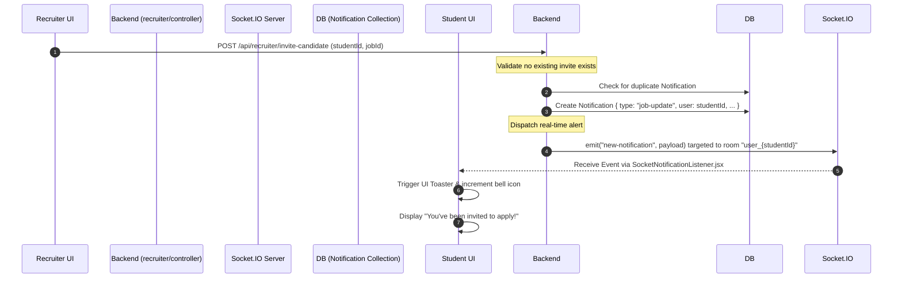

# Proactive Recruitment & Job Application Workflow

This document outlines the end-to-end recruitment pipeline within the SkillsSphere-AI platform. It bridges the Recruiter's proactive talent discovery tools with the Student's job application process, all powered by real-time WebSockets and an advanced AI scoring engine that evaluates candidates deterministically.

---

## 1. High-Level Architecture Overview

The Recruitment module flips the traditional job board model. Rather than posting a job and waiting for applicants to organically discover it, Recruiters are empowered to proactively discover candidates via Semantic Search over the global `Resume` collection.

When a candidate is invited, they receive a real-time `Socket.io` notification. They can then generate an AI-tailored Cover Letter and apply. Finally, the `recruiterIntelligence` pipeline evaluates the application against the job requirements and assigns a deterministic Match Score, allowing the Recruiter to filter their applicant tracking system instantly.

---

## 2. End-to-End Workflow & Sequence

### Step 1: Job Posting & Talent Discovery

1. **Job Creation**: The Recruiter navigates to `RecruiterJobsPage.jsx` and creates a new `JobPosting`. This schema contains required skills (automatically lowercased for indexing), structured salary ranges (validated ensuring `max >= min`), and required experience levels.
2. **Talent Finder Interface**: The Recruiter navigates to `TalentFinderPage.jsx` to search for candidates matching this new job.
3. **The Aggregation Pipeline**: When a search is triggered, the backend `recruiter/controller.js` runs a complex MongoDB Aggregation Pipeline:
   - It utilizes a `$text` index search (yielding a `$meta textScore`) to rank resumes based on query relevance.
   - It applies a `$match` stage with regex operators to filter by specific required technical skills.
   - It extracts the candidate's graduation year from the `education` array to filter by experience level.

**Specialization Mapping**:
The UI simplifies searches by mapping broad domains to backend keyword arrays:
- *Frontend*: `react, vue, angular, javascript, typescript, html, css, next.js`
- *Backend*: `node.js, express, django, flask, java, go, rust`
- *DevOps*: `docker, kubernetes, aws, azure, ci/cd, terraform`

### Step 2: The Invitation (Real-Time Sync)

When a Recruiter identifies a promising candidate, they click "Invite to Apply". This triggers a real-time notification flow.

### Step 3: The Application & Cover Letter Generation

1. The student clicks the notification and is routed to the detailed Job View.
2. **AI Cover Letter Generation**: Before finalizing the application, the student can launch the `CoverLetterModal.jsx`.
   - The frontend calls `POST /api/cover-letters/generate`.
   - The `coverLetters/service.js` backend service retrieves the specific `JobPosting` text and the student's `Resume` text.
   - An LLM prompt merges these two data sources, instructing the AI to output a highly tailored, professional cover letter highlighting exactly how the student's projects align with the job's required skills.
3. The student reviews, edits, and submits the application, generating a `JobApplication` document.

### Step 4: The Intelligence Matching Pipeline

The moment the `JobApplication` is created, the system must grade the candidate. This is handled by the `recruiterIntelligence/service.js` module.

The system calculates an aggregated Match Score (0-100) using a 5-pillar formula:

`Final Score = (ATS × 0.20) + (Skills × 0.35) + (Projects × 0.25) + (Career × 0.10) + (Contributions × 0.10)`

- **ATS (20%)**: Checks if the resume formatting and keyword density pass standard ATS filters.
- **Skills (35%)**: Direct intersection check between `JobPosting.skills` and `Resume.skills`.
- **Projects (25%)**: Semantic evaluation of project descriptions against the job role.
- **Career (10%) & Contributions (10%)**: These metrics are uniquely parsed dynamically from the student's `LearningProgress` profile (e.g., their historical Mock Interview scores and completed Roadmaps).

### Step 5: Recruiter Review & Badging

The Recruiter opens `RecruiterApplicantsPage.jsx` to view the incoming applications. The UI parses the `matchCategory` returned by the AI and attaches semantic color-coded badges to instantly draw attention to top candidates:

- **Excellent Match (Score ≥ 85)**: Highlighted in green. These are fast-tracked candidates.
- **Moderate Match (Score ≥ 70)**: Highlighted in blue. Good candidates missing a minor skill.
- **Growth Potential (Score ≥ 50)**: Highlighted in yellow. Lacking experience but showing high `Contributions` scores.
- **Weak Alignment (Score < 50)**: Highlighted in red. Does not meet minimum ATS or skill thresholds.

---

## 3. Key Files & Components Reference

| File Path | Responsibility |
| :--- | :--- |
| `client/src/modules/recruiter-jobs/pages/TalentFinderPage.jsx` | UI for the Semantic Search interface and manual triggering of the "Evaluate Match" action. |
| `client/src/modules/recruiter-jobs/pages/RecruiterApplicantsPage.jsx` | The applicant tracking dashboard where recruiters view applications sorted by AI Match Score. |
| `client/src/shared/components/SocketNotificationListener.jsx` | A global React context wrapper that mounts at the root of the app. It listens for `new-notification` socket events and triggers non-intrusive UI toasts. |
| `client/src/shared/components/CoverLetterModal.jsx` | The UI interceptor allowing students to generate AI cover letters before applying. |
| `server/src/modules/recruiter/controller.js` | Contains the massive MongoDB `$text` aggregation logic powering the Talent Finder search. |
| `server/src/modules/recruiterIntelligence/service.js` | The mathematical AI engine that calculates the Match Score based on the 5-pillar formula and generates actionable "Hiring Signals". |
| `server/src/modules/coverLetters/service.js` | The backend service responsible for merging a Resume and a Job Posting via an LLM to output a tailored cover letter. |

---

## 4. Security & Edge Cases

- **Duplicate Invitations**: The backend controller actively checks the `Notification` collection to ensure a Recruiter cannot spam a candidate with multiple invitations for the same `JobPosting`.
- **Socket Rooms**: Socket.io notifications are highly targeted. When a user connects, their socket is forced to join a room named `user_{userId}`. The invitation emit is sent *only* to this room, preventing other connected users from intercepting the payload.
- **Missing Data Fallbacks**: If a student does not have a fully populated `LearningProgress` document, the AI scoring engine safely defaults the Career and Contributions metrics to baseline values to prevent `NaN` errors during the final score calculation.
