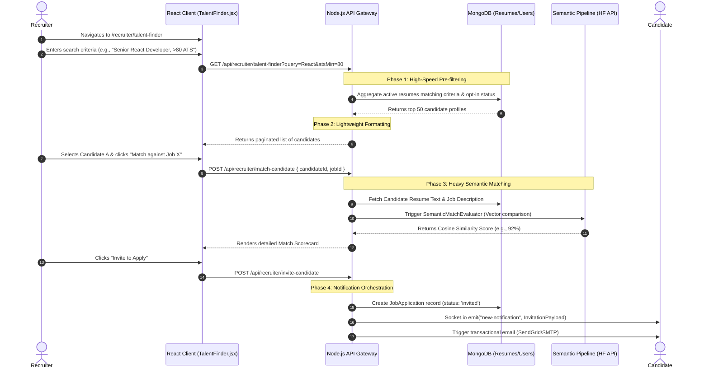
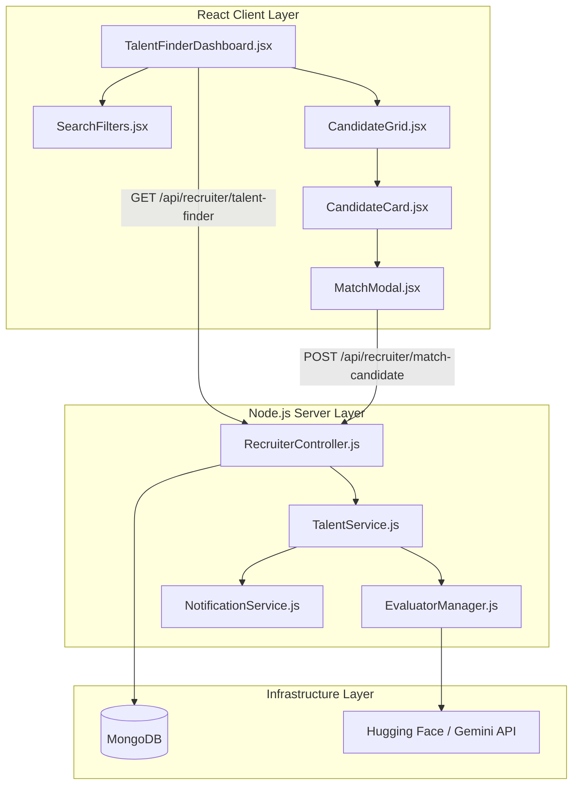

# Recruitment & Talent Discovery Workflow

## 1. Executive Summary & Domain Scope

The **Recruitment & Talent Discovery** module serves as the primary B2B engine for the SkillsSphere-AI platform. It is explicitly designed to solve the "resume black hole" problem by reversing the traditional job board paradigm: instead of waiting for candidates to apply, recruiters proactively query an indexed, AI-scored database of opted-in student profiles. By integrating deep semantic search, ATS evaluation history, and real-time Socket.IO invitations, the module accelerates the sourcing pipeline from weeks to seconds.

### Core Problem Addressed
Standard applicant tracking systems rely on exact keyword matching, which frequently discards highly qualified candidates who use slightly different terminology (e.g., "frontend engineering" vs. "UI development"). Furthermore, recruiters waste countless hours manually screening resumes. This module introduces the **AI Talent Finder**, which leverages vector embeddings and semantic similarity scoring to uncover hidden talent, while exposing the candidate's historical AI interview and resume analysis scores to provide a holistic measure of competence.

### Target User Personas
- **Recruiters / Hiring Managers**: Need a high-fidelity search interface, transparent candidate scoring, and the ability to instantly trigger application invitations.
- **Candidates (Students)**: Need a passive, privacy-first way to be discovered by employers based purely on merit (verified skills and AI evaluation scores) without actively applying.

### High-Level Capability Matrix
**What the Module Does:**
- **Semantic Talent Discovery**: Enables searching the entire candidate database using natural language queries, technical specializations, graduation years, and ATS score minimums.
- **Dynamic Scorecards**: Generates a real-time "Match Scorecard" computing the compatibility between a candidate's resume and a recruiter's specific active job posting.
- **Proactive Outreach**: Allows recruiters to send one-click invitations that trigger real-time, in-app notifications and emails to the candidate.
- **Privacy-First Indexing**: Strictly enforces opt-in policies; candidates who disable discovery or set their profile to private are hard-filtered from all recruiter aggregations.

**What the Module Deliberately Avoids:**
- **Automated Rejections**: The AI matching pipeline provides recommendations and percentage scores, but it intentionally does not auto-reject candidates. All final outreach decisions remain with the human recruiter.
- **Direct Messaging**: To prevent spam, recruiters cannot directly chat with candidates until the candidate accepts an application invitation.

---

## 2. Comprehensive Architecture & Sequence Diagrams

The architecture separates the search index (MongoDB text and array indexing) from the heavy semantic matching pipeline (Hugging Face / Gemini API).

### End-to-End User Flow (Talent Discovery)



### Component Hierarchy & Service Boundaries



---

## 3. Detailed Data Models & Schemas

The recruitment workflow relies heavily on the `JobPosting` and `JobApplication` schemas, as well as complex aggregation pipelines targeting the `Resume` model.

### MongoDB Schemas

**Job Posting Model (`src/database/models/JobPosting.js`)**
Represents a position opened by a recruiter. It requires detailed constraints to power the matching engine.

```javascript
const mongoose = require('mongoose');

const jobPostingSchema = new mongoose.Schema({
  recruiterId: { 
    type: mongoose.Schema.Types.ObjectId, 
    ref: 'User', 
    required: true,
    index: true
  },
  title: { type: String, required: true },
  company: { type: String, required: true },
  description: { type: String, required: true },
  requirements: [{ type: String }],
  skills: [{ type: String, index: true }], // Used for rapid exact-match filtering
  location: { type: String },
  salary: {
    min: { type: Number },
    max: { type: Number },
    currency: { type: String, default: 'USD' }
  },
  status: { 
    type: String, 
    enum: ['draft', 'published', 'closed'], 
    default: 'published',
    index: true
  },
  metrics: {
    views: { type: Number, default: 0 },
    applications: { type: Number, default: 0 },
    invitationsSent: { type: Number, default: 0 }
  }
}, { timestamps: true });

// Text index to support full-text search across titles and descriptions
jobPostingSchema.index({ title: 'text', description: 'text', company: 'text' });

module.exports = mongoose.model('JobPosting', jobPostingSchema);
```

**Job Application Model (`src/database/models/JobApplication.js`)**
The pivot table connecting a Candidate (via their Resume) to a Job Posting. It tracks the bidirectional lifecycle of hiring.

```javascript
const mongoose = require('mongoose');

const jobApplicationSchema = new mongoose.Schema({
  jobId: { 
    type: mongoose.Schema.Types.ObjectId, 
    ref: 'JobPosting', 
    required: true,
    index: true
  },
  candidateId: { 
    type: mongoose.Schema.Types.ObjectId, 
    ref: 'User', 
    required: true,
    index: true
  },
  resumeId: { 
    type: mongoose.Schema.Types.ObjectId, 
    ref: 'Resume', 
    required: true 
  },
  status: { 
    type: String, 
    enum: [
      'invited',       // Recruiter initiated
      'applied',       // Candidate initiated
      'reviewing',     // Recruiter is reviewing
      'interviewing',  // Advanced to interview stage
      'rejected',      // Not selected
      'withdrawn',     // Candidate withdrew
      'hired'          // Successful placement
    ], 
    default: 'applied'
  },
  matchScore: { 
    type: Number,      // Stored scorecard result to prevent re-computation
    default: null 
  },
  timeline: [{
    status: { type: String },
    updatedAt: { type: Date, default: Date.now },
    note: { type: String } // Internal recruiter notes
  }]
}, { timestamps: true });

// Ensure a candidate cannot apply to or be invited to the same job twice concurrently
jobApplicationSchema.index({ jobId: 1, candidateId: 1 }, { unique: true });

module.exports = mongoose.model('JobApplication', jobApplicationSchema);
```

### The Pre-Filtering Aggregation Pipeline
To rapidly search millions of potential candidates, the backend utilizes a multi-stage MongoDB aggregation pipeline.

```javascript
// Inside TalentService.js
const candidates = await Resume.aggregate([
  { 
    $match: { 
      isActive: true,
      "evaluation.aggregatedScore": { $gte: atsMin || 0 }
    } 
  },
  {
    $lookup: {
      from: 'users',
      localField: 'user',
      foreignField: '_id',
      as: 'userData'
    }
  },
  { $unwind: "$userData" },
  { 
    $match: { 
      "userData.settings.isDiscoverable": true,
      "userData.role": "student"
    } 
  },
  // Apply text search if query provided
  ...(query ? [{ $match: { $text: { $search: query } } }] : []),
  { $sort: { "evaluation.aggregatedScore": -1 } },
  { $skip: (page - 1) * limit },
  { $limit: limit }
]);
```

---

## 4. API Endpoints & State Management

### REST Endpoints

| Method | Endpoint | Auth Level | Purpose | Request Payload | Response |
| :--- | :--- | :--- | :--- | :--- | :--- |
| `GET` | `/api/recruiter/talent-finder` | Recruiter | Searches the global resume index. | `?query=react&atsMin=80&page=1` | `{ candidates: [...], pagination: {...} }` |
| `POST` | `/api/recruiter/match-candidate` | Recruiter | Triggers the heavy semantic pipeline to match a candidate against a specific job. | `{ candidateId, jobId }` | `{ score: 92, missingSkills: [...], strengths: [...] }` |
| `POST` | `/api/recruiter/invite-candidate` | Recruiter | Creates an 'invited' application and triggers notifications. | `{ candidateId, jobId }` | `{ success: true, applicationId }` |
| `GET` | `/api/recruiter/jobs/:jobId/applicants` | Recruiter | Lists all applications/invitations for a specific job posting. | `?status=applied` | `[{ applicationData, candidatePreview }]` |
| `PATCH` | `/api/recruiter/applications/:id/status`| Recruiter | Advances a candidate through the hiring pipeline (e.g., 'reviewing' -> 'interviewing'). | `{ status: "interviewing", note: "Passed tech screen" }` | `{ success: true }` |

### Redux State Management
The recruiter dashboard relies heavily on Redux to cache search results and preserve filter states when navigating between candidate profiles and the main grid.

```javascript
// client/src/features/recruiter/recruiterSlice.js

const initialState = {
  talentSearch: {
    query: '',
    atsMin: 0,
    specializations: [],
    results: [],
    loading: false,
    page: 1,
    totalPages: 1
  },
  activeJobs: [], // Cached list of the recruiter's open roles for dropdowns
  selectedCandidateInfo: null
};

export const recruiterSlice = createSlice({
  name: 'recruiter',
  initialState,
  reducers: {
    setSearchFilters: (state, action) => {
      state.talentSearch = { ...state.talentSearch, ...action.payload };
    },
    setSearchResults: (state, action) => {
      state.talentSearch.results = action.payload.candidates;
      state.talentSearch.totalPages = action.payload.pagination.totalPages;
    },
    clearSearch: (state) => {
      state.talentSearch = initialState.talentSearch;
    }
  }
});
```

---

## 5. Security, Edge Cases & Error Handling

### Data Privacy & Discoverability Boundaries
- **Strict Opt-In Enforcement**: The aggregation pipeline enforces `"userData.settings.isDiscoverable": true`. Even if a user has a perfect 100 ATS score, they will be entirely invisible to recruiters if this toggle is off.
- **Data Minimization**: The `/api/recruiter/talent-finder` endpoint explicitly strips out sensitive personal identifiers (like exact street addresses or phone numbers if parsed) until the candidate explicitly accepts the invitation to apply. It returns a sanitized DTO (Data Transfer Object) containing only skills, education, ATS metrics, and the first name / last initial.

### Mitigating Semantic Match Abuse (Rate Limiting)
The semantic match pipeline (`/api/recruiter/match-candidate`) calls out to external LLM/Embedding APIs (Hugging Face or Gemini). This operation is computationally expensive.
- **API Query Complexity Limits**: The server utilizes `express-rate-limit` specifically scoped to this route, restricting recruiters to 50 deep semantic matches per hour.
- **Score Caching**: Once a candidate is matched against `jobId_X`, the `matchScore` is cached in a Redis layer. Subsequent identical requests return the cached result instantly, saving API tokens.

### Preventing Invitation Spam
To prevent recruiters from mass-inviting the entire database, the system enforces a cooldown mechanism.
- A recruiter can only have a maximum of 100 "pending" invitations across all jobs at any given time.
- A candidate cannot receive a new invitation from the same company within a 30-day window if they ignored the previous one.
- This logic is handled inside a MongoDB transaction block during the `invite-candidate` execution to prevent race conditions.

---

## 6. Component-Level Implementation Specs

### `TalentFinderDashboard.jsx` (The Search Hub)
This component acts as the primary layout for the Recruiter interface. It orchestrates the search bar, the filter sidebar, and the pagination logic.

- **Dependencies**: Relies heavily on `useDispatch` and `useSelector` to pull filter states from Redux.
- **Optimization**: Uses `lodash/debounce` on the main search input. It delays firing the `fetchCandidates` thunk until the user has stopped typing for 500ms, drastically reducing load on the MongoDB text indexes.

```javascript
// Search debounce implementation in TalentFinderDashboard.jsx
const dispatch = useDispatch();
const filters = useSelector(state => state.recruiter.talentSearch);

const debouncedSearch = useCallback(
  debounce((query) => {
    dispatch(fetchTalentSearch({ ...filters, query, page: 1 }));
  }, 500),
  [filters]
);

const handleQueryChange = (e) => {
  const query = e.target.value;
  dispatch(setSearchFilters({ query })); // Updates local UI instantly
  debouncedSearch(query); // Triggers network request after delay
};
```

### `CandidateCard.jsx` (The Profile Summary)
A highly optimized, memoized component that renders the candidate's core metrics. It uses vibrant conditional CSS classes to color-code ATS scores (e.g., green for >80, yellow for 60-79).
- Uses `React.memo` because the parent `CandidateGrid` might render 50 of these at once. Re-rendering all 50 when a single modal opens is a massive performance drain.

### `MatchModal.jsx` (The Pipeline Trigger)
This component mounts when a recruiter clicks "Match".
1. It requests the recruiter's active job postings (`GET /api/jobs/recruiter`).
2. Renders a dropdown allowing the recruiter to select a specific job.
3. Upon selection, it fires the `match-candidate` endpoint.
4. Renders a loading skeleton (simulating deep AI thought) for ~2 seconds.
5. Displays the resulting scorecard using a circular SVG progress bar for the match percentage, alongside a two-column list of "Strengths" (matched skills) and "Gaps" (missing skills).
6. Provides the final "Send Invitation" call-to-action button, which triggers the Socket.IO notification payload to the candidate.
